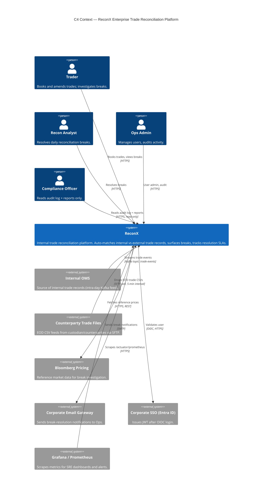
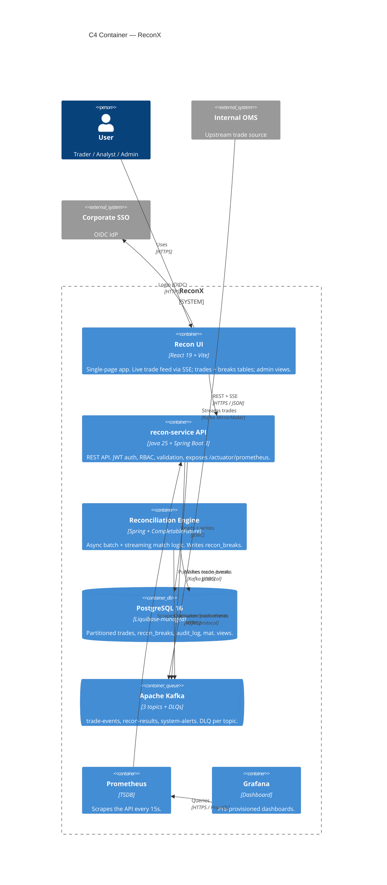
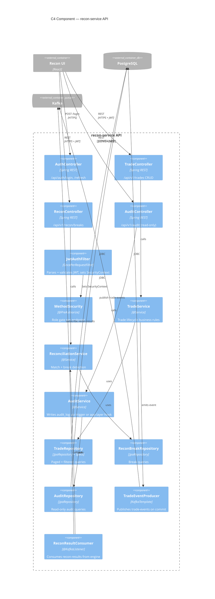

# TrainersGuide — Day 1: PostgreSQL Modules 1 & 2 + Liquibase Deep Dive

> **Student-facing equivalent:** [student-guides/day1/README.md](../../student-guides/day1/README.md)
> **Exercises:** Day 1 · TICKET-ADV001 – TICKET-ADV017 (17 hands-on exercises across three PM workshop blocks)
> **Theme:** Database & SQL — PostgreSQL Modules 1 & 2 + Liquibase Deep Dive
> **New 2026 topics:** Liquibase deep dive, AI-assisted ADRs

Day 1 of the Advanced Track is the heaviest single day in the programme for
trainer setup. It covers an enterprise-grade database foundation in one
sitting: architecture diagrams, OpenAPI, partitioned schema, materialised
views, JSONB, window functions, recursive CTEs, Liquibase, and an AI lab — all
before grads see a single line of Java tomorrow.

Pace ruthlessly. If a team falls behind on the C4 diagrams (TICKET-ADV002–TICKET-ADV004) they will not catch up by
TICKET-ADV017 without your active intervention.

---

## Day at a glance

| #    | Block                                                                          | Exercises       | What students produce                                                            |
|---------------|--------------------------------------------------------------------------------|-----------------|----------------------------------------------------------------------------------|
| 1 | Standup + Day-0 holdover unblock                                               | —               | Everyone on green; Docker + psql working                                         |
| 2 | **AM Module 1 — PostgreSQL Foundations** (theory + live demo + Percipio labs)  | —               | Notes: architecture, DDL, normalisation, JOINs, GROUP BY, B-Tree                 |
| 3 | Break                                                                          | —               | —                                                                                |
| 4 | **Workshop 1A — GitHub & C4**                                                  | TICKET-ADV001 – TICKET-ADV004 | Team repo with branch protection, 3 C4 diagrams                                  |
| 5 | Lunch                                                                          | —               | —                                                                                |
| 6 | **PM Module 2 — PostgreSQL Advanced** (theory + live demo + Percipio labs)     | —               | Notes: window fns, CTEs, JSONB, GIN/GiST/BRIN, EXPLAIN, RLS, Liquibase intro     |
| 7 | **Workshop 1B — Schema, partitioning, mat. view, JSONB, window fns**           | TICKET-ADV006 – TICKET-ADV011| 8-entity ER model, partitioned `trades`, `mv_daily_recon_summary`, VWAP + CTE    |
| 8 | Break                                                                          | —               | —                                                                                |
| 9 | **Workshop 1C — Liquibase, AI ADRs, Jira, seed**                               | TICKET-ADV012 – TICKET-ADV017| Liquibase project with rollback tags + preconditions, ADRs, Jira board, seed   |
| 10 | End-of-day debrief                                                             | —               | Schema migrated, repo green, tomorrow's preview                                  |

**Pacing notes:**

- The two theory blocks (AM 75 min, PM 60 min) are tight. **Do not** turn them
  into 2-hour lectures. Demo, then push them into the workshop queue.
- TICKET-ADV002–TICKET-ADV004 (C4 diagrams) are paralleliseable across the four roles in a
  team. Push the team to split: PM owns Context, Tech Lead owns Container,
  Architect owns Component. Don't let one person do all three sequentially.
- Workshop 1B (1h 15min) for 6 SQL exercises is fast. **The students don't
  have to hand-type the partitioning DDL** — give them the parent-table
  boilerplate and have them write the child partitions.
- Workshop 1C is intentionally short (45 min) because TICKET-ADV015 (Claude for ADRs)
  and TICKET-ADV016 (Jira) are mostly cognitive, not typing-intensive.

---

## Pre-day instructor prep

The evening before Day 1:

- [ ] Have psql in your terminal history — `docker compose exec postgres psql -U reconx_user -d reconx`. You will demo this at least 15 times today.
- [ ] Pre-open this trainer README + the student Day-1 README side-by-side. Acceptance criteria are in the student copy; full answers are here.
- [ ] **ER diagram sketch** ready as a slide AND on the whiteboard. You will redraw it during the TICKET-ADV006 walkthrough. Eight entities — practice fitting them on the board *once* before the session.
- [ ] **Decide Liquibase changeset style** you teach: structured XML (`<createTable>`, `<addColumn>`) vs. SQL passthrough (`<sql>`). The starter assumes structured XML for TICKET-ADV012–TICKET-ADV014. Use SQL only for things XML can't express (partitions, materialised views).
- [ ] **JSONB demo data preloaded** in a scratch DB — keep a `psql` window open with `SELECT metadata FROM instruments WHERE metadata @> '{"sector":"Tech"}';` ready so you can demo GIN-index speedup live.
- [ ] **C4 diagram reference images** open in your browser (`structurizr` or the TICKET-ADV002-TICKET-ADV004 reference SVGs in `db/diagrams/`). When a team asks "what level of detail?", you show them.
- [ ] Pre-warm `claude` / `gemini` CLI logins (whichever you're demoing for TICKET-ADV015). A mid-session "please log in" wastes 5 minutes.
- [ ] Refresh on rollback semantics: `liquibase rollback-count 1`, `liquibase rollback <tag>`. Grads ALWAYS ask "what if I want to undo only one of the changesets in the file?" — you need the answer fluent.
- [ ] Print or pull up a one-pager of [Liquibase preconditions reference](https://docs.liquibase.com/concepts/changelogs/preconditions.html) — there are ~15 of them and you'll get asked about ones you've never used.

---

## AM theory block — Module 1 (75 min)

Cover the following, in this order, with live psql demos sprinkled in:

| Topic                      | Time   | Live demo                                                            |
|----------------------------|--------|----------------------------------------------------------------------|
| Postgres architecture      | 10 min | `\du`, `\l`, `\dt`, show data directory structure                    |
| psql + pgAdmin tour        | 5 min  | Run a query in psql, same query in pgAdmin                           |
| DDL — CREATE / ALTER / DROP| 10 min | Create scratch `demo_trades` table, ALTER a column type              |
| Core types                 | 5 min  | `NUMERIC(18,4)` vs `DOUBLE`, `TIMESTAMPTZ` vs `TIMESTAMP`            |
| Normalisation 1NF → 3NF    | 10 min | Whiteboard: denormalised trades blob → 3NF (instrument + counterparty split out) |
| DML + constraints          | 5 min  | INSERT / UPDATE / DELETE with FK violation                           |
| JOINs (INNER, LEFT, FULL)  | 10 min | 3-table JOIN: trades × instruments × counterparties                  |
| GROUP BY / HAVING / aggs   | 5 min  | `SELECT counterparty_id, COUNT(*), SUM(quantity*price)` grouped      |
| Subqueries + views + txns  | 10 min | Wrap inserts in BEGIN/COMMIT/ROLLBACK; demo a view                   |
| B-Tree indexes             | 5 min  | `CREATE INDEX`, `EXPLAIN ANALYZE` before/after                       |

**Anti-pattern to call out early:** "We don't normalise — disk is cheap." Disk is
cheap; **bugs caused by duplicated truth** are not. Counterparty name in 500 trade
rows means 500 places to update when SAP rebrands.

---

## Workshop 1A — GitHub, C4 & OpenAPI (105 min)

### TICKET-ADV001 — Create GitHub repo with branch protection

**Common student blockers:**
- Branch protection rules on `main` reject their first push. Some treat this as a bug, not the point.
- They configure protection too aggressively on `develop` and can't merge their own PRs (require 2 reviews but the team has 4 people, so the PR author + 1 reviewer = blocked).
- One team-mate's git is configured with the wrong email and commits show "Unknown" or a personal address. The DB email is what's on the corp policy.
- They forget to enable "Require status checks to pass before merging" — Day 5 CI gates won't work without it.
- They give the repo a public visibility by accident. **Must be private** for the programme.

**Unblocking ladder:**
1. **Nudge:** "Read the error message — what does GitHub think you tried to do?"
2. **Hint:** "Branch protection is *supposed* to stop direct pushes to main. What's the right path to get a change to main?"
3. **Reveal:** Walk through opening a PR from a feature branch live. Open the Settings → Branches → Branch protection rules UI and explain each toggle.

<details>
<summary>▶ Reference branch protection settings (paste into repo Settings → Branches)</summary>

```
Branch name pattern: main
  [x] Require a pull request before merging
      [x] Require approvals (2)
      [x] Dismiss stale pull request approvals when new commits are pushed
      [x] Require review from Code Owners
  [x] Require status checks to pass before merging
      [x] Require branches to be up to date before merging
      Status checks required: build, test, lint
  [x] Require conversation resolution before merging
  [x] Require signed commits (optional — turn on by Day 5)
  [x] Require linear history
  [x] Include administrators
  [ ] Allow force pushes  (LEAVE OFF)
  [ ] Allow deletions     (LEAVE OFF)

Branch name pattern: develop
  [x] Require a pull request before merging
      [x] Require approvals (1)
  [x] Require status checks to pass before merging
      Status checks required: build, test
  [ ] Require signed commits
  [ ] Include administrators
```

`CODEOWNERS` file (root of repo):

```
# .github/CODEOWNERS
*               @team-lead-handle
backend/        @team-lead-handle @backend-lead-handle
frontend/       @team-lead-handle @frontend-lead-handle
db/             @team-lead-handle @db-lead-handle
.github/        @team-lead-handle
```

</details>

**Talking point:** "Why two approvals on Advanced when Intermediate used one?"
Because the Advanced Track simulates a near-prod release process. Two-reviewer
is the DB norm for any service touching client trade data.

**▶ Verify the artifact — confirm TICKET-ADV001 end-to-end**

Repo is private, branch protection rules are live on `main` and `develop`, and CODEOWNERS routes PR review to the right team.

```bash
# from project root
cat .github/CODEOWNERS
git checkout -b throwaway-push-test
git commit --allow-empty -m "test: branch protection"
git push origin throwaway-push-test:main   # MUST be rejected by GitHub
```

**Observe:**

- `.github/CODEOWNERS` exists and routes `backend/`, `frontend/`, `db/` paths to the lead handles.
- The direct push to `main` is rejected by GitHub with a protected-branch error.
- Repo Settings → General shows "Visibility: Private".
- Settings → Branches shows two rules: `main` (2 approvals + Code Owners + status checks + linear history) and `develop` (1 approval + status checks).
- Opening a PR into `main` surfaces required-checks and required-reviews UI.

---

### TICKET-ADV002 — Design C4 Context diagram

**Common student blockers:**
- They draw the system internals (database, queues) on the Context diagram. **Wrong level** — Context is one box for "ReconX" and the actors/systems around it.
- They forget external systems (e.g., the counterparty SFTP feed, Bloomberg pricing) and only draw users.
- They use UML or random shapes instead of the C4 notation (person, software system, external system).
- They render in PowerPoint instead of Structurizr / Mermaid / draw.io with the C4 plugin — fine, but the diagrams must live in `db/diagrams/` as committed images.

**Unblocking ladder:**
1. **Nudge:** "C4 Context is one box for the *whole* system. What's inside that box from the user's perspective?"
2. **Hint:** "Who or what *talks to* ReconX? Not what's inside it."
3. **Reveal:** Show the reference diagram below and re-draw it on the whiteboard.

<details>
<summary>▶ Reference Context diagram (Mermaid — paste into db/diagrams/c4-context.md)</summary>



</details>

**Talking point:** "Why is Bloomberg an external system but the database isn't?"
The database is an *implementation detail* of ReconX — it lives at the Container
level, not Context. C4 is hierarchical: zoom in for more detail. Don't mix levels.

**▶ Verify the artifact — confirm TICKET-ADV002 end-to-end**

The C4 Context diagram is committed as Mermaid and renders cleanly in a Mermaid-aware previewer.

```bash
# from project root
ls -l db/diagrams/c4-context.md
# Then open in VS Code (Markdown Preview) or paste into https://mermaid.live
```

**Observe:**

- `db/diagrams/c4-context.md` exists and contains a `C4Context` Mermaid block.
- The diagram renders without parse errors in the Mermaid live editor.
- Exactly one `System(reconx, ...)` node — no internal containers leaked in.
- Four `Person(...)` nodes (Trader, Recon Analyst, Ops Admin, Compliance) and roughly six `System_Ext(...)` nodes (OMS, SFTP, Bloomberg, email, SSO, Grafana).
- Every `Rel(...)` arrow carries both an intent label and a protocol (HTTPS / Kafka / OIDC / SMTP).

---

### TICKET-ADV003 — Design C4 Container diagram

**Common student blockers:**
- They draw classes / methods (Component-level detail) on the Container diagram.
- They forget Kafka and treat the broker as part of the backend.
- They put the React frontend in the same box as the backend.
- They label arrows as "uses" instead of with a protocol + intent.

**Unblocking ladder:**
1. **Nudge:** "Containers are *separately deployable units*. How many `docker run` commands do you have?"
2. **Hint:** "If you tore Kafka out and replaced it with RabbitMQ, would you redeploy the backend? Then it's a separate container."
3. **Reveal:** Show the reference below.

<details>
<summary>▶ Reference Container diagram (Mermaid)</summary>



</details>

**Talking point:** "Should we put Prometheus and Grafana *inside* the ReconX
boundary?" Yes — for this project, they're provisioned by the team and run on
the demo laptop, so they're part of ReconX. In a real org they're a shared
SRE platform and you'd show them as external.

**▶ Verify the artifact — confirm TICKET-ADV003 end-to-end**

The C4 Container diagram is committed as Mermaid and shows the seven independently deployable units inside the ReconX boundary.

```bash
# from project root
ls -l db/diagrams/c4-container.md
# Then preview in VS Code or paste into https://mermaid.live
```

**Observe:**

- `db/diagrams/c4-container.md` exists with a `C4Container` Mermaid block that renders without errors.
- A `System_Boundary(reconxBoundary, "ReconX")` wraps seven containers: React SPA, API, recon engine, Postgres, Kafka, Prometheus, Grafana.
- Postgres uses `ContainerDb(...)` and Kafka uses `ContainerQueue(...)`.
- External actors (User, OMS, SSO) sit outside the boundary.
- Every `Rel(...)` arrow carries both protocol and intent (`"REST + SSE", "HTTPS / JSON"`).

---

### TICKET-ADV004 — Design C4 Component diagram

**Common student blockers:**
- They draw every Spring `@Component` they can think of (50+ boxes). The Component diagram is the **major components within one container** — usually 8-15 boxes.
- They forget to pick *which container* the diagram is for. "Components of what?" If you can't answer that in one phrase, you're not ready.
- They draw a class diagram instead of a logical-component diagram.

**Unblocking ladder:**
1. **Nudge:** "Component diagram is ONE container, zoomed in. Which container?" (Almost always: the API.)
2. **Hint:** "Group by Spring stereotype — Controllers, Services, Repositories, Config. Each grouping is a few boxes."
3. **Reveal:** Show the reference below.

<details>
<summary>▶ Reference Component diagram (Mermaid) — for the recon-service API container</summary>



</details>

**Talking point:** "Why call out JwtAuthFilter as its own component when it's
five lines of Spring config?" Because security boundaries are first-class
architectural concerns. A component on the diagram = a thing reviewers must
think about. Make it visible.

**▶ Verify the artifact — confirm TICKET-ADV004 end-to-end**

The C4 Component diagram is committed as Mermaid and zooms into exactly one container — `recon-service API` — with all major Spring stereotypes shown.

```bash
# from project root
ls -l db/diagrams/c4-component.md
# Preview in VS Code or paste into https://mermaid.live
```

**Observe:**

- `db/diagrams/c4-component.md` exists with a `C4Component` Mermaid block that renders without errors.
- Title clearly names the container being zoomed into (`recon-service API`).
- Between 10 and 15 component boxes, grouped by Spring stereotype: 4 controllers, JwtAuthFilter, MethodSecurity, 3 services, 3 repositories, 1 Kafka producer, 1 Kafka consumer.
- External neighbours (UI, Postgres, Kafka) appear as `Container_Ext` / `ContainerDb_Ext` / `ContainerQueue_Ext` at the edge — NOT as components.
- Arrows flow UI → controllers → services → repositories + producer → DB / Kafka.

---

### TICKET-ADV006 — Design ER model (8 entities)

**Common student blockers:**
- They try to merge `recon_breaks` and `audit_log` because "both are append-only history". Different semantics — push back.
- They forget `recon_jobs` (the batch-run table) and put job state into `recon_breaks` rows. That's mixing the *what happened* with the *who ran it when*.
- They skip the `users` table and assume "Spring Security handles users". Spring Security *authenticates* against your `users` table — it doesn't replace it.
- They put `instrument.metadata` (JSONB) as a separate table. JSONB column is the whole point of TICKET-ADV009; don't pre-normalise it away.

**Unblocking ladder:**
1. **Nudge:** "What's the difference between a `recon_break` and an `audit_log` entry? Both are 'something happened'."
2. **Hint:** "A break is a *business event* with a resolution lifecycle. An audit is a *technical record* of a row change. Different stakeholders read each."
3. **Reveal:** Show the diagram below.

<details>
<summary>▶ Reference ER diagram — 8 entities, FK relationships (paste into db/erd.md)</summary>

```
                ┌─────────────────────┐         ┌──────────────────────┐
                │   counterparties    │         │     instruments      │
                ├─────────────────────┤         ├──────────────────────┤
                │ id (PK)             │         │ id (PK)              │
                │ name                │         │ symbol (UQ)          │
                │ lei_code (UQ)       │         │ name                 │
                │ region              │         │ asset_class          │
                │ created_at          │         │ currency (CHAR(3))   │
                └──────────┬──────────┘         │ isin (UQ, NULLABLE)  │
                           │                    │ metadata JSONB       │  ← TICKET-ADV009
                           │                    └──────────┬───────────┘
                           │                               │
                           │   ┌───────────────────────────┴──┐
                           │   │            trades            │   ← TICKET-ADV007 partitioned by trade_date
                           │   ├──────────────────────────────┤
                           │   │ id (PK)                      │
                           ├──►│ counterparty_id (FK)         │
                               │ instrument_id (FK)           │
                               │ trade_ref (UQ)               │
                               │ quantity (NUMERIC)           │
                               │ price (NUMERIC)              │
                               │ trade_date (DATE)  ← part key│
                               │ status                       │
                               │ created_at (TIMESTAMPTZ)     │
                               └─┬──────────────┬─────────────┘
                                 │              │
                                 ▼              ▼
              ┌──────────────────────┐    ┌──────────────────────┐
              │     settlements      │    │     recon_breaks     │
              ├──────────────────────┤    ├──────────────────────┤
              │ id (PK)              │    │ id (PK)              │
              │ trade_id (FK)        │    │ trade_id (FK)        │
              │ settlement_date      │    │ recon_job_id (FK) ──┐│
              │ amount               │    │ discrepancy_type    ││
              │ status               │    │ status              ││
              │ created_at           │    │ detected_at         ││
              └──────────────────────┘    │ resolved_at         ││
                                          │ resolution          ││
                                          │ comment             ││
                                          └──────────┬──────────┘│
                                                     │           │
                                                     ▼           │
                                          ┌──────────────────────┴───┐
                                          │      recon_jobs          │
                                          ├──────────────────────────┤
                                          │ id (PK)                  │
                                          │ trade_date               │
                                          │ status                   │
                                          │ started_at               │
                                          │ completed_at             │
                                          │ break_count              │
                                          │ triggered_by (FK→users)─┐│
                                          └──────────────────────────┘│
                                                                      │
              ┌──────────────────────┐                                 │
              │       users          │◄────────────────────────────────┘
              ├──────────────────────┤
              │ id (PK)              │
              │ email (UQ)           │
              │ password_hash        │
              │ role                 │
              │ enabled              │
              │ created_at           │
              └──────────┬───────────┘
                         │
                         ▼
              ┌──────────────────────┐
              │     audit_log        │   (denormalised — no FKs into business tables)
              ├──────────────────────┤
              │ id (PK)              │
              │ table_name           │
              │ operation (I/U/D)    │
              │ row_pk               │
              │ before_data (JSONB)  │
              │ after_data  (JSONB)  │
              │ changed_by (→users.email, app-layer, no FK) │
              │ changed_at           │
              └──────────────────────┘
```

**FK summary:**
- `trades.counterparty_id` → `counterparties.id`
- `trades.instrument_id` → `instruments.id`
- `settlements.trade_id` → `trades.id`  *(cross-partition aware — see Q&A)*
- `recon_breaks.trade_id` → `trades.id`
- `recon_breaks.recon_job_id` → `recon_jobs.id`
- `recon_jobs.triggered_by` → `users.id`
- `audit_log.changed_by` → no FK (denormalised on purpose — see Q&A)

</details>

**Talking point:** "Why no FK from `audit_log` to anything?" Because audit log
must outlive the rows it audits. If a trade is deleted, the audit entry stays.
Hard FKs would cascade-delete history. Same principle: log forever, source-of-truth
elsewhere.

**▶ Verify the artifact — confirm TICKET-ADV006 end-to-end**

The ER model is committed as a Mermaid `erDiagram` and covers exactly the eight core entities with FK arrows.

```bash
# from project root
ls -l db/erd.md
# Then preview in VS Code (Markdown Preview) or paste into https://mermaid.live
```

**Observe:**

- `db/erd.md` exists with an `erDiagram` Mermaid block that renders without errors.
- Exactly eight entities are drawn: COUNTERPARTIES, INSTRUMENTS, USERS, TRADES, SETTLEMENTS, RECON_JOBS, RECON_BREAKS, AUDIT_LOG.
- Seven FK arrows: trades→counterparties, trades→instruments, settlements→trades, recon_breaks→trades, recon_breaks→recon_jobs, recon_jobs→users, users→audit_log.
- `trades.trade_date` is annotated as `"PARTITION KEY (TICKET-ADV007)"` and `instruments.metadata` is annotated as `"TICKET-ADV009"`.
- `audit_log.changed_by` (actor) deliberately has NO database FK — audit outlives the rows it audits.

---

### TICKET-ADV007 — CREATE TABLE with monthly partitioning

**Common student blockers:**
- They create the parent `trades` table without `PARTITION BY RANGE (trade_date)` — then can't attach partitions.
- They include `id BIGSERIAL PRIMARY KEY` and Postgres rejects: "primary key must include all partitioning columns". Have to make PK `(id, trade_date)` — common gotcha.
- They use `id` not `trade_date` as the partition key because "id is the PK". Partitioning by ID gives you no query speedup.
- They forget to create future partitions and inserts for next month silently fail.

**Unblocking ladder:**
1. **Nudge:** "What column appears in 90% of your WHERE clauses? That's your partition key."
2. **Hint:** "Postgres needs the partition key in the PK. What does that mean your PK has to look like?"
3. **Reveal:** Show the DDL below.

<details>
<summary>▶ Reference partitioning DDL (db/partitioning.sql)</summary>

```sql
-- ============================================================================
-- TICKET-ADV007 — Partitioned trades table
-- Strategy: RANGE partitioning by trade_date, one partition per calendar month.
-- ============================================================================

-- Parent (logical) table — note: PK must include partition column
CREATE TABLE trades (
    id              BIGSERIAL,
    trade_ref       VARCHAR(30) NOT NULL,
    instrument_id   BIGINT      NOT NULL REFERENCES instruments(id),
    counterparty_id BIGINT      NOT NULL REFERENCES counterparties(id),
    quantity        NUMERIC(18,4) NOT NULL CHECK (quantity > 0),
    price           NUMERIC(18,4) NOT NULL CHECK (price > 0),
    trade_date      DATE        NOT NULL,
    status          VARCHAR(20) NOT NULL DEFAULT 'PENDING'
                    CHECK (status IN ('PENDING','MATCHED','UNMATCHED','DISPUTED','CANCELLED')),
    created_at      TIMESTAMPTZ NOT NULL DEFAULT CURRENT_TIMESTAMP,
    PRIMARY KEY (id, trade_date),                              -- partition key in PK
    UNIQUE      (trade_ref, trade_date)                        -- same rule for UNIQUE
) PARTITION BY RANGE (trade_date);

-- Index on the parent → automatically propagated to all partitions
CREATE INDEX idx_trades_status      ON trades (status);
CREATE INDEX idx_trades_instrument  ON trades (instrument_id);
CREATE INDEX idx_trades_counterparty ON trades (counterparty_id);

-- Child partitions — one per month for the active window
CREATE TABLE trades_y2026m04 PARTITION OF trades
    FOR VALUES FROM ('2026-04-01') TO ('2026-05-01');

CREATE TABLE trades_y2026m05 PARTITION OF trades
    FOR VALUES FROM ('2026-05-01') TO ('2026-06-01');

CREATE TABLE trades_y2026m06 PARTITION OF trades
    FOR VALUES FROM ('2026-06-01') TO ('2026-07-01');

CREATE TABLE trades_y2026m07 PARTITION OF trades
    FOR VALUES FROM ('2026-07-01') TO ('2026-08-01');

-- DEFAULT partition catches anything outside the explicit ranges.
-- Keep it for safety; production teams usually drop it and pre-create 12 months ahead.
CREATE TABLE trades_default PARTITION OF trades DEFAULT;

-- Verify: \d+ trades should show all partitions.
-- Confirm partition pruning:
EXPLAIN ANALYZE SELECT * FROM trades WHERE trade_date = '2026-06-15';
-- Expect: scans only trades_y2026m06, not all partitions.
```

</details>

**Talking point:** "What does `\d+ trades` show? Look — `Partition key: RANGE
(trade_date)`. And the child tables appear underneath. That's what partition
pruning operates on." Demo `EXPLAIN ANALYZE` with and without a date filter to
show pruning vs. fan-out.

**▶ Run the project — verify TICKET-ADV007 end-to-end**

Postgres is up, Liquibase has applied the partitioning changeset, and `trades` is RANGE-partitioned on `trade_date` with at least four monthly children plus a default.

```bash
# from project root
docker compose up -d postgres
./mvnw -pl backend spring-boot:run        # in a separate terminal
psql -h localhost -p 5432 -U reconx -d reconx_dev   # password: reconx
# Inside psql:
#   \d+ trades
#   EXPLAIN ANALYZE SELECT * FROM trades WHERE trade_date = '2026-06-15';
#   SELECT id, filename FROM databasechangelog WHERE filename LIKE '%partitioning%';
```

**Observe:**

- `\d+ trades` reports `Partition key: RANGE (trade_date)` and lists each monthly child partition underneath.
- At least four monthly partitions (`trades_y2026m04` through `trades_y2026m07`) plus `trades_default` are listed.
- `EXPLAIN ANALYZE ... WHERE trade_date = '2026-06-15'` scans only the June child partition — partition pruning is active.
- `databasechangelog` contains a row for the partitioning changeset (filename includes `004-partitioning.xml` or equivalent).
- If `\d+ trades` does not show `Partition key`, the changeset did not apply — re-check the Liquibase classpath and Postgres dialect precondition.

---

### TICKET-ADV008 — Materialised view: mv_daily_recon_summary

**Common student blockers:**
- They use `CREATE VIEW` instead of `CREATE MATERIALIZED VIEW` — query slow, data live.
- They forget the unique index — `REFRESH MATERIALIZED VIEW CONCURRENTLY` will fail without it.
- They schedule `REFRESH` from inside a transaction. Won't work for CONCURRENTLY.
- They put it in a Liquibase XML `<createView>` tag — that tag doesn't support MATERIALIZED. Must use `<sql>` block.

**Unblocking ladder:**
1. **Nudge:** "If the dashboard re-runs your aggregation every page load, what's the read cost?"
2. **Hint:** "Materialised views cache the result on disk. What's the trade-off?"
3. **Reveal:** Show below.

<details>
<summary>▶ Reference materialised view (db/queries.sql)</summary>

```sql
-- ============================================================================
-- TICKET-ADV008 — Materialised view: daily reconciliation summary
-- Refreshed nightly by a scheduled job or via API trigger after each recon run.
-- ============================================================================

CREATE MATERIALIZED VIEW mv_daily_recon_summary AS
SELECT
    t.trade_date,
    cp.region,
    i.asset_class,
    COUNT(*)                                                  AS total_trades,
    COUNT(*) FILTER (WHERE t.status = 'MATCHED')              AS matched_trades,
    COUNT(*) FILTER (WHERE t.status = 'UNMATCHED')            AS unmatched_trades,
    COUNT(*) FILTER (WHERE t.status = 'DISPUTED')             AS disputed_trades,
    COUNT(rb.id) FILTER (WHERE rb.status = 'OPEN')            AS open_breaks,
    COUNT(rb.id) FILTER (WHERE rb.status = 'RESOLVED')        AS resolved_breaks,
    ROUND(SUM(t.quantity * t.price)::NUMERIC, 2)              AS gross_notional,
    ROUND(
        100.0 * COUNT(*) FILTER (WHERE t.status = 'MATCHED')
              / NULLIF(COUNT(*), 0)
    , 2)                                                      AS match_rate_pct
FROM trades t
JOIN counterparties cp  ON cp.id = t.counterparty_id
JOIN instruments    i   ON i.id  = t.instrument_id
LEFT JOIN recon_breaks rb ON rb.trade_id = t.id
GROUP BY t.trade_date, cp.region, i.asset_class
WITH NO DATA;   -- create empty; populate on demand with REFRESH

-- REQUIRED for REFRESH MATERIALIZED VIEW CONCURRENTLY
CREATE UNIQUE INDEX uq_mv_daily_recon_summary
    ON mv_daily_recon_summary (trade_date, region, asset_class);

-- Additional indexes for common dashboard filters
CREATE INDEX idx_mv_daily_recon_summary_date   ON mv_daily_recon_summary (trade_date);
CREATE INDEX idx_mv_daily_recon_summary_region ON mv_daily_recon_summary (region);

-- Initial population
REFRESH MATERIALIZED VIEW mv_daily_recon_summary;

-- Nightly (or post-recon-run) refresh, no read lock:
-- REFRESH MATERIALIZED VIEW CONCURRENTLY mv_daily_recon_summary;
```

**Refresh cadence rule of thumb:**
- `REFRESH MATERIALIZED VIEW` — locks the view, fast.
- `REFRESH MATERIALIZED VIEW CONCURRENTLY` — no lock, but slower and needs a UNIQUE index.

For a dashboard powered by this view, **always CONCURRENTLY** so the dashboard
doesn't 500 during the refresh.

</details>

**Talking point:** "Why not just an indexed view (like SQL Server)?" Postgres
doesn't have indexed views — materialised view is the equivalent. The price
you pay is staleness — that's why we have the FILTER on `status = 'MATCHED'`
and refresh after each recon run.

**▶ Run the project — verify TICKET-ADV008 end-to-end**

The materialised view `mv_daily_recon_summary` exists, has a unique index, and can be refreshed CONCURRENTLY without blocking dashboard reads.

```bash
# from project root
docker compose up -d postgres
./mvnw -pl backend spring-boot:run
psql -h localhost -p 5432 -U reconx -d reconx_dev   # password: reconx
# Inside psql:
#   \d+ mv_daily_recon_summary
#   SELECT * FROM mv_daily_recon_summary LIMIT 5;
#   REFRESH MATERIALIZED VIEW CONCURRENTLY mv_daily_recon_summary;
```

**Observe:**

- `\d+ mv_daily_recon_summary` shows the materialised view with columns `trade_date`, `total_trades`, `matched_trades`, `break_trades`, `total_notional`.
- A unique index (`uq_mv_daily_recon_summary_trade_date`) exists — without it `REFRESH ... CONCURRENTLY` would fail.
- `REFRESH MATERIALIZED VIEW CONCURRENTLY mv_daily_recon_summary;` succeeds and returns immediately on an empty/seeded DB.
- Once TICKET-ADV017 seed is in, `SELECT * FROM mv_daily_recon_summary` returns one row per `trade_date` with sensible counts.
- The changeset is recorded in `databasechangelog` with filename ending in `005-mat-views.xml`.

---

### TICKET-ADV009 — Add JSONB column to instruments

**Common student blockers:**
- They use `JSON` not `JSONB`. JSON stores as text (preserves whitespace, key order, dupes). JSONB stores as binary tree (fast, indexable, no dupes). Always pick JSONB unless you specifically need to preserve input formatting.
- They create a btree index on the JSONB column. Useless — wrong index type.
- They use the wrong GIN operator class — `jsonb_ops` vs `jsonb_path_ops`. Default is fine for TICKET-ADV009; teach the distinction in Q&A.

**Unblocking ladder:**
1. **Nudge:** "What types of metadata might an instrument have? Sector? Issuer rating? FX pair components?"
2. **Hint:** "JSONB lets you query `WHERE metadata @> '{...}'`. What index makes that fast?"
3. **Reveal:** Show below.

<details>
<summary>▶ Reference JSONB column + GIN index</summary>

```sql
-- ============================================================================
-- TICKET-ADV009 — Add JSONB metadata to instruments
-- ============================================================================

ALTER TABLE instruments
    ADD COLUMN metadata JSONB NOT NULL DEFAULT '{}'::JSONB;

-- GIN index with jsonb_path_ops — optimised for @> containment queries.
-- Smaller and faster than default jsonb_ops, at the cost of fewer ops supported.
CREATE INDEX idx_instruments_metadata
    ON instruments
    USING GIN (metadata jsonb_path_ops);

-- Example payloads (commit these as documentation in db/seed_data.sql):
UPDATE instruments SET metadata = '{
  "sector": "Technology",
  "exchange": "XETR",
  "issuer": {"name": "SAP SE", "country": "DE", "lei": "529900D6BF99LW9R2E68"},
  "rating": {"sp": "AA-", "moody": "Aa3"},
  "tags": ["DAX40", "ESG-tier-1"]
}'::JSONB WHERE symbol = 'SAP.DE';

UPDATE instruments SET metadata = '{
  "sector": "Energy",
  "underlying": "WTI",
  "contractSize": 1000,
  "expiryMonth": "2026-12",
  "tags": ["futures", "physical-settlement"]
}'::JSONB WHERE symbol = 'CL_FUT';

-- Sample queries — show EXPLAIN ANALYZE before/after the index:

-- Containment (uses GIN):
SELECT symbol, metadata->>'sector' AS sector
FROM instruments
WHERE metadata @> '{"sector": "Technology"}';

-- Path extraction (text):
SELECT symbol, metadata->'issuer'->>'country' AS country FROM instruments;

-- Array membership:
SELECT symbol FROM instruments WHERE metadata->'tags' ? 'DAX40';

-- Existence:
SELECT symbol FROM instruments WHERE metadata ? 'rating';
```

</details>

**Talking point:** "Why not just a `sector` column?" Because tomorrow we'll
have `region`, `exchange`, `rating`, `currency_secondary`. JSONB absorbs schema
churn for low-cardinality discoverable attributes. Use columns for things you
query *constantly* on hot paths; use JSONB for the long tail.

**▶ Run the project — verify TICKET-ADV009 end-to-end**

The `instruments` table has a `metadata JSONB` column backed by a GIN `jsonb_path_ops` index, and containment queries use the index.

```bash
# from project root
docker compose up -d postgres
./mvnw -pl backend spring-boot:run
psql -h localhost -p 5432 -U reconx -d reconx_dev   # password: reconx
# Inside psql:
#   \d instruments
#   \di instruments*
#   EXPLAIN ANALYZE SELECT * FROM instruments WHERE metadata @> '{"sector":"Technology"}';
```

**Observe:**

- `\d instruments` shows a `metadata` column of type `jsonb` with `NOT NULL DEFAULT '{}'::jsonb`.
- `\di instruments*` lists `idx_instruments_metadata_gin` as a GIN index over `(metadata)`.
- `EXPLAIN ANALYZE ... metadata @> '{"sector":"Technology"}'` shows a `Bitmap Index Scan on idx_instruments_metadata_gin` — NOT a `Seq Scan on instruments`.
- The changeset is recorded in `databasechangelog` with filename ending in `003-jsonb.xml`.
- If the column type comes back as `varchar` or `text`, the precondition gated it out — verify you are on the Postgres profile, not H2.

---

### TICKET-ADV010 — Window Function: VWAP per instrument per day

**Common student blockers:**
- They write a GROUP BY query and lose row-level detail. Window functions keep every row AND add aggregates.
- They use `OVER ()` (no PARTITION) and get a single VWAP across the entire table.
- They forget to multiply price × quantity in the numerator.

**Unblocking ladder:**
1. **Nudge:** "VWAP = sum(price × qty) / sum(qty). Where do those sums need to be scoped?"
2. **Hint:** "Each row should keep its trade detail AND know its instrument-day VWAP. GROUP BY collapses rows. What doesn't?"
3. **Reveal:** Show below.

<details>
<summary>▶ Reference VWAP window function (db/queries.sql)</summary>

```sql
-- ============================================================================
-- TICKET-ADV010 — Volume-Weighted Average Price per instrument per trade_date
-- Each row keeps its trade detail; VWAP shown alongside.
-- ============================================================================

SELECT
    t.trade_ref,
    t.trade_date,
    i.symbol,
    t.quantity,
    t.price,
    t.quantity * t.price                                                AS notional,
    SUM(t.price * t.quantity) OVER (PARTITION BY t.instrument_id, t.trade_date)
      / NULLIF(SUM(t.quantity)  OVER (PARTITION BY t.instrument_id, t.trade_date), 0)
                                                                        AS vwap,
    ROW_NUMBER() OVER (PARTITION BY t.instrument_id, t.trade_date ORDER BY t.created_at)
                                                                        AS intraday_seq,
    SUM(t.quantity) OVER (PARTITION BY t.instrument_id, t.trade_date
                          ORDER BY t.created_at
                          ROWS BETWEEN UNBOUNDED PRECEDING AND CURRENT ROW)
                                                                        AS cumulative_qty
FROM trades t
JOIN instruments i ON i.id = t.instrument_id
WHERE t.trade_date BETWEEN '2026-06-01' AND '2026-06-30'
ORDER BY i.symbol, t.trade_date, t.created_at;
```

**Tip:** Show `EXPLAIN ANALYZE` — there's *one* sort per partition, not a
re-aggregation per row. Window functions are O(n log n), not O(n²).

</details>

**Talking point:** "When would I pick GROUP BY over a window function?" When
you only need the aggregate, not the per-row detail. Dashboards = GROUP BY.
Trader-facing trade blotters with running totals = window.

**▶ Run the project — verify TICKET-ADV010 end-to-end**

The VWAP window-function query is committed to `db/queries.sql` and runs cleanly against seeded data, returning per-row detail alongside the partition-scoped VWAP.

```bash
# from project root
docker compose up -d postgres
./mvnw -pl backend spring-boot:run          # ensures seed has run
psql -h localhost -p 5432 -U reconx -d reconx_dev -f db/queries.sql
# Or open psql interactively and run the VWAP block:
psql -h localhost -p 5432 -U reconx -d reconx_dev
```

**Observe:**

- `db/queries.sql` exists and contains the VWAP block labelled with the ticket ID.
- The query runs without error and returns rows with `instrument_id`, `trade_date`, and a non-NULL `vwap` column.
- There is no `GROUP BY` collapse — per-row trade detail (quantity, price) is preserved when you remove the `DISTINCT`.
- `EXPLAIN ANALYZE` of the query shows window-function `WindowAgg` nodes partitioned by `(instrument_id, trade_date)`.
- Dividing by zero is guarded with `NULLIF(SUM(quantity) OVER ..., 0)` — no divide-by-zero errors on edge partitions.

---

### TICKET-ADV011 — Recursive CTE: trade lifecycle rollup

**Common student blockers:**
- They write a non-recursive CTE and wonder why it returns only direct rows.
- They forget the UNION ALL base + recursive part structure.
- They build an infinite loop (no termination condition) and crash psql.
- They try to model the lifecycle as a self-FK on `trades` — *which it isn't* in our schema. The lifecycle stages live in different tables: trades → settlements → recon_breaks → resolution. The CTE walks across tables.

**Unblocking ladder:**
1. **Nudge:** "Recursive CTE = base case UNION ALL recursion. What's the base case here?"
2. **Hint:** "Each stage adds a row. We're not following an FK chain — we're unioning lifecycle events into one stream per trade."
3. **Reveal:** Show below.

<details>
<summary>▶ Reference recursive CTE: trade lifecycle (db/queries.sql)</summary>

```sql
-- ============================================================================
-- TICKET-ADV011 — Hierarchical trade lifecycle rollup
-- Walks execution → confirmation → settlement → recon_break → resolution
-- and rolls up per-trade.
-- ============================================================================

WITH RECURSIVE trade_lifecycle AS (
    -- Base: every trade as a stage-1 (execution) event
    SELECT
        t.id                          AS trade_id,
        t.trade_ref,
        1                             AS stage,
        'EXECUTION'                   AS stage_name,
        t.created_at                  AS event_at,
        t.status                      AS event_status,
        ARRAY[t.created_at]           AS event_path
    FROM trades t

    UNION ALL

    -- Recursion: advance from stage N → stage N+1
    SELECT
        tl.trade_id,
        tl.trade_ref,
        tl.stage + 1                  AS stage,
        next_event.stage_name,
        next_event.event_at,
        next_event.event_status,
        tl.event_path || next_event.event_at
    FROM trade_lifecycle tl
    JOIN LATERAL (
        SELECT 'CONFIRMATION' AS stage_name,
               t.created_at + INTERVAL '5 minutes' AS event_at,
               'CONFIRMED'    AS event_status
        FROM trades t
        WHERE t.id = tl.trade_id AND tl.stage = 1
        UNION ALL
        SELECT 'SETTLEMENT', s.settlement_date::TIMESTAMPTZ, s.status
        FROM settlements s
        WHERE s.trade_id = tl.trade_id AND tl.stage = 2
        UNION ALL
        SELECT 'RECON_BREAK', rb.detected_at, rb.status
        FROM recon_breaks rb
        WHERE rb.trade_id = tl.trade_id AND tl.stage = 3
        UNION ALL
        SELECT 'RESOLUTION', rb.resolved_at, rb.status
        FROM recon_breaks rb
        WHERE rb.trade_id = tl.trade_id
          AND tl.stage = 4
          AND rb.resolved_at IS NOT NULL
    ) AS next_event ON TRUE
    WHERE tl.stage < 5                                  -- termination guard
)
SELECT
    trade_id,
    trade_ref,
    stage,
    stage_name,
    event_at,
    event_status,
    array_length(event_path, 1)       AS depth
FROM trade_lifecycle
ORDER BY trade_id, stage;

-- Bonus: per-trade summary using the recursive output
WITH RECURSIVE trade_lifecycle AS ( /* same as above */ )
SELECT
    trade_id,
    trade_ref,
    MAX(stage)                                        AS final_stage,
    STRING_AGG(stage_name, ' → ' ORDER BY stage)      AS lifecycle_path,
    MAX(event_at) - MIN(event_at)                     AS total_duration
FROM trade_lifecycle
GROUP BY trade_id, trade_ref;
```

**Termination guard** — `WHERE tl.stage < 5` is essential. Without it, Postgres
will spin until `max_recursion_depth` (or you OOM).

</details>

**Talking point:** "When is a recursive CTE the right tool?" Tree / graph
traversal, hierarchical rollups, lifecycle walks where the depth is unknown
in advance. If you know it's 4 levels, use 4 JOINs — simpler. Recursion = unknown
depth.

**▶ Run the project — verify TICKET-ADV011 end-to-end**

The recursive CTE is committed to `db/queries.sql`, has a proper termination guard, and emits one row per stage per trade.

```bash
# from project root
docker compose up -d postgres
./mvnw -pl backend spring-boot:run
psql -h localhost -p 5432 -U reconx -d reconx_dev -f db/queries.sql
# Or run the recursive CTE block interactively
```

**Observe:**

- The CTE returns up to five rows per trade in lifecycle order (EXECUTED → CONFIRMED → SETTLED → RECONCILED → resolution stage).
- A clear base case (anchor) UNION ALL'd with a recursive step references the CTE itself.
- A termination guard (`WHERE tl.step < 4` or `tl.stage < 5`) prevents infinite recursion — the query finishes in milliseconds, not seconds.
- `EXPLAIN ANALYZE` shows a `CTE Scan` and `Recursive Union` node — confirming Postgres recognised the CTE as recursive.
- Output is sorted by `trade_id, step` so each trade's lifecycle reads top-to-bottom.

---

## Workshop 1C — Liquibase, AI ADRs, Jira, seed (45 min)

### TICKET-ADV012 — Liquibase master changelog

**Common student blockers:**
- They write everything in one giant 500-line `db.changelog-master.xml`. Painful to review.
- They forget the XML namespace / schema location and Liquibase rejects parse.
- They use `<include>` with absolute path instead of classpath-relative.
- They omit the `runOnChange` semantics for an included file containing mutable SQL (e.g., view definitions). The view never updates after the first apply.

**Unblocking ladder:**
1. **Nudge:** "Master changelog should be a *table of contents*. What goes in chapter files?"
2. **Hint:** "Look at the structure — each `<include>` is one logical migration."
3. **Reveal:** Show below.

<details>
<summary>▶ Reference master changelog (backend/src/main/resources/db/changelog/db.changelog-master.xml)</summary>

```xml
<?xml version="1.0" encoding="UTF-8"?>
<databaseChangeLog
        xmlns="http://www.liquibase.org/xml/ns/dbchangelog"
        xmlns:xsi="http://www.w3.org/2001/XMLSchema-instance"
        xsi:schemaLocation="http://www.liquibase.org/xml/ns/dbchangelog
                            http://www.liquibase.org/xml/ns/dbchangelog/dbchangelog-4.27.xsd">

    <!-- ============================================================
         Release 1.0 — Initial schema
         ============================================================ -->
    <include file="db/changelog/changes/001-init-extensions.xml"/>
    <include file="db/changelog/changes/002-create-counterparties.xml"/>
    <include file="db/changelog/changes/003-create-instruments.xml"/>
    <include file="db/changelog/changes/004-create-users.xml"/>
    <include file="db/changelog/changes/005-create-trades-partitioned.xml"/>
    <include file="db/changelog/changes/006-create-settlements.xml"/>
    <include file="db/changelog/changes/007-create-recon-jobs.xml"/>
    <include file="db/changelog/changes/008-create-recon-breaks.xml"/>
    <include file="db/changelog/changes/009-create-audit-log.xml"/>

    <!-- ============================================================
         Release 1.1 — JSONB metadata + GIN index
         ============================================================ -->
    <include file="db/changelog/changes/010-instruments-jsonb-metadata.xml"/>

    <!-- ============================================================
         Release 1.2 — Materialised view + analytical objects
         ============================================================ -->
    <include file="db/changelog/changes/011-mv-daily-recon-summary.xml"/>

    <!-- ============================================================
         Release 1.3 — Seed reference data
         ============================================================ -->
    <include file="db/changelog/changes/012-seed-reference-data.xml"/>

    <!-- ============================================================
         Tag: end-of-Day-1 release boundary (used by rollback)
         ============================================================ -->
    <changeSet id="tag-day1-complete" author="trainer">
        <tagDatabase tag="day1-complete"/>
    </changeSet>

</databaseChangeLog>
```

And one chapter file as an example:

```xml
<?xml version="1.0" encoding="UTF-8"?>
<!-- backend/src/main/resources/db/changelog/changes/002-create-counterparties.xml -->
<databaseChangeLog
        xmlns="http://www.liquibase.org/xml/ns/dbchangelog"
        xmlns:xsi="http://www.w3.org/2001/XMLSchema-instance"
        xsi:schemaLocation="http://www.liquibase.org/xml/ns/dbchangelog
                            http://www.liquibase.org/xml/ns/dbchangelog/dbchangelog-4.27.xsd">

    <changeSet id="002-create-counterparties" author="trainer">
        <preConditions onFail="MARK_RAN">
            <not><tableExists tableName="counterparties"/></not>
        </preConditions>

        <createTable tableName="counterparties">
            <column name="id" type="BIGSERIAL">
                <constraints primaryKey="true"/>
            </column>
            <column name="name" type="VARCHAR(100)">
                <constraints nullable="false"/>
            </column>
            <column name="lei_code" type="CHAR(20)">
                <constraints nullable="false" unique="true"/>
            </column>
            <column name="region" type="VARCHAR(10)">
                <constraints nullable="false"/>
            </column>
            <column name="created_at" type="TIMESTAMPTZ" defaultValueComputed="CURRENT_TIMESTAMP"/>
        </createTable>

        <sql>
            ALTER TABLE counterparties
            ADD CONSTRAINT chk_region CHECK (region IN ('APAC','EMEA','NAMR','LATAM'));
        </sql>

        <rollback>
            <dropTable tableName="counterparties"/>
        </rollback>
    </changeSet>

</databaseChangeLog>
```

And the Spring Boot wiring:

```yaml
# backend/src/main/resources/application.yml
spring:
  liquibase:
    enabled: true
    change-log: classpath:db/changelog/db.changelog-master.xml
    default-schema: public
    contexts: dev
```

</details>

**Talking point:** "Why XML — isn't YAML nicer?" XML is the historical standard,
has best IDE schema validation, and every Liquibase ref doc uses it. YAML is
fine but lacks XSD validation in most IDEs. **Pick one and stick with it** —
mixing XML + YAML + SQL in one project is a recipe for parse errors.

**▶ Run the project — verify TICKET-ADV012 end-to-end**

The Liquibase master changelog wires every chapter file in dependency order and Spring Boot applies the whole changelog cleanly at startup.

```bash
# from project root
docker compose up -d postgres
./mvnw -pl backend spring-boot:run
# In a separate terminal:
psql -h localhost -p 5432 -U reconx -d reconx_dev   # password: reconx
# Inside psql:
#   \dt
#   SELECT id, author, filename FROM databasechangelog ORDER BY orderexecuted;
```

**Observe:**

- App boot logs include `Liquibase: Reading from public.databasechangelog` and a line per applied changeset, in declared order.
- `\dt` lists all eight business tables (counterparties, instruments, trades, settlements, recon_jobs, recon_breaks, audit_log, users) plus `databasechangelog` and `databasechangeloglock`.
- `SELECT * FROM databasechangelog` shows one row per `<include>`'d changeset, with filenames `001-init.xml` through `008-seed.xml`.
- `application.yml` uses `classpath:/db/changelog/db.changelog-master.xml` — missing the `classpath:` prefix is the classic silent-skip bug.
- Restarting the app produces "0 changesets applied" — confirming the master is idempotent.

---

### TICKET-ADV013 — Add rollback tags

**Common student blockers:**
- They expect rollback to "just work" because they wrote `<createTable>`. Liquibase **auto-rolls back** most structured changes; SQL passthrough needs explicit `<rollback>`.
- They don't understand `tagDatabase` vs `<rollback>` tag — different concepts.
- They run `liquibase rollback day1-complete` and it does nothing because they didn't tag.

**Unblocking ladder:**
1. **Nudge:** "Two flavours: (1) per-changeset `<rollback>` block, (2) database tag for 'rollback to this point'. You need both."
2. **Hint:** "What if a changeset is an `<sql>` block — can Liquibase guess how to undo it?"
3. **Reveal:** Show below.

<details>
<summary>▶ Reference rollback tags + tagDatabase</summary>

```xml
<!-- Per-changeset rollback for an SQL-passthrough change ----------------- -->
<changeSet id="010-instruments-jsonb-metadata" author="trainer">
    <preConditions onFail="MARK_RAN">
        <columnExists tableName="instruments" columnName="metadata"/>
    </preConditions>

    <sql>
        ALTER TABLE instruments ADD COLUMN metadata JSONB NOT NULL DEFAULT '{}'::JSONB;
        CREATE INDEX idx_instruments_metadata ON instruments USING GIN (metadata jsonb_path_ops);
    </sql>

    <rollback>
        DROP INDEX IF EXISTS idx_instruments_metadata;
        ALTER TABLE instruments DROP COLUMN IF EXISTS metadata;
    </rollback>
</changeSet>

<!-- Tag a release boundary so we can roll back to it as a unit ---------- -->
<changeSet id="tag-release-1-0" author="trainer">
    <tagDatabase tag="release-1.0"/>
</changeSet>

<changeSet id="tag-release-1-1" author="trainer">
    <tagDatabase tag="release-1.1"/>
</changeSet>
```

```bash
# Rollback the last N changesets:
./mvnw liquibase:rollback -Dliquibase.rollbackCount=1

# Rollback to a named tag (everything after release-1.0 reverts):
./mvnw liquibase:rollback -Dliquibase.rollbackTag=release-1.0

# Preview rollback SQL without applying:
./mvnw liquibase:rollbackSQL -Dliquibase.rollbackTag=release-1.0 > /tmp/rollback.sql
```

**Rule of thumb:** Every `<sql>` block must have a matching `<rollback>` block.
Structured tags (`<createTable>`, `<addColumn>`) auto-generate rollback unless
you override.

</details>

**Talking point:** "Rollback in production — really?" *Cold-truth answer:*
production rollbacks of DDL are rare and risky (data loss). What rollback
tags actually buy you is (1) deterministic dev/test environment teardown,
(2) the ability to *generate* the rollback SQL for a DBA to review before any
change is applied. Even if you never `liquibase:rollback` in prod, you've made
the change reversible on paper.

**▶ Run the project — verify TICKET-ADV013 end-to-end**

Every `<sql>` changeset has a matching `<rollback>`, at least one `<tagDatabase>` anchors a release boundary, and Liquibase can emit reverse-DDL on demand.

```bash
# from project root
docker compose up -d postgres
./mvnw -pl backend spring-boot:run                                          # apply forward
./mvnw -pl backend liquibase:rollbackSQL -Dliquibase.rollbackTag=release-1.0 > /tmp/rollback.sql
cat /tmp/rollback.sql
# Optionally apply against a throwaway DB:
# ./mvnw -pl backend liquibase:rollback -Dliquibase.rollbackTag=release-1.0
```

**Observe:**

- `rollbackSQL` exits with status 0 and writes a non-empty SQL script to `/tmp/rollback.sql`.
- The script contains `DROP INDEX IF EXISTS idx_instruments_metadata_gin;` and `ALTER TABLE instruments DROP COLUMN metadata;` in that order (reverse of forward order).
- Every `<sql>` changeset in `db/changelog/changes/` has a sibling `<rollback>` block.
- At least one `<changeSet><tagDatabase tag="release-1.0"/></changeSet>` is present in the master or a chapter file.
- Applying the rollback against a dev DB returns the schema to the pre-tag state — `\d instruments` no longer shows `metadata`.

---

### TICKET-ADV014 — Add preconditions

**Common student blockers:**
- They use the wrong `onFail` mode. Defaults to HALT which breaks the whole migration.
- They forget preconditions on changesets that re-run across environments — e.g., a dev environment that already had the column.
- They use `<and>` / `<or>` incorrectly, getting unexpected truth.

**Unblocking ladder:**
1. **Nudge:** "Precondition asks 'should this changeset run?'. What does it check?"
2. **Hint:** "Look at the `onFail` options: HALT (stop), CONTINUE (skip just this), MARK_RAN (skip + record as applied), WARN (log + run anyway)."
3. **Reveal:** Show below.

<details>
<summary>▶ Reference precondition patterns</summary>

```xml
<!-- Pattern 1: Idempotent table creation (most common) -->
<changeSet id="011-mv-daily-recon-summary" author="trainer">
    <preConditions onFail="MARK_RAN">
        <not>
            <tableExists tableName="mv_daily_recon_summary"/>
        </not>
    </preConditions>

    <sql>
        CREATE MATERIALIZED VIEW mv_daily_recon_summary AS
        SELECT t.trade_date, cp.region, i.asset_class,
               COUNT(*) AS total_trades
        FROM trades t
        JOIN counterparties cp ON cp.id = t.counterparty_id
        JOIN instruments    i  ON i.id  = t.instrument_id
        GROUP BY t.trade_date, cp.region, i.asset_class
        WITH NO DATA;

        CREATE UNIQUE INDEX uq_mv_daily_recon_summary
            ON mv_daily_recon_summary (trade_date, region, asset_class);
    </sql>

    <rollback>
        DROP MATERIALIZED VIEW IF EXISTS mv_daily_recon_summary;
    </rollback>
</changeSet>

<!-- Pattern 2: Skip in environments where another condition holds (e.g., already migrated by a colleague) -->
<changeSet id="012-add-rating-column" author="trainer">
    <preConditions onFail="CONTINUE">
        <and>
            <tableExists tableName="instruments"/>
            <not><columnExists tableName="instruments" columnName="rating"/></not>
        </and>
    </preConditions>

    <addColumn tableName="instruments">
        <column name="rating" type="VARCHAR(10)"/>
    </addColumn>

    <rollback>
        <dropColumn tableName="instruments" columnName="rating"/>
    </rollback>
</changeSet>

<!-- Pattern 3: Environment-gated (only run in dev/test) -->
<changeSet id="013-seed-test-data" author="trainer" context="dev,test">
    <preConditions onFail="MARK_RAN">
        <sqlCheck expectedResult="0">
            SELECT COUNT(*) FROM counterparties
        </sqlCheck>
    </preConditions>

    <sqlFile path="db/changelog/data/seed-counterparties.sql"/>

    <rollback>
        DELETE FROM counterparties;
    </rollback>
</changeSet>

<!-- Pattern 4: Database vendor gate -->
<changeSet id="014-postgres-only-tsvector" author="trainer">
    <preConditions onFail="MARK_RAN">
        <dbms type="postgresql"/>
    </preConditions>

    <sql>
        ALTER TABLE instruments ADD COLUMN search_vector TSVECTOR;
        CREATE INDEX idx_instruments_search ON instruments USING GIN (search_vector);
    </sql>

    <rollback>
        DROP INDEX IF EXISTS idx_instruments_search;
        ALTER TABLE instruments DROP COLUMN IF EXISTS search_vector;
    </rollback>
</changeSet>
```

**`onFail` cheat sheet:**

| Value         | Behaviour when precondition fails                                   |
|---------------|---------------------------------------------------------------------|
| `HALT` (default) | Migration aborts. Use when a missing prerequisite means catastrophe. |
| `CONTINUE`    | Skip this changeset, run rest. Don't record as applied. Re-tries next run. |
| `MARK_RAN`    | Skip this changeset AND record as applied. Used for idempotent setup. |
| `WARN`        | Log warning, run the changeset anyway. Rarely useful.                |

</details>

**Talking point:** "Why preconditions at all?" Because the same changelog runs
against dev (empty DB), CI (empty DB), staging (yesterday's data), prod
(years of data). Preconditions encode *"only do X if Y"* so the same file
works everywhere. Without them, you ship environment-specific changelogs and
drift sets in.

**▶ Run the project — verify TICKET-ADV014 end-to-end**

Every changeset is guarded by a `<preConditions>` block with the right `onFail` mode, so re-running the changelog against the same DB is a no-op.

```bash
# from project root
docker compose up -d postgres
./mvnw -pl backend spring-boot:run        # first apply
# Restart the app (Ctrl+C, then re-run):
./mvnw -pl backend spring-boot:run
psql -h localhost -p 5432 -U reconx -d reconx_dev -c \
  "SELECT id, filename, exectype FROM databasechangelog ORDER BY orderexecuted;"
```

**Observe:**

- Second boot's Liquibase output reports "0 changesets applied" (or equivalent) — preconditions short-circuit each changeset.
- `databasechangelog.exectype` is `EXECUTED` for first-time changes and `MARK_RAN` for those whose precondition fired.
- Every chapter file has a `<preConditions>` block at the top of each `<changeSet>` — idempotent ones use `MARK_RAN`, environment-gated ones use `context="dev,test"` plus `<sqlCheck>`.
- Postgres-only DDL (partitioning, JSONB) is wrapped in `<dbms type="postgresql"/>` — running against H2 marks them ran without erroring.
- Seed data changesets do NOT re-insert rows on a second boot (count stays at 10/50/500).

---

### TICKET-ADV015 — Use Claude to generate ADRs

**Common student blockers:**
- They paste "write me an ADR" with no context, get a generic template, copy-paste it. **Reject the PR.**
- They generate ADRs but the prompt is one line. AI policy requires the **full prompt committed alongside the ADR**.
- They generate 10 ADRs in 5 minutes and none of them say anything specific to ReconX.

**Unblocking ladder:**
1. **Nudge:** "An ADR records *one decision*. Pick a real one you've made today: partition by trade_date, JSONB for metadata, GIN over btree. Now prompt for *that*."
2. **Hint:** "Provide context — what's the system, what alternatives did you consider, what's the constraint?"
3. **Reveal:** Show the prompt template and the example ADR below.

<details>
<summary>▶ Reference ADR prompt + output (docs/adr/0001-partition-trades-by-date.md)</summary>

**Prompt template (commit in `docs/adr/README.md`):**

```
You are an enterprise software architect. Write an Architecture Decision Record
(ADR) in the Michael Nygard format (Title, Status, Context, Decision,
Consequences) for the following decision.

System: ReconX, a near-prod trade reconciliation platform.
Stack: PostgreSQL 16, Spring Boot 3, Kafka, React.
Scale: ~50,000 trades/day, 5-year retention, 10 concurrent recon analysts.

Decision to record: <ONE LINE DESCRIBING THE DECISION>

Alternatives we considered: <LIST 2-3>

Constraints / forces: <LIST 2-3>

Format: Markdown, Nygard 5-section template, no fluff. Keep under 300 words.
Include a "Status: Accepted | Date: <YYYY-MM-DD>" line.
```

**Example output (after running the above for the partitioning decision):**

```markdown
# ADR-0001 — Partition the `trades` table by `trade_date`

- Status: Accepted
- Date: 2026-06-02
- Deciders: ReconX team

## Context

`trades` is our highest-volume table — ~50k inserts/day, 5-year retention =
~91M rows at steady state. The vast majority of queries (dashboards,
recon runs, analyst lookups) filter by a date range (often single day or
single month). A single unpartitioned table forces full-table scans for
date-range deletes and complicates archival of older trade data for the
5-year-retention SLA.

## Decision

Partition `trades` by RANGE on `trade_date`, with one partition per calendar
month. The primary key includes `trade_date` to satisfy Postgres' partitioning
constraint. Child partitions are named `trades_yYYYYmMM` and are pre-created
for the next 12 months by a monthly maintenance job.

A `trades_default` partition catches any out-of-range inserts so the table
never rejects writes; the maintenance job alerts on unexpected default-partition
inserts.

## Consequences

**Positive**
- Partition pruning eliminates 11/12 of the data on a typical month-filtered query.
- Archival becomes a DDL operation (`DETACH PARTITION`), not a row-level delete.
- Indexes are smaller per partition, faster to maintain.

**Negative**
- Composite PK `(id, trade_date)` complicates JPA `@Id` mapping (see ADR-0007).
- Cross-partition unique constraints (e.g., `trade_ref`) require a workaround.
- Pre-creating partitions is a recurring ops task — must be automated.
```

</details>

**What instructors must teach during the review:**

- The AI will produce **plausible but generic** ADRs unless prompted with
  scale, constraints, and alternatives. Make grads include those.
- Commit the prompt in `docs/adr/README.md` so future ADRs follow the same shape.
- Five well-written ADRs > thirty boilerplate ones. Quality bar matters.

**▶ Verify the artifact — confirm TICKET-ADV015 end-to-end**

At least three ADRs are committed under `docs/adr/`, each in Nygard format, and the prompt template is committed alongside so future ADRs follow the same shape.

```bash
# from project root
ls -l docs/adr/
cat docs/adr/README.md           # prompt template
head -40 docs/adr/0001-*.md
```

**Observe:**

- `docs/adr/` contains at least three files: `0001-*.md`, `0002-*.md`, `0003-*.md`.
- `docs/adr/README.md` exists and contains the prompt template referenced from Hint 4.
- Each ADR has the five Nygard sections: Title, Status, Context, Decision, Consequences.
- Each ADR is ReconX-specific — named scale numbers (50k trades/day, 91M-row steady state), named alternatives, named constraints. Generic boilerplate fails review.
- The prompt used to generate each ADR is either inline in the file footer or committed under `docs/adr/prompts/`.

---

### TICKET-ADV016 — Set up Jira / Kanban with epics

**Common student blockers:**
- They create one card per day instead of one per exercise. Loses traceability.
- They forget to set up swimlanes / columns.
- They use GitHub Projects when the spec said Jira. **Either is fine** as long as the team agrees and the trainer can find work items.

**Unblocking ladder:**
1. **Nudge:** "An epic groups related work items. What's a sensible grouping for our 17 Day-1 exercises?"
2. **Hint:** "By workshop block? By module? By owner? Pick a dimension."
3. **Reveal:** Show below.

<details>
<summary>▶ Reference Jira / GitHub Projects setup</summary>

**Epics (recommended structure — one per day, sub-grouped by workshop block):**

| Epic key   | Title                              | Exercises             |
|------------|------------------------------------|-----------------------|
| RECONX-E1  | Day 1: Architecture & Setup        | TICKET-ADV001 – TICKET-ADV004       |
| RECONX-E2  | Day 1: Schema & Analytics          | TICKET-ADV006 – TICKET-ADV011      |
| RECONX-E3  | Day 1: Liquibase & Tooling         | TICKET-ADV012 – TICKET-ADV017     |
| RECONX-E4  | Day 2: Domain Model                | TICKET-ADV018 – TICKET-ADV032      |
| RECONX-E5  | Day 3: Functional + Testing        | TICKET-ADV033 – TICKET-ADV047      |
| ...        | (one per day)                      | ...                   |

**Board columns:**
- Backlog
- To Do (today)
- In Progress
- In Review (PR open)
- Done

**Per-card fields:**
- Exercise ID (e.g., TICKET-ADV007) — exact match to the codebase TODO blocks
- Estimate (story points: 1, 2, 3, 5, 8)
- Owner
- Linked PR
- Acceptance criteria (copy from student guide)

</details>

**Talking point:** "Why bother with Jira on a 10-day training project?" Because
the *practice* of breaking work into trackable units is what we're teaching.
The tool is interchangeable.

**▶ Verify the artifact — confirm TICKET-ADV016 end-to-end**

A project board (Jira or GitHub Projects) is set up with three epics, one card per Day-1 exercise, and at least one card has flowed end-to-end by the debrief.

```bash
# Open the board in a browser:
#   GitHub Projects: https://github.com/orgs/<org>/projects/<n>
#   Jira:            https://<tenant>.atlassian.net/jira/software/projects/RECONX/boards/<n>
```

**Observe:**

- Three epics exist: "Day 1: Architecture & Setup" (TICKET-ADV001–ADV004), "Day 1: Schema & Analytics" (TICKET-ADV006–ADV011), "Day 1: Liquibase & Tooling" (TICKET-ADV012–ADV017).
- Exactly 17 cards exist — one per ticket — each tagged with its `TICKET-IHxxx` ID, story-point estimate, owner, and acceptance criteria pasted from the student guide.
- Columns are configured as: Backlog → To Do → In Progress → In Review → Done.
- At least one card has moved through every column by the 16:45 debrief.
- Each card's Exercise ID matches the `TICKET-IHxxx` tag used in the codebase TODO blocks so trainers can grep both.

---

### TICKET-ADV017 — Seed data: 10 counterparties, 50 instruments, 500 trades

**Common student blockers:**
- They try to type 500 trades by hand. **No** — they should generate.
- They forget FK order — try to insert trades before counterparties exist.
- They generate timestamps from `now()` and end up with all trades on the same day, defeating the partitioning.
- They forget to spread trades across multiple months → only one partition gets populated.

**Unblocking ladder:**
1. **Nudge:** "How would you generate 500 rows in SQL without typing them?"
2. **Hint:** "`generate_series` is your friend. `random()` for varied data."
3. **Reveal:** Show the pattern below.

<details>
<summary>▶ Reference seed data (db/seed_data.sql or Liquibase changeset 012-seed-reference-data.xml)</summary>

```sql
-- ============================================================================
-- TICKET-ADV017 — Seed data: 10 counterparties, 50 instruments, 500 trades
-- ============================================================================

-- 10 counterparties — explicit, named, spread across all 4 regions
INSERT INTO counterparties (name, lei_code, region) VALUES
  ('Apex Brokers Inc',           '5493001ABCDE12345001', 'NAMR'),
  ('Vertex Securities LLC',      '5493001ABCDE12345002', 'NAMR'),
  ('Helix Capital Markets',      '5493001ABCDE12345003', 'APAC'),
  ('Aurora Markets SA',          '5493001ABCDE12345004', 'LATAM'),
  ('Borealis Trading GmbH',      '5493001ABCDE12345005', 'EMEA'),
  ('Cascadia Investments PLC',   '5493001ABCDE12345006', 'EMEA'),
  ('Delphi Asset Management',    '5493001ABCDE12345007', 'EMEA'),
  ('Equinox Securities Pty',     '5493001ABCDE12345008', 'APAC'),
  ('Fjord Capital Partners',     '5493001ABCDE12345009', 'EMEA'),
  ('Granite Hill Brokers',       '5493001ABCDE12345010', 'NAMR');

-- 50 instruments — 5 explicit + 45 generated
INSERT INTO instruments (symbol, name, asset_class, currency, isin, metadata) VALUES
  ('SAP.DE', 'SAP SE',                'EQUITY',       'EUR', 'DE0007164600',
     '{"sector":"Technology","exchange":"XETR"}'::JSONB),
  ('US10Y',  'US 10-Year Treasury',   'FIXED_INCOME', 'USD', 'US912828F622',
     '{"tenor":"10Y","issuer":"US Treasury"}'::JSONB),
  ('EURUSD', 'Euro / US Dollar',      'FX',           'USD', NULL,
     '{"pair":["EUR","USD"]}'::JSONB),
  ('XAU',    'Spot Gold',             'COMMODITY',    'USD', NULL,
     '{"unit":"troy ounce"}'::JSONB),
  ('CL_FUT', 'WTI Crude Oil Futures', 'DERIVATIVE',   'USD', NULL,
     '{"underlying":"WTI","contractSize":1000}'::JSONB);

INSERT INTO instruments (symbol, name, asset_class, currency, isin, metadata)
SELECT
    'GEN' || LPAD(g::TEXT, 4, '0'),
    'Generated Instrument ' || g,
    (ARRAY['EQUITY','FIXED_INCOME','FX','COMMODITY','DERIVATIVE'])[1 + (g % 5)],
    (ARRAY['USD','EUR','GBP','JPY','CHF'])[1 + (g % 5)],
    NULL,
    jsonb_build_object('seq', g, 'auto', true)
FROM generate_series(1, 45) AS g;

-- 500 trades spread across 4 months (April–July 2026)
INSERT INTO trades (trade_ref, instrument_id, counterparty_id, quantity, price, trade_date, status)
SELECT
    'TRD-2026-' || LPAD(n::TEXT, 6, '0')                     AS trade_ref,
    1 + (n % 50)                                              AS instrument_id,
    1 + (n % 10)                                              AS counterparty_id,
    ROUND((random() * 10000 + 1)::NUMERIC, 4)                 AS quantity,
    ROUND((random() * 500 + 1)::NUMERIC, 4)                   AS price,
    DATE '2026-04-01' + (n % 120) * INTERVAL '1 day'          AS trade_date,
    (ARRAY['PENDING','MATCHED','UNMATCHED','DISPUTED','MATCHED','MATCHED'])[1 + (n % 6)]
                                                              AS status
FROM generate_series(1, 500) AS n;

-- A handful of breaks against the unmatched/disputed trades
INSERT INTO recon_breaks (trade_id, discrepancy_type, status)
SELECT id,
       (ARRAY['PRICE_MISMATCH','QUANTITY_MISMATCH','DATE_MISMATCH'])[1 + (id % 3)],
       'OPEN'
FROM trades
WHERE status IN ('UNMATCHED','DISPUTED')
LIMIT 30;

-- Sanity checks
SELECT COUNT(*) AS counterparties_total FROM counterparties;   -- expect 10
SELECT COUNT(*) AS instruments_total   FROM instruments;       -- expect 50
SELECT COUNT(*) AS trades_total        FROM trades;            -- expect 500
SELECT COUNT(*) AS open_breaks         FROM recon_breaks WHERE status = 'OPEN';

-- Confirm partition spread:
SELECT
    DATE_TRUNC('month', trade_date)::DATE AS month,
    COUNT(*) AS n
FROM trades
GROUP BY 1
ORDER BY 1;
-- Expect ~125 rows per month across the 4 active partitions.
```

</details>

**Talking point:** "Why 500 not 50,000?" Day-1 demo data must fit in seconds.
50k rows would slow down EXPLAIN ANALYZE comparisons and Liquibase startup.
Day 6 perf testing uses larger volumes via dedicated load tools.

**▶ Run the project — verify TICKET-ADV017 end-to-end**

The seed changeset loads 10 counterparties, 50 instruments, 500 trades spread across four monthly partitions, plus 4 BCrypt-hashed users — gated so it never runs in prod.

```bash
# from project root
docker compose up -d postgres
./mvnw -pl backend spring-boot:run
psql -h localhost -p 5432 -U reconx -d reconx_dev   # password: reconx
# Inside psql:
#   SELECT COUNT(*) FROM counterparties;   -- expect 10
#   SELECT COUNT(*) FROM instruments;      -- expect 50
#   SELECT COUNT(*) FROM trades;           -- expect 500
#   SELECT DATE_TRUNC('month', trade_date)::DATE AS m, COUNT(*) FROM trades GROUP BY 1 ORDER BY 1;
#   SELECT email, role, LEFT(password_hash, 7) AS hash_prefix FROM users;
```

**Observe:**

- Row counts: `counterparties` = 10, `instruments` = 50, `trades` = 500.
- Monthly grouping shows roughly 125 rows per month across April–July 2026 — every partition has data.
- `users` returns 4 rows (admin / trader / viewer / recon) and every `password_hash` starts with `$2a$10$` or `$2y$10$` — BCrypt cost-10.
- Changeset is gated with `context="dev,test"` or a `<sqlCheck expectedResult="0">` precondition — re-running the app does NOT double-insert.
- If the trades are all concentrated in one month, the `DATE '2026-04-01' + (n % 120) * INTERVAL '1 day'` spread expression was dropped or wrong.

---

<details>
<summary><b>Q&A bank — common Day-1 questions</b></summary>


| #  | Question                                                       | Model answer (use as a starting point — adapt to the team's actual confusion) |
|----|----------------------------------------------------------------|-------------------------------------------------------------------------------|
| 1  | "Why partition by `trade_date` not by `id`?"                   | Because 90% of our queries filter by date range — partition pruning gives 10x+ speedup. Partitioning by ID doesn't help any real query; it just distributes rows. |
| 2  | "Why does Postgres force `trade_date` into the PK?"            | Partition routing happens at index level. Postgres needs every index on a partitioned table to include the partition key. If `id` alone were the PK, the index couldn't be local to a partition. So PK = `(id, trade_date)`. |
| 3  | "When does a materialised view need REFRESH?"                  | Whenever the source data changes and you want the view to reflect it. Mat views are *snapshots*, not live. Pick a refresh cadence (post-recon-run, nightly, on-demand). |
| 4  | "Why CONCURRENTLY for refresh?"                                | Plain `REFRESH MATERIALIZED VIEW` takes an exclusive lock — readers block for the duration. CONCURRENTLY refreshes side-by-side using the UNIQUE index, swaps atomically. Slightly slower; doesn't disrupt readers. |
| 5  | "JSONB vs JSON — which?"                                       | JSONB 99% of the time. JSON only if you need to preserve whitespace / key order / duplicate keys (rare). JSONB is indexable (GIN), faster on read, dedupes keys, sorts predictably. |
| 6  | "Why JSONB column instead of a normalised metadata table?"     | For low-cardinality, evolving, optional attributes (e.g., `sector`, `rating`, `tags`). Normalised tables shine when you query the attribute on hot paths or it's mandatory. Use both — JSONB for the long tail, columns for the load-bearing data. |
| 7  | "Why Liquibase XML over YAML?"                                 | XSD validation in IDE, best documentation, most examples online. YAML is fine but lint catches fewer errors. Mixing in one project = parse hell — pick one. |
| 8  | "Rollback in production — really?"                             | Rarely as a live operation; almost always as a paper trail. Real value: deterministic dev/test teardown + the ability to `liquibase rollbackSQL` and hand the generated SQL to a DBA for review *before* the forward change ships. |
| 9  | "Can Claude write the changelog for me?"                       | Yes, and it'll often produce something reasonable. But: (a) you MUST review every line — Claude doesn't know your constraints. (b) Commit the prompt alongside the output. (c) Don't generate then ship — generate, *read*, refine, then ship. |
| 10 | "What's a 'precondition' in Liquibase and why?"                | A gate that asks "should this changeset run on THIS environment right now?". Lets one changelog work across dev/CI/staging/prod where the starting state differs. Without preconditions you ship environment-specific changelogs and drift in. |
| 11 | "B-Tree vs GIN vs GiST — when?"                                | B-Tree: default; equality + range on scalar columns. GIN: contains/element-of queries on JSONB, arrays, full-text. GiST: range types, geometry, "nearest" queries. BRIN: very large append-only tables where data is correlated with physical order (e.g., trade_date in a partitioned table). |
| 12 | "Should our team use a single shared DB or one per dev?"       | One per dev (via local Docker) for dev work. Shared DB for the *team integration env* used for end-to-end demos. Don't make grads share a single DB — Liquibase checksum conflicts will eat the day. |
| 13 | "What's the difference between `recon_breaks` and `audit_log`?"| `recon_breaks` is a *business event* with a resolution lifecycle owned by Ops. `audit_log` is a *technical record of row changes* owned by Compliance. Different readers, different retention, different schemas. Don't merge them. |
| 14 | "Why no FK from `audit_log` to `trades`?"                      | Audit must outlive its source. If a trade is deleted, the audit row stays. Hard FK would cascade-delete history. Compliance requires audit immutability. |
| 15 | "Should I use `NUMERIC` or `DOUBLE` for price?"                | `NUMERIC(18,4)` always for money / quantities. DOUBLE = IEEE-754 = silent rounding bugs (`0.1 + 0.2 != 0.3`). The Day-4 P&L tests will fail with DOUBLE — find out now, not then. |

---

</details>

<details>
<summary><b>End-of-day debrief prompts</b></summary>


Run the team through these three questions verbally. If anyone can't answer
#1 confidently, they will struggle on Day 2.

1. **"Sketch the ER diagram from memory — 8 entities, FK directions, partition column. You have 5 minutes on paper."**
   Look for: trades partitioned by trade_date, FKs from trades to instruments + counterparties, recon_breaks linked to both trades and recon_jobs, audit_log standalone.

2. **"Explain what a Liquibase rollback tag does — in 30 seconds, no notes."**
   Look for: marks a point in the changelog history; later you can `liquibase rollback <tag>` to undo every changeset applied after that point.

3. **"Your dashboard query joining 4 tables takes 3 seconds. What's your first move?"**
   Look for: EXPLAIN ANALYZE to find the bottleneck, then either an index, a materialised view, or rewriting as a window function. *Not* "throw more JOINs at it" or "cache in the app layer".

Optional bonus: **"What's the smallest change you'd make to switch the partition strategy from monthly to weekly?"**
Look for: new CREATE TABLE statements with weekly ranges, DETACH/REATTACH plan, no schema change. The point is they understand partitions are addable/detachable.

---

</details>

<details>
<summary><b>Things that have gone wrong before</b></summary>


- **Team built schema in raw SQL files instead of Liquibase changelogs.**

  Looked easier in the moment; by Day 4 they couldn't reproduce their dev DB in CI.

  **Fix:** *Reject any PR* on Day 1 that adds DDL outside of `db/changelog/`. Set this expectation in the morning standup.

- **JSONB column queried without GIN index — 30-second response time on the dashboard.**

  A team built `WHERE metadata->>'sector' = 'Tech'` and shipped.

  **Fix:** Always pair JSONB column creation with the GIN index in the *same* changeset. Check this in PR review.

- **Liquibase classpath prefix missing in application.yml.**

  Wrote `change-log: db/changelog/db.changelog-master.xml` instead of `change-log: classpath:db/changelog/db.changelog-master.xml`. Boot fails with a cryptic "Cannot find change log file" before Liquibase even loads.

  **Fix:** Include `classpath:` in the reference snippet you give them.

- **Circular dep between Liquibase and JPA on first boot.**

  Spring tried to validate JPA entities against a schema Liquibase hadn't created yet, because Hibernate `ddl-auto` defaulted to `validate`.

  **Fix:** Set `spring.jpa.hibernate.ddl-auto: none` from Day 1 — Liquibase owns the schema, Hibernate just reads it.

- **Seed data assumed FK ordering — failed on fresh DB.**

  A team's seed script inserted trades before counterparties. Worked on their laptop where the DB had been migrated before; broken on a teammate's fresh clone.

  **Fix:** Seed script must INSERT counterparties → instruments → users → trades → settlements → recon_breaks in that order. Add a comment block at the top of the seed file documenting the order.

- **`status` columns had typos in CHECK constraints.**

  `'pending'` (lowercase) inserted by a teammate; the app uses `'PENDING'`. CHECK rejected the row, team spent 40 minutes debugging.

  **Fix:** All status values UPPERCASE, enforced by CHECK constraint AND documented in the ER diagram comments.

- **Partition table created without PK including the partition column.**

  Got `ERROR: primary key constraints are not supported on partitioned tables...` on the first migration.

  **Fix:** Include the snippet `PRIMARY KEY (id, trade_date)` in the reveal — students rarely guess this.

- **Team shipped 30 generic ADRs in 20 minutes by prompting Claude with "generate ADRs for this project".**

  Output was unreadable boilerplate.

  **Fix:** Require ADRs to be one-per-decision with the prompt committed. Reject batch-generated ADRs at PR review.

- **`REFRESH MATERIALIZED VIEW CONCURRENTLY` failed with "cannot refresh materialized view concurrently — no unique index".**

  Team forgot the unique index.

  **Fix:** Pair-program the view creation with the unique index in the same changeset.

- **A team's master changelog `<include>`'d files in the wrong order, so the FK on `trades` pointed at a not-yet-created `instruments` table.**

  Liquibase applied bottom-up to the change log, so dependencies failed.

  **Fix:** `<include>` order = creation order. Reference tables first. ---</details>

<details>
<summary><b>Hand-off to Day 2</b></summary>


By end-of-day each team must have **all** of the following committed and on
green CI:

- [ ] GitHub repo created with branch protection on `main` AND `develop` (TICKET-ADV001)
- [ ] C4 Context, Container, and Component diagrams committed to `docs/architecture/` as Mermaid or PNG (TICKET-ADV002–TICKET-ADV004)
- [ ] ER diagram at `db/erd.md` covering all 8 entities with FK arrows (TICKET-ADV006)
- [ ] Liquibase migrations applied successfully — `\d trades` shows partitions; `\d+ mv_daily_recon_summary` shows the mat view (TICKET-ADV007, TICKET-ADV008, TICKET-ADV012)
- [ ] JSONB column on `instruments` with GIN index (TICKET-ADV009)
- [ ] VWAP + recursive-CTE queries in `db/queries.sql` (TICKET-ADV010, TICKET-ADV011)
- [ ] Rollback tag `release-1.0` set; `liquibase:rollbackSQL` runs cleanly (TICKET-ADV013)
- [ ] Preconditions on every changeset that could re-run cross-environment (TICKET-ADV014)
- [ ] At least 3 ADRs in `docs/adr/` with prompts committed in `docs/adr/README.md` (TICKET-ADV015)
- [ ] Jira / GitHub Project board with epics + TICKET-ADV001–TICKET-ADV017 tracked (TICKET-ADV016)
- [ ] Seed data loaded — `SELECT COUNT(*) FROM trades;` returns 500, spread across 4 months (TICKET-ADV017)
- [ ] At least one PR opened on `develop`, two approvals, merged

**Day 2 will pick up with:** Java 25 sealed-class trade hierarchy + SOLID
refactor. Students will create the JPA entities **mapped to the schema
they wrote today**. Any drift between the ER diagram and the Liquibase
changelogs will bite Day 2 hard — catch it now.

**Next:** [TrainersGuide/day2/](../day2/README.md)

</details>
