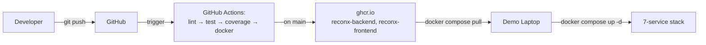

# TrainersGuide — Day 10: Docker, CI/CD & Final Demo

> **Student-facing equivalent:** [student-guides/day10/README.md](../../student-guides/day10/README.md)
> **Exercises:** Day 10 · TICKET-ADV146 – TICKET-ADV165 (20 hands-on exercises across the AM and PM workshop blocks — the heaviest day of the programme)
> **Theme:** Docker & CI/CD — Enterprise Deployment

This is the **highest-stakes day** of the Advanced Track. Twenty exercises is
nearly double a typical day, and the deliverables span Docker, GitHub
Actions, load testing, documentation, a slide deck, two rehearsals, and a
release tag. **By 16:00, demo rehearsal must already be running** — if the
team is still patching `docker-compose.yml` at 16:00, the demo will fall
over. Be ruthless about time-boxing the morning blocks.

The deploy story is **Option A**: GitHub Actions builds + pushes Docker
images to GHCR; the demo laptop pulls them and runs the full stack via
`docker compose up`. No cloud hosting, no PaaS, no Kubernetes. The demo
laptop **is** the deploy target.

---

## Day at a glance

| #    | Block | Exercises | What students produce |
|------|-------|-----------|----------------------|
| 1 | Standup + Day-9 carry-over | — | Kafka end-to-end confirmed, DLQ wired |
| 2 | **Workshop 10 — 7-Service Docker Compose + Multi-Stage GitHub Actions + Final Demo** (Part A — Dockerfiles + compose + provisioning) | TICKET-ADV146 – TICKET-ADV153 | 7-service compose stack boots clean |
| 3 | **Workshop 10 (Part B) — GitHub Actions pipeline** | TICKET-ADV154 – TICKET-ADV157 | CI green; images pushed to GHCR |
| 4 | **Workshop 10 (Part C) — Load test + screenshots** | TICKET-ADV158 – TICKET-ADV159 | k6 run captured; Grafana screenshots saved |
| 5 | **Workshop 10 (Part D) — Docs + deck + rehearsal + release** | TICKET-ADV160 – TICKET-ADV164 | README, mermaid diagram, deck, rehearsal #1, v1.0.0 |
| 6 | **Final demos** | — | Each team delivers their 20-min demo |
| 7 | Retrospective + close | TICKET-ADV165 | Filled retrospective markdown |

**Hard rule:** if a team is still touching Dockerfiles past 12:30, **stop
them**. Move them onto the smoke test using the trainer copy's compose file
and triage the Dockerfile after lunch. The CI/CD pipeline and demo deck
are non-negotiable deliverables — the Dockerfiles are not, because the
trainer copy has working ones.

---

## Pre-day instructor prep

The evening before Day 10:

- [ ] **Demo laptop logged into GHCR.** On the projector laptop you'll use
      tomorrow: `echo $GHCR_PAT | docker login ghcr.io -u <your-user>
      --password-stdin`. If you skip this and the morning standup runs
      long, the first `docker compose pull` of the day fails on stage.
- [ ] **All CI checks already green for the trainer copy.** Open
      `https://github.com/<org>/reconx-trainerCopy/actions` — every job
      on `main` is green. If any are red, fix tonight; you cannot debug
      a broken pipeline live tomorrow.
- [ ] **`docker compose pull` on the demo laptop tonight, plus
      `docker compose up -d` once to warm the cache.** Mid-demo pulls of
      a 400 MB Kafka image kill the room. Pull tonight.
- [ ] **Demo deck template ready.** A 10-slide skeleton with placeholders
      so each team copies and fills — not starts from a blank PowerPoint.
      Drop it at `TrainersGuide/day10/demo-deck-template.pptx` (or Google
      Slides equivalent).
- [ ] **Projector tested.** Plug in, fix resolution, check the
      browser zoom level is high enough that the back row can read
      the Grafana panels. Tabs you want open: GitHub Actions, GHCR
      packages page, Grafana, Swagger UI, Kafdrop.
- [ ] **Sample Grafana screenshots saved as fallback.** Five PNGs in
      `TrainersGuide/day10/fallback-screenshots/` — dashboard, breaks
      panel, Kafka lag, latency p95, request rate under load. If a team's
      Grafana dies live, you can paste the screenshots into their deck in
      90 seconds.
- [ ] **Pre-tag a trainer-copy `v1.0.0-reference`** so you can diff a
      team's repo against a known-good state during Workshop 10 (Part D).
- [ ] **Have a working 60-second master recording** of the full
      end-to-end demo (login → post trade → Kafka event → reconciliation
      → Grafana panel ticks). When every team's demo collapses, this is
      your final backup.

---

## Reference solutions — where they live

Every exercise below has a `<details>` block with the full reference code.
When a team is stuck, your unblocking ladder ends at **"open the `<details>`
block, read every line out loud to your pair before pasting."** That's the
convention.

| Exercise | Solution location |
|---|---|
| TICKET-ADV146 backend Dockerfile | Workshop 10 (Part A) → TICKET-ADV146 ▶ |
| TICKET-ADV147 frontend Dockerfile + nginx.conf | Workshop 10 (Part A) → TICKET-ADV147 ▶ |
| TICKET-ADV148 docker-compose.yml (7 services) | Workshop 10 (Part A) → TICKET-ADV148 ▶ |
| TICKET-ADV149 Prometheus scrape config | Workshop 10 (Part A) → TICKET-ADV149 ▶ |
| TICKET-ADV150 Grafana provisioning YAMLs | Workshop 10 (Part A) → TICKET-ADV150 ▶ |
| TICKET-ADV151 Liquibase entrypoint | Workshop 10 (Part A) → TICKET-ADV151 ▶ |
| TICKET-ADV152 compose healthchecks | Workshop 10 (Part A) → TICKET-ADV152 ▶ |
| TICKET-ADV153 compose smoke-test script | Workshop 10 (Part A) → TICKET-ADV153 ▶ |
| TICKET-ADV154 CI workflow with GHCR push | Workshop 10 (Part B) → TICKET-ADV154 ▶ |
| TICKET-ADV155 Liquibase validate step | Workshop 10 (Part B) → TICKET-ADV155 ▶ |
| TICKET-ADV156 JaCoCo coverage gate | Workshop 10 (Part B) → TICKET-ADV156 ▶ |
| TICKET-ADV157 static analysis config | Workshop 10 (Part B) → TICKET-ADV157 ▶ |
| TICKET-ADV158 k6 load test script | Workshop 10 (Part C) → TICKET-ADV158 ▶ |
| TICKET-ADV159 Grafana screenshot capture | Workshop 10 (Part C) → TICKET-ADV159 ▶ |
| TICKET-ADV160 mermaid architecture diagram | Workshop 10 (Part D) → TICKET-ADV160 ▶ |
| TICKET-ADV161 README outline | Workshop 10 (Part D) → TICKET-ADV161 ▶ |
| TICKET-ADV162 demo deck outline | Workshop 10 (Part D) → TICKET-ADV162 ▶ |
| TICKET-ADV163 rehearsal runsheet | Workshop 10 (Part D) → TICKET-ADV163 ▶ |
| TICKET-ADV164 release tag | Workshop 10 (Part D) → TICKET-ADV164 ▶ |
| TICKET-ADV165 retrospective template | End-of-day debrief |

---

## Workshop 10 (Part A) — Dockerfiles + compose + provisioning (~3 hr 15 min)

### TICKET-ADV146 — Backend multi-stage Dockerfile

**Acceptance criteria:** Multi-stage build, final image < 250 MB, JRE
(not JDK) in final layer, Maven layer cached when only `src/` changes.

**Common blockers:**

| Symptom | Cause | Unblocking ladder |
|---|---|---|
| First build takes 8 min | No Docker layer cache yet | **Just wait.** Normal first time. Second build should be 10-30 s if the Maven layer is cached. |
| Image is 800 MB | Single-stage build or final stage uses `:21-jdk` instead of `:21-jre-alpine` | **Nudge:** "Does your final `FROM` reference a JDK or JRE?" → **Hint:** "Multi-stage means TWO `FROM` lines." → **Reveal:** open the TICKET-ADV146 solution. |
| Every code change re-downloads Maven deps | `COPY src/` before `COPY pom.xml` | **Nudge:** "Why does the solution copy `pom.xml` first?" → **Reveal:** Docker layer caching depends on order. |
| `mvnw: not found` in build stage | `.mvn/` and `mvnw` not copied, or no execute bit | **Reveal:** show `COPY .mvn/ .mvn/`, `COPY mvnw .`, `RUN chmod +x mvnw`. |

<details>
<summary>▶ TICKET-ADV146 — Full backend Dockerfile</summary>

```dockerfile
# ============================================================================
# File: backend/Dockerfile
# TICKET-ADV146 — Multi-stage build: Maven (JDK) → JRE-only runtime
# ============================================================================

# ---- Stage 1: build ----
FROM eclipse-temurin:25-jdk-alpine AS build
WORKDIR /workspace

# Cache dependencies first — only re-download when pom.xml changes
COPY .mvn/ .mvn/
COPY mvnw pom.xml ./
RUN chmod +x mvnw && ./mvnw -B dependency:go-offline

# Then copy sources and build
COPY src ./src
RUN ./mvnw -B -DskipTests clean package \
    && mkdir -p target/extracted \
    && java -Djarmode=layertools -jar target/*.jar extract --destination target/extracted

# ---- Stage 2: runtime ----
FROM eclipse-temurin:25-jre-alpine
WORKDIR /app

# Non-root user — never run a JVM as root in production
RUN addgroup -S spring && adduser -S spring -G spring
USER spring:spring

# Spring Boot layered jars (faster rebuilds when only app code changes)
COPY --from=build /workspace/target/extracted/dependencies/         ./
COPY --from=build /workspace/target/extracted/spring-boot-loader/   ./
COPY --from=build /workspace/target/extracted/snapshot-dependencies/ ./
COPY --from=build /workspace/target/extracted/application/          ./

EXPOSE 8080
ENV JAVA_OPTS=""
ENTRYPOINT ["sh","-c","exec java $JAVA_OPTS org.springframework.boot.loader.launch.JarLauncher"]
```

Also: a sibling `backend/.dockerignore` containing `target/`, `.git`,
`.idea`, `*.iml`, `node_modules`. Without it the build context bloats
to several hundred MB and re-uploads on every build.

</details>

**Talking point — why multi-stage matters.** Single-stage images carry
the JDK (~ 450 MB), Maven, and the build cache into production. Show the
size diff live: `docker image ls reconx-backend`. 800 MB vs 180 MB. In
CI you pull this image dozens of times a day.

**▶ Run the project — verify TICKET-ADV146 end-to-end**

Build the backend image standalone and inspect it.

```bash
docker build -t reconx-backend backend/
docker images reconx-backend                   # check final size
docker run --rm reconx-backend sh -c "id; ls -la /app"
```

**Observe:**

- Multi-stage build (Maven/JDK build stage → `eclipse-temurin:25-jre-alpine` runtime); final image < 250 MB in `docker images`
- `docker run ... id` shows `uid=...(reconx)` — container does not run as root
- `/app/app.jar` exists and the `ENTRYPOINT` runs `java -jar app.jar`
- Failure signal: image is > 500 MB — the build stage was reused as the runtime; ensure `FROM eclipse-temurin:25-jre-alpine` is the final stage with only the fat-jar copied in

---

### TICKET-ADV147 — Frontend multi-stage Dockerfile + nginx.conf

**Acceptance criteria:** Vite build runs in node-alpine; runtime is
nginx-alpine serving `dist/`; SPA routing works (refresh on `/trades`
must not 404); API requests proxy to backend.

**Common blockers:**

| Symptom | Cause | Unblocking ladder |
|---|---|---|
| Refresh on `/trades` 404s | nginx has no `try_files` for SPA fallback | **Hint:** "nginx doesn't know it's an SPA. What tells it to serve `index.html` on every unknown path?" → **Reveal:** the `try_files` line in TICKET-ADV147. |
| `/api/v1/trades` calls hit nginx, return 404 | No `location /api/` proxy_pass | **Reveal:** show the proxy block in `nginx.conf`. |
| Build fails on `npm ci` | `package-lock.json` not committed | **Nudge:** "What does `npm ci` require that `npm install` doesn't?" → **Reveal:** commit the lockfile. |

<details>
<summary>▶ TICKET-ADV147 — Frontend Dockerfile + nginx.conf</summary>

```dockerfile
# ============================================================================
# File: frontend/Dockerfile
# TICKET-ADV147 — Vite build → nginx static serve
# ============================================================================

FROM node:22-alpine AS build
WORKDIR /app
COPY package.json package-lock.json ./
RUN npm ci
COPY . .
RUN npm run build

FROM nginx:1.27-alpine
COPY --from=build /app/dist /usr/share/nginx/html
COPY nginx.conf /etc/nginx/conf.d/default.conf
EXPOSE 80
HEALTHCHECK --interval=10s --timeout=3s CMD wget -qO- http://localhost/ || exit 1
CMD ["nginx", "-g", "daemon off;"]
```

```nginx
# File: frontend/nginx.conf
server {
    listen       80;
    server_name  _;
    root         /usr/share/nginx/html;
    index        index.html;

    # SPA fallback — every unknown path returns index.html so React Router takes over
    location / {
        try_files $uri $uri/ /index.html;
    }

    # Backend API proxy — keeps the browser on the same origin (no CORS)
    location /api/ {
        proxy_pass         http://backend:8080/api/;
        proxy_set_header   Host              $host;
        proxy_set_header   X-Real-IP         $remote_addr;
        proxy_set_header   X-Forwarded-For   $proxy_add_x_forwarded_for;
        proxy_set_header   X-Forwarded-Proto $scheme;
    }

    # Server-Sent Events feed (Day 7) — disable buffering
    location /api/v1/trades/stream {
        proxy_pass         http://backend:8080/api/v1/trades/stream;
        proxy_http_version 1.1;
        proxy_set_header   Connection        '';
        proxy_buffering    off;
        proxy_cache        off;
        chunked_transfer_encoding off;
    }
}
```

</details>

**▶ Run the project — verify TICKET-ADV147 end-to-end**

Build the frontend image and run it standalone.

```bash
docker build -t reconx-frontend frontend/
docker images reconx-frontend                  # check final size
docker run --rm -p 8081:80 reconx-frontend &
curl -sI http://localhost:8081/ | head -1      # expect 200 OK
```

**Observe:**

- Multi-stage build (`node:22-alpine` build → `nginx:alpine` runtime); final image < 50 MB in `docker images`
- nginx serves on port 80 inside the container; `curl -I` returns `HTTP/1.1 200 OK`
- `/api/` proxy rule from `nginx.conf` forwards to `backend:8080` (only verifiable inside compose, not standalone)
- Failure signal: image is hundreds of MB — the `node_modules/` directory was copied into the runtime stage; fix the second stage to copy only `dist/`

---

### TICKET-ADV148 — docker-compose.yml (7 services)

**Acceptance criteria:** All 7 services start with one command; backend
waits for Postgres and Kafka to be healthy before starting; Prometheus
scrapes the backend; Grafana auto-provisions the datasource and
dashboards.

**The single most-common Workshop-10-Part-A failure: `localhost` somewhere in a
service-to-service URL.** Almost every team hits this. Symptoms vary;
cause is the same — inside the compose network, use **service names**,
never `localhost`.

| Where the mistake hides | Symptom |
|---|---|
| `SPRING_DATASOURCE_URL` | Backend exits with "connection refused" to Postgres |
| `SPRING_KAFKA_BOOTSTRAP_SERVERS` | Backend boots, then dies on `KafkaTemplate.send` |
| `prometheus.yml` scrape target | Target = DOWN, error "no such host" |
| Grafana datasource URL | Every panel says "No data" |

**The second most-common: Kafka listener config.** Kafka needs **two**
advertised listeners — `kafka:29092` for inside the compose network,
`localhost:9092` for `kafka-console-producer` from your laptop. Most
students get this wrong on the first try.

<details>
<summary>▶ TICKET-ADV148 — Full docker-compose.yml (7 services + optional Kafdrop)</summary>

```yaml
# ============================================================================
# File: docker-compose.yml
# TICKET-ADV148 — Full ReconX stack
# ============================================================================
name: reconx

services:

  # ---- Data layer ----
  postgres:
    image: postgres:16-alpine
    container_name: reconx-postgres
    environment:
      POSTGRES_DB:       reconx
      POSTGRES_USER:     reconx_user
      POSTGRES_PASSWORD: reconx_pass
    volumes:
      - postgres_data:/var/lib/postgresql/data
    ports:
      - "5432:5432"
    healthcheck:
      test: ["CMD-SHELL", "pg_isready -U reconx_user -d reconx"]
      interval: 5s
      timeout: 5s
      retries: 10
    networks: [reconx-net]

  # ---- Messaging ----
  zookeeper:
    image: confluentinc/cp-zookeeper:7.6.0
    container_name: reconx-zookeeper
    environment:
      ZOOKEEPER_CLIENT_PORT: 2181
      ZOOKEEPER_TICK_TIME:   2000
    healthcheck:
      test: ["CMD-SHELL", "echo ruok | nc -w 2 localhost 2181 | grep imok"]
      interval: 10s
      timeout: 5s
      retries: 10
    networks: [reconx-net]

  kafka:
    image: confluentinc/cp-kafka:7.6.0
    container_name: reconx-kafka
    depends_on:
      zookeeper:
        condition: service_healthy
    ports:
      - "9092:9092"
    environment:
      KAFKA_BROKER_ID:                    1
      KAFKA_ZOOKEEPER_CONNECT:            zookeeper:2181
      KAFKA_LISTENER_SECURITY_PROTOCOL_MAP: PLAINTEXT:PLAINTEXT,PLAINTEXT_HOST:PLAINTEXT
      KAFKA_ADVERTISED_LISTENERS:         PLAINTEXT://kafka:29092,PLAINTEXT_HOST://localhost:9092
      KAFKA_LISTENERS:                    PLAINTEXT://0.0.0.0:29092,PLAINTEXT_HOST://0.0.0.0:9092
      KAFKA_INTER_BROKER_LISTENER_NAME:   PLAINTEXT
      KAFKA_OFFSETS_TOPIC_REPLICATION_FACTOR: 1
      KAFKA_AUTO_CREATE_TOPICS_ENABLE:    "true"
      KAFKA_JMX_PORT:                     9101
    healthcheck:
      test: ["CMD-SHELL", "kafka-topics --bootstrap-server kafka:29092 --list >/dev/null 2>&1"]
      interval: 10s
      timeout: 5s
      retries: 15
    networks: [reconx-net]

  # ---- Application ----
  backend:
    image: ${BACKEND_IMAGE:-ghcr.io/<org>/reconx-backend:latest}
    container_name: reconx-backend
    depends_on:
      postgres: { condition: service_healthy }
      kafka:    { condition: service_healthy }
    environment:
      SPRING_PROFILES_ACTIVE:           docker
      SPRING_DATASOURCE_URL:            jdbc:postgresql://postgres:5432/reconx
      SPRING_DATASOURCE_USERNAME:       reconx_user
      SPRING_DATASOURCE_PASSWORD:       reconx_pass
      SPRING_LIQUIBASE_ENABLED:         "true"
      SPRING_KAFKA_BOOTSTRAP_SERVERS:   kafka:29092
      MANAGEMENT_ENDPOINTS_WEB_EXPOSURE_INCLUDE: health,info,prometheus,metrics
      JWT_SECRET:                       ${JWT_SECRET:-changeme-in-prod-please}
    ports:
      - "8080:8080"
    healthcheck:
      test: ["CMD-SHELL", "wget -qO- http://localhost:8080/actuator/health | grep -q '\"status\":\"UP\"'"]
      interval: 10s
      timeout: 5s
      retries: 20
      start_period: 30s
    networks: [reconx-net]

  frontend:
    image: ${FRONTEND_IMAGE:-ghcr.io/<org>/reconx-frontend:latest}
    container_name: reconx-frontend
    depends_on:
      backend: { condition: service_healthy }
    ports:
      - "5173:80"
    healthcheck:
      test: ["CMD-SHELL", "wget -qO- http://localhost/ >/dev/null 2>&1 || exit 1"]
      interval: 10s
      timeout: 5s
      retries: 5
    networks: [reconx-net]

  # ---- Observability ----
  prometheus:
    image: prom/prometheus:v2.54.1
    container_name: reconx-prometheus
    volumes:
      - ./monitoring/prometheus/prometheus.yml:/etc/prometheus/prometheus.yml:ro
      - prometheus_data:/prometheus
    ports:
      - "9090:9090"
    networks: [reconx-net]

  grafana:
    image: grafana/grafana:11.2.0
    container_name: reconx-grafana
    depends_on: [prometheus]
    environment:
      GF_SECURITY_ADMIN_USER:     admin
      GF_SECURITY_ADMIN_PASSWORD: admin
      GF_USERS_ALLOW_SIGN_UP:     "false"
    volumes:
      - ./monitoring/grafana/provisioning:/etc/grafana/provisioning:ro
      - ./monitoring/grafana/dashboards:/var/lib/grafana/dashboards:ro
      - grafana_data:/var/lib/grafana
    ports:
      - "3000:3000"
    networks: [reconx-net]

  # ---- Optional: Kafdrop UI (disable with --profile no-kafdrop) ----
  kafdrop:
    image: obsidiandynamics/kafdrop:4.0.2
    container_name: reconx-kafdrop
    depends_on:
      kafka: { condition: service_healthy }
    environment:
      KAFKA_BROKERCONNECT: kafka:29092
    ports:
      - "9000:9000"
    networks: [reconx-net]
    profiles: ["debug"]

volumes:
  postgres_data:
  prometheus_data:
  grafana_data:

networks:
  reconx-net:
    driver: bridge
```

</details>

**Talking points:**
- **`depends_on: condition: service_healthy`** is what makes boot order
  deterministic. Without it the backend starts before Postgres is ready
  and exits with `Connection refused`.
- **`${BACKEND_IMAGE:-...}` env-var syntax** — show it live. Explain
  how `.env` overrides it for the demo to pin a specific SHA. Tie back
  to Option A deploy.
- **`profiles: ["debug"]` on Kafdrop** — keeps the default `docker
  compose up` to 7 services; debug tooling is opt-in with `--profile debug`.

**▶ Run the project — verify TICKET-ADV148 end-to-end**

Boot the full compose stack from a clean state.

```bash
docker compose down -v
docker compose up -d --build
# wait ~60s for all services to settle
docker compose ps
```

**Observe:**

- `docker compose ps` lists all eight services — postgres, kafka, zookeeper, kafdrop, prometheus, grafana, backend, frontend — each with STATUS column `Up ... (healthy)`
- `docker network ls` shows the project-scoped network (e.g. `reconx_reconx`) and every service is attached to it
- Named volumes `postgres_data` and `grafana_data` exist (`docker volume ls`) and persist across `docker compose restart`
- Failure signal: a service stays `restarting` — `docker compose logs <name>` shows the cause (wrong image, env var missing, port collision)

---

### TICKET-ADV149 — Prometheus scrape config

<details>
<summary>▶ TICKET-ADV149 — monitoring/prometheus/prometheus.yml</summary>

```yaml
# ============================================================================
# File: monitoring/prometheus/prometheus.yml
# TICKET-ADV149 — Scrape Spring Boot + Kafka JMX
# ============================================================================
global:
  scrape_interval:     10s
  evaluation_interval: 10s

scrape_configs:

  - job_name: 'spring-boot'
    metrics_path: /actuator/prometheus
    static_configs:
      - targets: ['backend:8080']
        labels:
          app:     reconx
          service: recon-service

  - job_name: 'kafka-jmx'
    static_configs:
      - targets: ['kafka:9101']
        labels:
          app:     reconx
          service: kafka

  - job_name: 'prometheus-self'
    static_configs:
      - targets: ['localhost:9090']
```

</details>

**Common blocker:** team uses `localhost:8080` as the scrape target.
Prometheus then tries to reach itself, gets nothing, dashboards stay
empty. **Service name, always.** Repeat the morning whiteboard mantra.

**▶ Run the project — verify TICKET-ADV149 end-to-end**

Bring Prometheus and the backend up, then check Prometheus is scraping the backend job.

```bash
docker compose up -d prometheus backend
open http://localhost:9090/targets
```

**Observe:**

- The `reconx-backend` target shows State `UP` with `scrape_interval=15s`
- Endpoint is `http://backend:8080/api/actuator/prometheus` (service name, not localhost)
- Querying `up{job="reconx-backend"}` in the Prometheus expression bar returns `1`
- Failure signal: target is DOWN with `connection refused` — `management.endpoints.web.exposure.include` is missing `prometheus`, or the backend isn't on the same compose network

---

### TICKET-ADV150 — Grafana provisioning

<details>
<summary>▶ TICKET-ADV150 — Grafana datasource + dashboard provisioning</summary>

```yaml
# ============================================================================
# File: monitoring/grafana/provisioning/datasources/prometheus.yml
# ============================================================================
apiVersion: 1

datasources:
  - name:      Prometheus
    type:      prometheus
    access:    proxy
    url:       http://prometheus:9090
    isDefault: true
    uid:       reconx-prometheus    # MUST match the datasource UID in every dashboard JSON
    editable:  false
```

```yaml
# ============================================================================
# File: monitoring/grafana/provisioning/dashboards/reconx.yml
# ============================================================================
apiVersion: 1

providers:
  - name:            'ReconX dashboards'
    orgId:           1
    folder:          'ReconX'
    type:            file
    disableDeletion: true
    updateIntervalSeconds: 30
    allowUiUpdates:  true
    options:
      path: /var/lib/grafana/dashboards
```

Dashboards JSON lives at `monitoring/grafana/dashboards/reconx-main.json`
(provisioned by the YAML above). Every panel inside must reference
`"datasource": { "type": "prometheus", "uid": "reconx-prometheus" }` —
the UID **must match** the datasource UID exactly, or panels render
"No data".

</details>

**Top pitfall:** the dashboard JSON was exported from a different Grafana
instance with a different datasource UID. All panels stay empty. **First
check** when Grafana looks blank: `docker compose logs grafana | grep -i
provision`. Then `grep "uid" monitoring/grafana/dashboards/*.json`
against the datasource UID.

**▶ Run the project — verify TICKET-ADV150 end-to-end**

Bring Grafana up under compose and confirm both the datasource and the dashboards are provisioned without any manual import.

```bash
docker compose up -d grafana
# wait ~10s for Grafana to import
open http://localhost:3000          # login admin / admin
```

**Observe:**

- Login screen accepts `admin` / `admin` (or whatever `GF_SECURITY_ADMIN_PASSWORD` is set to)
- Configuration → Data sources lists Prometheus as pre-configured with `http://prometheus:9090`
- Dashboards → Browse shows the ReconX Overview dashboard already loaded under the `ReconX` folder — no JSON import needed
- Failure signal: Grafana shows the empty welcome screen — the `provisioning/` directory wasn't bind-mounted into `/etc/grafana/provisioning`

---

### TICKET-ADV151 — Liquibase migrations on startup

There are two viable approaches. **Recommend in-app Liquibase** for this
programme — simpler, fewer moving parts, matches how grads will see it
in real teams.

<details>
<summary>▶ TICKET-ADV151 — Option A (recommended): in-app Liquibase via Spring Boot</summary>

```yaml
# File: backend/src/main/resources/application-docker.yml
spring:
  liquibase:
    enabled:        true
    change-log:     classpath:db/changelog/db.changelog-master.xml
    contexts:       prod
    drop-first:     false
  jpa:
    hibernate:
      ddl-auto:     validate    # NEVER `update` or `create` in a Liquibase-managed app
```

Spring Boot runs Liquibase on startup, before the app accepts traffic.
This is why `depends_on: postgres: service_healthy` matters — Liquibase
needs Postgres up before it can apply changesets.

</details>

<details>
<summary>▶ TICKET-ADV151 — Option B: separate init container (only if migrations are slow)</summary>

```yaml
# Add to docker-compose.yml — runs once, exits on success
db-migrate:
  image: ${BACKEND_IMAGE:-ghcr.io/<org>/reconx-backend:latest}
  container_name: reconx-db-migrate
  depends_on:
    postgres: { condition: service_healthy }
  environment:
    SPRING_DATASOURCE_URL:      jdbc:postgresql://postgres:5432/reconx
    SPRING_DATASOURCE_USERNAME: reconx_user
    SPRING_DATASOURCE_PASSWORD: reconx_pass
  entrypoint: ["java","-cp","app:app/lib/*","liquibase.integration.commandline.Main",
               "--changeLogFile=db/changelog/db.changelog-master.xml",
               "--url=jdbc:postgresql://postgres:5432/reconx",
               "--username=reconx_user","--password=reconx_pass","update"]
  restart: "no"
  networks: [reconx-net]

# Then make backend wait on it:
backend:
  depends_on:
    db-migrate: { condition: service_completed_successfully }
```

Use this if migrations take > 30 s and you want app startup decoupled
from migration runtime. Otherwise Option A is simpler.

</details>

**▶ Run the project — verify TICKET-ADV151 end-to-end**

Bring the stack up from a clean volume and confirm Liquibase runs before backend serves traffic.

```bash
docker compose down -v
docker compose up -d --build
docker compose logs backend | grep -i liquibase
docker exec reconx-postgres psql -U reconx -d reconx -c "SELECT id, author, filename FROM databasechangelog ORDER BY orderexecuted;"
```

**Observe:**

- Backend logs show `Liquibase: Successfully acquired change log lock` followed by changesets applied, before the Tomcat `Started Application` line
- `databasechangelog` table lists every changeset the team has authored
- Backend reaches healthy state only after Postgres reports `healthy` — proves `depends_on: service_healthy` is wired
- `hibernate.ddl-auto` resolves to `validate` in the running container (check `docker exec reconx-backend env | grep DDL` or boot logs)

---

### TICKET-ADV152 — Health checks (already in TICKET-ADV148 compose, this is the validation step)

This exercise is really "verify every healthcheck works in isolation".
Run through each:

```bash
docker compose up -d postgres
docker inspect --format='{{.State.Health.Status}}' reconx-postgres
# → "healthy" within 10s

docker compose up -d kafka
docker inspect --format='{{.State.Health.Status}}' reconx-kafka
# → "healthy" within 30s

docker compose up -d backend
docker inspect --format='{{.State.Health.Status}}' reconx-backend
# → "healthy" within 60s (Liquibase migrations run here)
```

**If a healthcheck is stuck on "starting" forever:** the check command is
wrong (often a typo in the wget/curl URL). Run the check command manually
in the container: `docker exec reconx-backend wget -qO- http://localhost:8080/actuator/health`.

**▶ Verify the artifact — TICKET-ADV152 end-to-end**

Audit every container's healthcheck individually, then assert each reaches `healthy`.

```bash
docker compose up -d
docker compose ps                                   # STATUS column must show (healthy) for every service
docker inspect $(docker compose ps -q backend) | grep -A 10 '"Health"'
```

**Observe:**

- Each service definition in `docker-compose.yml` has its own `healthcheck:` block (no service relies on `depends_on` alone)
- `docker compose ps` STATUS column reads `(healthy)` for postgres, kafka, zookeeper, kafdrop, prometheus, grafana, backend, frontend
- `docker inspect` Health block for backend shows `Status: healthy` with a recent `Log` entry returning exit code 0
- Failure signal: a service stuck in `(health: starting)` past its `start_period` — open its healthcheck command and fix it before continuing

---

### TICKET-ADV153 — Compose smoke-test script

This is the **5-step end-to-end verification** that IS the demo. If the
smoke test passes, the demo will pass.

<details>
<summary>▶ TICKET-ADV153 — scripts/smoke-test.sh</summary>

```bash
#!/usr/bin/env bash
# ============================================================================
# File: scripts/smoke-test.sh
# TICKET-ADV153 — End-to-end smoke test for the full 7-service stack
# Run from repo root: bash scripts/smoke-test.sh
# ============================================================================
set -euo pipefail

echo "▶ 1/7  Bringing the stack up..."
docker compose down -v >/dev/null 2>&1 || true
docker compose up -d
echo "  Waiting up to 90s for backend to be healthy..."
for i in {1..18}; do
  status=$(docker inspect --format='{{.State.Health.Status}}' reconx-backend 2>/dev/null || echo starting)
  [[ "$status" == "healthy" ]] && break
  sleep 5
done
[[ "$status" == "healthy" ]] || { echo "✗ backend not healthy"; exit 1; }
echo "  ✓ backend healthy"

echo "▶ 2/7  Logging in as trader..."
TOKEN=$(curl -fsS -X POST http://localhost:8080/api/auth/login \
  -H 'Content-Type: application/json' \
  -d '{"email":"trader@db.com","password":"trader123"}' | jq -r .accessToken)
[[ -n "$TOKEN" && "$TOKEN" != "null" ]] || { echo "✗ login failed"; exit 1; }
echo "  ✓ JWT acquired"

echo "▶ 3/7  Posting a trade..."
TRADE=$(curl -fsS -X POST http://localhost:8080/api/v1/trades \
  -H "Authorization: Bearer $TOKEN" \
  -H 'Content-Type: application/json' \
  -d '{"tradeRef":"SMOKE-001","instrumentSymbol":"SAP.DE","counterpartyLei":"5493001ABCDE12345001","quantity":100,"price":245.5,"tradeDate":"2026-06-02"}')
echo "  ✓ trade created: $(echo "$TRADE" | jq -r .id)"

echo "▶ 4/7  Confirming Kafka event..."
sleep 3
docker exec reconx-kafka kafka-console-consumer \
  --bootstrap-server kafka:29092 --topic trade-events \
  --from-beginning --max-messages 1 --timeout-ms 10000 | grep -q SMOKE-001 \
  && echo "  ✓ trade-event found on topic" || { echo "✗ no Kafka event"; exit 1; }

echo "▶ 5/7  Confirming Postgres audit row..."
docker exec reconx-postgres psql -U reconx_user -d reconx -tAc \
  "SELECT COUNT(*) FROM audit_log WHERE table_name='trades';" | grep -qv '^0$' \
  && echo "  ✓ audit row present" || { echo "✗ no audit row"; exit 1; }

echo "▶ 6/7  Confirming Prometheus scrape..."
curl -fsS http://localhost:9090/api/v1/query?query=up\{job=\"spring-boot\"\} \
  | jq -e '.data.result[0].value[1]=="1"' >/dev/null \
  && echo "  ✓ Prometheus scraping backend" || { echo "✗ Prometheus target DOWN"; exit 1; }

echo "▶ 7/7  Confirming Grafana datasource..."
curl -fsS -u admin:admin http://localhost:3000/api/datasources/uid/reconx-prometheus \
  | jq -e '.uid=="reconx-prometheus"' >/dev/null \
  && echo "  ✓ Grafana datasource provisioned" || { echo "✗ Grafana datasource missing"; exit 1; }

echo
echo "✅  All 7 checks green — stack is demo-ready."
```

</details>

**Run this for every team before lunch.** If their `smoke-test.sh`
exits 0, they will demo successfully. If it doesn't, you have until
13:30 to triage.

**▶ Run the project — verify TICKET-ADV153 end-to-end**

Run the smoke script against the running compose stack.

```bash
docker compose up -d --wait
bash scripts/smoke-test.sh
echo "exit=$?"
```

**Observe:**

- Every check line prints `✓` and the script exits with `0`
- Final line: `All 7 checks green — stack is demo-ready.`
- Failure signal: stop one service (`docker compose stop prometheus`) and re-run — the corresponding line prints `✗`, the script exits non-zero, and it names exactly which check failed

---

## Workshop 10 (Part B) — GitHub Actions pipeline (~1 hr 15 min)

### TICKET-ADV154 — CI workflow with GHCR push

**Acceptance criteria:** Push to any branch runs lint + test + build;
push to `main` additionally builds Docker images and pushes them to
GHCR; PR comments include test summary; the workflow uses
`GITHUB_TOKEN`, not a PAT.

**Common blockers:**

| Symptom | Cause | Unblocking ladder |
|---|---|---|
| `403 Forbidden` on first GHCR push | Missing `permissions: packages: write` | **Hint:** "GitHub's workflow token is read-only by default — how do you opt in to package writes?" → **Reveal:** the `permissions:` block in TICKET-ADV154. |
| Image tag = `refs-heads-main` not a SHA | Used `github.ref` instead of `github.sha` | **Nudge:** "What's the difference between `github.ref` and `github.sha`?" → **Reveal:** the metadata-action block. |
| `:latest` is stale after push | Both tags must be in the same metadata-action `tags:` block | **Reveal:** show both `type=raw,value=latest` and `type=sha`. |
| `docker pull` from laptop fails — `denied` | Skipped `docker login ghcr.io` or wrong PAT scope | **Reveal:** `read:packages` is the only scope needed. |
| Test job times out at 360 min | Forgot a `timeout-minutes:` cap; one stuck test hangs | **Reveal:** every job needs `timeout-minutes: 15`. |

<details>
<summary>▶ TICKET-ADV154 — Full .github/workflows/ci.yml</summary>

```yaml
# ============================================================================
# File: .github/workflows/ci.yml
# TICKET-ADV154 — Multi-stage CI: lint → test → build → docker → push (GHCR)
# ============================================================================
name: CI

on:
  push:
    branches: [main, develop]
    tags: ['v*']
  pull_request:
    branches: [main, develop]

permissions:
  contents: read
  packages: write           # required for GHCR push
  pull-requests: write      # required for PR comments

env:
  REGISTRY:        ghcr.io
  BACKEND_IMAGE:   ${{ github.repository_owner }}/reconx-backend
  FRONTEND_IMAGE:  ${{ github.repository_owner }}/reconx-frontend

jobs:

  lint:
    runs-on: ubuntu-latest
    timeout-minutes: 10
    steps:
      - uses: actions/checkout@v4
      - uses: actions/setup-java@v4
        with: { java-version: '25', distribution: 'temurin', cache: 'maven' }
      - name: Checkstyle
        working-directory: backend
        run: ./mvnw -B checkstyle:check
      - uses: actions/setup-node@v4
        with: { node-version: '22', cache: 'npm', cache-dependency-path: frontend/package-lock.json }
      - name: ESLint
        working-directory: frontend
        run: npm ci && npm run lint

  test:
    needs: lint
    runs-on: ubuntu-latest
    timeout-minutes: 20
    services:
      postgres:
        image: postgres:16-alpine
        env:
          POSTGRES_DB:       reconx_test
          POSTGRES_USER:     reconx_user
          POSTGRES_PASSWORD: reconx_pass
        ports: ['5432:5432']
        options: >-
          --health-cmd "pg_isready -U reconx_user"
          --health-interval 5s --health-timeout 5s --health-retries 10
    steps:
      - uses: actions/checkout@v4
      - uses: actions/setup-java@v4
        with: { java-version: '25', distribution: 'temurin', cache: 'maven' }

      # TICKET-ADV155 — Liquibase validate must pass before tests run
      - name: Liquibase validate
        working-directory: backend
        run: ./mvnw -B liquibase:validate -Dliquibase.url=jdbc:postgresql://localhost:5432/reconx_test

      - name: Backend tests + coverage
        working-directory: backend
        run: ./mvnw -B verify          # `verify` triggers JaCoCo report + coverage gate (TICKET-ADV156)

      - name: Upload JaCoCo report
        if: always()
        uses: actions/upload-artifact@v4
        with:
          name: jacoco-report
          path: backend/target/site/jacoco/

      - name: Frontend tests
        working-directory: frontend
        run: npm ci && npm test -- --run

  build-and-push:
    needs: test
    runs-on: ubuntu-latest
    timeout-minutes: 30
    if: github.event_name == 'push' && (github.ref == 'refs/heads/main' || startsWith(github.ref, 'refs/tags/v'))
    steps:
      - uses: actions/checkout@v4

      - uses: docker/setup-qemu-action@v3
      - uses: docker/setup-buildx-action@v3

      - name: GHCR login
        uses: docker/login-action@v3
        with:
          registry: ${{ env.REGISTRY }}
          username: ${{ github.actor }}
          password: ${{ secrets.GITHUB_TOKEN }}

      - name: Backend image metadata
        id: meta-backend
        uses: docker/metadata-action@v5
        with:
          images: ${{ env.REGISTRY }}/${{ env.BACKEND_IMAGE }}
          tags: |
            type=raw,value=latest,enable={{is_default_branch}}
            type=sha,format=long
            type=ref,event=tag

      - name: Build + push backend
        uses: docker/build-push-action@v6
        with:
          context:   ./backend
          push:      true
          tags:      ${{ steps.meta-backend.outputs.tags }}
          labels:    ${{ steps.meta-backend.outputs.labels }}
          cache-from: type=gha
          cache-to:   type=gha,mode=max
          platforms:  linux/amd64,linux/arm64

      - name: Frontend image metadata
        id: meta-frontend
        uses: docker/metadata-action@v5
        with:
          images: ${{ env.REGISTRY }}/${{ env.FRONTEND_IMAGE }}
          tags: |
            type=raw,value=latest,enable={{is_default_branch}}
            type=sha,format=long
            type=ref,event=tag

      - name: Build + push frontend
        uses: docker/build-push-action@v6
        with:
          context:   ./frontend
          push:      true
          tags:      ${{ steps.meta-frontend.outputs.tags }}
          labels:    ${{ steps.meta-frontend.outputs.labels }}
          cache-from: type=gha
          cache-to:   type=gha,mode=max
          platforms:  linux/amd64,linux/arm64
```

</details>

**Talking points:**
- **Why `:sha` AND `:latest`?** `:sha` is your audit trail (immutable,
  always the same image). `:latest` is convenience for "just pull
  whatever's newest". For the actual demo, **pin SHAs** in `.env`.
- **`cache-from/cache-to: type=gha`** — first CI build is slow; second
  reuses Docker layers and is 2-3x faster. Show the second build live.
- **Workflow token vs PAT.** `secrets.GITHUB_TOKEN` is auto-injected,
  scoped to the repo, no secret storage required. Use PATs only when the
  workflow token doesn't have the scope you need.

**▶ Run the project — verify TICKET-ADV154 end-to-end**

Push a feature branch and let GitHub Actions run the full pipeline.

```bash
git checkout -b ci/smoke && git commit --allow-empty -m "chore: smoke CI" && git push -u origin ci/smoke
gh run watch
```

**Observe:**

- GitHub UI shows the workflow run with all jobs green: `backend-build-and-test`, `frontend-build-and-test`, `lint`
- On a push to `main`, the `docker-push` job runs and pushes `reconx-backend` + `reconx-frontend` to GHCR with both `:latest` and `:${SHA}` tags
- Failure signal: any unit test, Liquibase validate, or coverage gate fails — the job stops and the PR check goes red

---

### TICKET-ADV155 — Liquibase validate in CI

Embedded in TICKET-ADV154 as the first step of the `test` job. The standalone
step is:

<details>
<summary>▶ TICKET-ADV155 — Standalone Liquibase validate step</summary>

```yaml
- name: Liquibase validate
  working-directory: backend
  run: |
    ./mvnw -B liquibase:validate \
      -Dliquibase.url=jdbc:postgresql://localhost:5432/reconx_test \
      -Dliquibase.username=reconx_user \
      -Dliquibase.password=reconx_pass
```

**What this catches:** pending changesets, checksum mismatches (someone
edited an already-applied changeset), XML parse errors, undeclared
preconditions. Fails the build before any test runs — saves 10 minutes
of "tests fail mysteriously" debugging.

</details>

**Demo tip for the AM whiteboard:** edit a changeset on the trainer
copy, run `mvn liquibase:validate` locally, show the checksum mismatch
error. Then revert. This is the moment grads understand why migrations
are immutable.

**▶ Run the project — verify TICKET-ADV155 end-to-end**

Run Liquibase validate locally — this is what the CI step does.

```bash
cd backend && ./mvnw -B liquibase:validate
```

**Observe:**

- Console prints `Liquibase command 'validate' was executed successfully` (or equivalent SUCCESS marker)
- In the CI run logs, the `Liquibase validate` step is green
- Failure signal: introduce a typo in any `db/changelog/*.xml` and the step fails with `Unexpected error running Liquibase: Error parsing changelog` — proves the gate actually inspects the changelogs

---

### TICKET-ADV156 — JaCoCo coverage gate at 85%

<details>
<summary>▶ TICKET-ADV156 — JaCoCo enforce rule in backend/pom.xml</summary>

```xml
<plugin>
    <groupId>org.jacoco</groupId>
    <artifactId>jacoco-maven-plugin</artifactId>
    <version>0.8.12</version>
    <executions>
        <execution>
            <id>prepare-agent</id>
            <goals><goal>prepare-agent</goal></goals>
        </execution>
        <execution>
            <id>report</id>
            <phase>test</phase>
            <goals><goal>report</goal></goals>
        </execution>
        <execution>
            <id>coverage-gate</id>
            <phase>verify</phase>
            <goals><goal>check</goal></goals>
            <configuration>
                <rules>
                    <rule>
                        <element>BUNDLE</element>
                        <limits>
                            <limit>
                                <counter>LINE</counter>
                                <value>COVEREDRATIO</value>
                                <minimum>0.85</minimum>
                            </limit>
                            <limit>
                                <counter>BRANCH</counter>
                                <value>COVEREDRATIO</value>
                                <minimum>0.70</minimum>
                            </limit>
                        </limits>
                    </rule>
                </rules>
                <excludes>
                    <exclude>**/dto/**</exclude>
                    <exclude>**/config/**</exclude>
                    <exclude>**/ReconxApplication.class</exclude>
                </excludes>
            </configuration>
        </execution>
    </executions>
</plugin>
```

</details>

**Common pitfall:** report path is wrong, so the gate "passes" because
it has no data to check. **Verify** by looking at the CI logs for
`Rule violated for bundle reconx-backend: lines covered ratio is X.XX,
but expected minimum is 0.85`. If you don't see *any* JaCoCo line in the
log, the report wasn't generated — fix the path before celebrating green
builds.

**▶ Run the project — verify TICKET-ADV156 end-to-end**

Run the verify phase locally to generate the JaCoCo report; the CI gate parses the same file.

```bash
./mvnw -pl backend verify
open backend/target/site/jacoco/index.html
```

**Observe:**

- BUILD SUCCESS with the JaCoCo HTML report at `backend/target/site/jacoco/index.html` showing >= 85% line coverage overall
- Failure signal: BUILD FAILURE with `Insufficient coverage` or the CI `Coverage gate` step printing `Line coverage XX% below 85%` and exiting non-zero
- `target/site/jacoco/jacoco.csv` exists — this is what the CI script parses

---

### TICKET-ADV157 — Static analysis (Checkstyle or SpotBugs)

Pick **one**. Checkstyle is easier to onboard; SpotBugs catches real
bugs. For this programme, Checkstyle.

<details>
<summary>▶ TICKET-ADV157 — Checkstyle plugin + checkstyle.xml</summary>

```xml
<!-- backend/pom.xml -->
<plugin>
    <groupId>org.apache.maven.plugins</groupId>
    <artifactId>maven-checkstyle-plugin</artifactId>
    <version>3.5.0</version>
    <configuration>
        <configLocation>checkstyle.xml</configLocation>
        <failOnViolation>true</failOnViolation>
        <violationSeverity>warning</violationSeverity>
        <consoleOutput>true</consoleOutput>
    </configuration>
    <executions>
        <execution>
            <phase>validate</phase>
            <goals><goal>check</goal></goals>
        </execution>
    </executions>
</plugin>
```

Drop a pragmatic `backend/checkstyle.xml` (start with the Google checks,
disable the picky ones). **Do not turn it off when it flags 200
violations** — that's the anti-pattern from prior cohorts. Either fix
the top 20 and `<suppressions>` the rest, or tighten the config to only
the rules you'll actually enforce.

</details>

**▶ Run the project — verify TICKET-ADV157 end-to-end**

Run Checkstyle locally; the CI `lint` job already invokes the same goal.

```bash
./mvnw -pl backend checkstyle:check
```

**Observe:**

- BUILD SUCCESS when no rule is violated; HTML report written to `backend/target/site/checkstyle.html`
- BUILD FAILURE with a list of `[ERROR]` violations when rules trip
- Failure signal: `Could not find goal 'check' in plugin org.apache.maven.plugins:maven-checkstyle-plugin` — the trainer pom currently ships without the plugin, so add it (this is the work for the ticket) before re-running

---

## Workshop 10 (Part C) — Load test + Grafana screenshots (~45 min)

### TICKET-ADV158 — k6 load test (200 concurrent trade creations)

<details>
<summary>▶ TICKET-ADV158 — loadtest/trade-creation.js</summary>

```javascript
// ============================================================================
// File: loadtest/trade-creation.js
// TICKET-ADV158 — k6 load test: 200 concurrent users posting trades for 2 min
// Run:  k6 run loadtest/trade-creation.js
// ============================================================================
import http from 'k6/http';
import { check, sleep } from 'k6';
import { Trend, Rate } from 'k6/metrics';

const tradeLatency = new Trend('trade_post_latency_ms');
const errorRate    = new Rate('trade_post_errors');

export const options = {
  scenarios: {
    constant_load: {
      executor:        'constant-vus',
      vus:             200,
      duration:        '2m',
      gracefulStop:    '10s',
    },
  },
  thresholds: {
    'trade_post_latency_ms': ['p(95)<800', 'p(99)<2000'],
    'trade_post_errors':     ['rate<0.02'],
    'http_req_failed':       ['rate<0.02'],
  },
};

const BASE_URL = __ENV.BASE_URL || 'http://localhost:8080';

// One-time login per VU
export function setup() {
  const res = http.post(`${BASE_URL}/api/auth/login`,
    JSON.stringify({ email: 'trader@db.com', password: 'trader123' }),
    { headers: { 'Content-Type': 'application/json' } });
  return { token: res.json('accessToken') };
}

export default function (data) {
  const payload = JSON.stringify({
    tradeRef:         `LT-${__VU}-${__ITER}-${Date.now()}`,
    instrumentSymbol: 'SAP.DE',
    counterpartyLei:  '5493001ABCDE12345001',
    quantity:         100 + (__VU % 50),
    price:            245.50 + (__ITER % 10) * 0.01,
    tradeDate:        '2026-06-02',
  });

  const t0 = Date.now();
  const res = http.post(`${BASE_URL}/api/v1/trades`, payload, {
    headers: {
      'Content-Type':  'application/json',
      Authorization:  `Bearer ${data.token}`,
    },
  });
  tradeLatency.add(Date.now() - t0);

  const ok = check(res, {
    '201 created':   r => r.status === 201,
    'has trade id':  r => !!r.json('id'),
  });
  errorRate.add(!ok);

  sleep(0.5);
}
```

**Run while watching Grafana:** `BASE_URL=http://localhost:8080 k6 run
loadtest/trade-creation.js`. You should see request rate spike to ~400
RPS, p95 latency climb briefly, then settle as the JVM warms up. **Take
screenshots during the test** — that's TICKET-ADV159.

</details>

**Common blocker:** k6 hits 200 VUs but request rate is only 50 RPS.
Cause: backend is the bottleneck (HikariCP pool size = 10 by default).
Either tune `spring.datasource.hikari.maximum-pool-size: 50` or accept
the result and discuss it during the demo (honest "we identified the
bottleneck" beats hand-waving).

**▶ Run the project — verify TICKET-ADV158 end-to-end**

Run the k6 script against the running stack with a fresh JWT.

```bash
export TOKEN=$(curl -s -X POST localhost:8080/auth/login -H 'Content-Type: application/json' \
  -d '{"username":"trader1","password":"changeme"}' | jq -r .token)
k6 run perf-test/load.js
```

**Observe:**

- 100+ VUs ramp up over ~30s, hold for ~60s, ramp down — matches the `stages` block in the script
- k6 summary shows p95 latency < 200ms and HTTP error rate < 1%
- Grafana panels light up under load — Kafka consumer lag spikes then drains, recon throughput stays steady
- Failure signal: thresholds breached — k6 exits non-zero and prints which threshold (`http_req_duration{p(95)}` or `errors`) failed

---

### TICKET-ADV159 — Grafana screenshots

Three screenshots required for the demo deck + README:

1. **Steady-state dashboard** — request rate < 5 RPS, Kafka lag 0,
   latency p95 ~ 50ms.
2. **Under load** — taken during the k6 run. Request rate ~ 200-400
   RPS, Kafka consumer lag visible, latency p95 climbing.
3. **Recovery** — 30 s after k6 finished. Request rate back to baseline,
   Kafka lag flushed to 0.

**Capture method:** Grafana → panel → "Share" → "Direct link rendered
image" → save the PNG. Don't use OS screenshots — the rendered images
look professional and crop cleanly.

**Saved as:** `docs/screenshots/grafana-baseline.png`,
`grafana-under-load.png`, `grafana-recovery.png`. **Reference them from
the README** so they actually get reviewed.

**▶ Verify the artifact — TICKET-ADV159 end-to-end**

The deliverable is screenshots; list and open them.

```bash
ls -lh docs/screenshots/grafana-*.png
open docs/screenshots/grafana-baseline.png docs/screenshots/grafana-under-load.png docs/screenshots/grafana-recovery.png
```

**Observe:**

- Three PNGs committed: `grafana-baseline.png`, `grafana-under-load.png`, `grafana-recovery.png` (each well under 1 MB)
- Baseline shows idle stack — low RPS, low p95, zero Kafka lag
- Under-load shot captures the k6 run — elevated RPS, raised p95, visible Kafka consumer lag
- Recovery shot shows the system 30+ seconds after k6 stops — Kafka lag back to 0
- All three are referenced from the README with descriptive captions

---

## Workshop 10 (Part D) — Docs + deck + rehearsal + release (~1 hr)

### TICKET-ADV160 — Mermaid architecture diagram

Two diagrams required: runtime architecture, and CI/CD flow.

<details>
<summary>▶ TICKET-ADV160 — Mermaid runtime + CI/CD diagrams</summary>

````markdown
## Runtime architecture

```mermaid
graph TD
    User[Ops Analyst] -->|HTTPS| FE[React + Vite<br/>nginx-alpine]
    FE -->|/api/* proxy| BE[Spring Boot 3<br/>Java 25]
    BE -->|JDBC| PG[(PostgreSQL 16<br/>+ Liquibase)]
    BE -->|KafkaTemplate| K[Apache Kafka<br/>trade-events, recon-results,<br/>system-alerts, DLQ]
    K -->|@KafkaListener| C1[ReconConsumer]
    K -->|@KafkaListener| C2[AuditConsumer]
    K -->|@KafkaListener| C3[AlertConsumer]
    C1 --> PG
    C2 --> PG
    BE -->|/actuator/prometheus| PR[Prometheus]
    PR --> GR[Grafana<br/>dashboards + alerts]
```

## CI/CD + deploy flow


````

</details>

**Common student mistake:** they draw the runtime diagram and skip the
CI/CD diagram. **Both are required.** Push back on PRs that have only
one. Mermaid renders natively on GitHub — `docker compose up` is not
needed to view them.

**▶ Run the project — verify TICKET-ADV160 end-to-end**

Push the README and open it on GitHub so Mermaid renders the diagrams natively.

```bash
git add README.md && git commit -m "docs: add architecture and CI/CD mermaid diagrams"
git push
# then open the repo on GitHub in a browser
```

**Observe:**

- Runtime mermaid diagram renders showing browser → frontend → backend → Postgres + Kafka + Prometheus → Grafana
- CI/CD mermaid diagram renders showing dev → branch → PR → CI → main → GHCR push → demo machine pull
- Both diagrams render natively on GitHub without requiring any local plugin
- Failure signal: GitHub shows raw ```mermaid fence — fenced block is mis-labelled or has a syntax error

---

### TICKET-ADV161 — Comprehensive README

<details>
<summary>▶ TICKET-ADV161 — README outline</summary>

```markdown
# ReconX — Enterprise Trade Reconciliation Platform

## Quick start (3 commands, < 60 s on a warm laptop)
```bash
echo $GHCR_PAT | docker login ghcr.io -u <user> --password-stdin
docker compose pull
docker compose up -d
```
Open http://localhost:5173 — login as `trader@db.com / trader123`.

## Table of contents
- [Architecture](#architecture) — mermaid runtime + CI/CD diagrams
- [Tech stack](#tech-stack) — Java 25, Spring Boot 3, Kafka, Postgres, React, Vite
- [API documentation](#api-documentation) — Swagger UI at /swagger-ui.html
- [Monitoring](#monitoring) — Prometheus scrape, Grafana dashboards (screenshots)
- [Kafka topics](#kafka-topics) — trade-events, recon-results, system-alerts, DLQ
- [Load test results](#load-test-results) — k6 200 VUs, p95 latency, throughput
- [CI/CD pipeline](#cicd-pipeline) — lint → test → coverage 85% → docker → GHCR
- [Deploy runbook](#deploy-runbook) — exactly 3 commands
- [Default credentials](#default-credentials) — dev profile only
- [Troubleshooting](#troubleshooting) — port conflicts, GHCR auth, Kafka listener
- [Team](#team) — who built what
```

**Review the PR for:**
- [ ] Quick-start fits above the fold (no scrolling on a 13" laptop).
- [ ] Deploy runbook is exactly 3 commands.
- [ ] Architecture diagrams link inline (Mermaid).
- [ ] Grafana screenshots are *recent* — taken during today's load test,
      not Day 6 placeholders.

</details>

**▶ Verify the artifact — TICKET-ADV161 end-to-end**

Open the top-level README on GitHub (or render locally) and audit it as a recruiter would.

```bash
open README.md   # or preview it on the GitHub web UI
```

**Observe:**

- Quick-start section is above the fold and is exactly three commands
- Table of contents links to all ten promised sections (Architecture, Tech stack, API docs, Monitoring, Kafka topics, Load test results, CI/CD, Deploy runbook, Credentials, Troubleshooting)
- Mermaid runtime + CI/CD diagrams render inline under `## Architecture`
- All three Grafana screenshots from ADV159 appear inline under `## Monitoring` with captions
- Swagger UI URL is linked under `## API documentation`

---

### TICKET-ADV162 — Demo deck (10 slides)

<details>
<summary>▶ TICKET-ADV162 — 10-slide outline (one line each)</summary>

| # | Slide | One-line content | Speaker note tip |
|---|---|---|---|
| 1 | Title | "ReconX — Enterprise Trade Reconciliation" + team names | 10 s max — don't read the title aloud |
| 2 | Problem | "Ops teams reconcile thousands of trades daily; mismatches cost millions" | Anchor in DB context — name a real ops pain point |
| 3 | Architecture | Mermaid runtime diagram | Point at each box, name the tech, 60 s total |
| 4 | Tech stack | Java 25 / Spring Boot 3 / Kafka / Postgres 16 / React 19 / Vite / Prometheus / Grafana | Don't list — group by layer (data, app, messaging, UI, observability) |
| 5 | Live demo — login + post trade | Screenshot of the flow (fallback if live fails) | Narrate while live: "JWT, role-checked, validated, persisted" |
| 6 | Live demo — Kafka + auto-recon | Kafdrop screenshot + Grafana panel | Show the trade hitting the topic, then the panel ticking |
| 7 | CI/CD | Mermaid CI/CD diagram + green Actions screenshot | Emphasise "85% coverage gate, Liquibase validate, GHCR push" |
| 8 | Monitoring | Three Grafana screenshots (baseline, under load, recovery) | Walk left-to-right; name what changed |
| 9 | Learnings | 3 bullets: hardest bug, biggest win, what you'd do differently | Honest > polished; trainers reward self-reflection |
| 10 | Q&A | "Questions?" + repo URL | Have the repo open in a tab, ready to navigate |

</details>

**▶ Verify the artifact — TICKET-ADV162 end-to-end**

Demo deck is a written artifact — open and audit the slide table.

```bash
open docs/demo/deck.md   # or: cat docs/demo/deck.md
```

**Observe:**

- A table of exactly 10 slides, in order, with columns for title, duration, and owner (or visual)
- Slide durations sum to ≤ 20 minutes (matches the live slot)
- Q&A is the last slide and the repo URL is on it
- Every slide names the speaker so handoffs are explicit

---

### TICKET-ADV163 — Rehearsal (20-min runsheet)

<details>
<summary>▶ TICKET-ADV163 — Minute-by-minute demo runsheet</summary>

```
30 min  Title slide + team intros (lead speaks)
150 min  Problem + Architecture (slides 2-3) — lead walks mermaid diagram
60 min  Tech stack (slide 4) — no slide-reading; group by layer
60 min  Switch to live demo machine. JWT login. Show 200 OK in DevTools.
90 min  Post a trade via the UI. Show the request in the Network tab.
90 min  Switch to Kafdrop → trade-events topic → show the message body.
90 min  Switch to Grafana → request-rate panel ticking up.
90 min  Switch to backend logs → "Reconciled trade TRD-...". Show the
             audit row in Postgres (one psql command).
60 min  Switch back to slides. "That was the live flow. Now the code."
90 min  Code walkthrough — TradeController.createTrade (engineer #1)
90 min  Code walkthrough — ReconConsumer.onTradeEvent (engineer #2)
60 min  Code walkthrough — useTradeStream hook (engineer #3)
90 min  Learnings slide (whole team contributes one sentence each)
150 min  Q&A — whole team. Lead routes questions to the right answerer.
```

**Two rehearsals are required.**

- **Rehearsal 1** (~15:30): chaos monkey. Mid-demo, unplug ethernet,
  close a browser tab, hit `Ctrl+C` on a curl. Teach the team to recover
  gracefully — "we have a screen recording as a backup, here it is".
- **Rehearsal 2** (~16:15): instructor mode. Ask 2-3 hard questions
  from the Q&A bank.

</details>

**▶ Verify the artifact — TICKET-ADV163 end-to-end**

The runsheet is a written timing document; open it and walk through.

```bash
open docs/demo/runsheet.md   # or: cat docs/demo/runsheet.md
```

**Observe:**

- Minute-by-minute timing from 0 to ~25 minutes (cushion past the 20-minute slot)
- Each step names an owner and a one-line script of what to say
- Two rehearsal blocks documented (chaos-monkey + instructor-Q&A)
- Fallback notes for every live step (Kafka slow, POST fails, Grafana dies)

---

### TICKET-ADV164 — Tag release v1.0.0

<details>
<summary>▶ TICKET-ADV164 — Tag + push v1.0.0</summary>

```bash
# Make sure you're on main with the green CI commit
git checkout main
git pull origin main
git log --oneline -1                                # confirm the SHA

# Annotated tag with a release message
git tag -a v1.0.0 -m "Release v1.0.0 — TDI 2026 Advanced Track demo"

# Push the tag (triggers the tag-build job in TICKET-ADV154)
git push origin v1.0.0

# Verify the workflow ran and re-built images with v1.0.0 tag
gh run watch
gh api repos/:owner/:repo/packages/container/reconx-backend/versions | jq '.[] | .metadata.container.tags'
```

</details>

**Common blocker:** branch protection blocks the CI from pushing tags
back, or the tag-triggered workflow doesn't fire because the `on: tags:`
trigger was missing. **Verify** the tag-triggered build appears in
Actions and tagged images appear in GHCR before declaring success.

**▶ Run the project — verify TICKET-ADV164 end-to-end**

Cut the annotated v1.0.0 tag and confirm the tag-triggered workflow pushes versioned images to GHCR.

```bash
git tag -a v1.0.0 -m "Release v1.0.0 — TDI 2026 Advanced Track demo"
git push origin v1.0.0
gh run watch
```

**Observe:**

- Tag visible on the GitHub Releases page for the repo
- CI workflow re-runs on the tag and goes green
- GHCR shows `reconx-backend:v1.0.0` and `reconx-frontend:v1.0.0` alongside `latest`
- Failure signal: tag-triggered build never starts — `on: push: tags:` trigger is missing in `.github/workflows/ci.yml`

---

## Demo coaching

The demo is **20 minutes**: 3 min context + 8 min live demo + 5 min code
walkthrough + 4 min Q&A. The single biggest predictor of a good demo is
**rehearsal**. Teams that rehearsed twice deliver smoothly; teams that
rehearsed once stutter; teams that didn't rehearse run over time.

### Minute-by-minute script (give this to every team)

```
180 min   CONTEXT (slides 1-4)
              - Slide 1: title (10 s)
              - Slide 2: problem (30 s)
              - Slide 3: architecture diagram (90 s) — point at every box
              - Slide 4: tech stack (50 s)

480 min  LIVE DEMO
              - 3:00  Switch laptops/screens
              - 3:30  Login (JWT acquired, role displayed in header)
              - 4:30  Post trade via UI form
              - 5:30  Show Kafdrop message
              - 6:30  Show Grafana request-rate panel ticking
              - 7:30  Show backend log "Reconciled trade"
              - 8:30  Show Postgres audit_log row (psql one-liner)
              - 9:30  Resolve a break in the UI
              -10:30  Show recon-resolved metric tick + Grafana panel

300 min CODE WALKTHROUGH (slides 5-7 + IDE)
              - 11:00 TradeController + validation + JWT principal
              - 12:30 ReconConsumer + DLQ handling
              - 14:00 useTradeStream + SSE event source
              - 15:30 CI workflow YAML on GitHub

240 min Q&A
              - Lead routes questions to the right answerer.
              - "We didn't get to that" is a valid, respected answer.
```

### Demo killers to avoid

| Killer | What to do instead |
|---|---|
| **Live coding mid-demo** | Never. If you didn't ship it by 15:30, talk about it conceptually but don't type. |
| **Untested SQL in the demo** | Run every psql command twice during rehearsal. Have it in your shell history. |
| **Unconfigured laptop network** | Pre-test the demo laptop on the actual room WiFi. Phone hotspot fallback. |
| **Slow demo machine** | Pull images, run `docker compose up -d` 10 min before demo. Don't open Chrome with 80 tabs. |
| **Reading slides verbatim** | If a slide is read aloud, the slide is wrong. Slides anchor; you speak. |
| **Ignoring the time-box** | At minute 18, finish your current sentence and move to Q&A. Overrun bleeds into next team. |

### Have a fallback for every step

| Step | Primary | Fallback (have ready) |
|---|---|---|
| `docker compose up` | Already running from rehearsal | Pre-recorded 60 s clip of the boot |
| Kafka health | Kafdrop live | Screenshot of trade-events topic |
| Grafana panel | Live request-rate panel | Three saved Grafana PNGs |
| Postgres audit row | `psql -c "SELECT..."` | Screenshot of psql output in demo deck |
| Backend logs | `docker compose logs -f backend` in tmux | Saved log excerpt in a text file |
| Frontend | Browser open | Screen recording from Workshop 10 (Part C) |

If Kafka takes 30 s to be healthy live, **don't wait silently** — keep
narrating: "While Kafka comes up, let's look at the topic structure
in the code." Use the wait as runway, not dead air.

### Speaker-note tips per slide (10-slide deck)

1. **Title** — don't read. 10 s of "We're team X, we built ReconX."
2. **Problem** — anchor in real DB context. "Ops desks today reconcile
   trades against custodian feeds; mismatches go to manual queues."
3. **Architecture** — point at boxes left to right. Don't speak before
   you point. Cover: UI → API → DB, async via Kafka, observability arrow.
4. **Tech stack** — group by layer, don't recite. "Java + Spring on the
   backend, React on the front, Kafka for async, Prometheus + Grafana
   for observability."
5. **Live demo intro** — switch screens deliberately. "We're going to
   create a trade and watch it flow through every service."
6. **Live demo wrap** — explicit recap. "What you just saw: a trade
   crossed every one of those boxes in the diagram in under 200 ms."
7. **CI/CD** — emphasise the gates, not the tools. "Every commit runs
   lint, tests, 85% coverage, Liquibase validate."
8. **Monitoring** — three screenshots, left to right. "Baseline 5 RPS,
   under k6 load 400 RPS p95 climbs, recovery within 30 s."
9. **Learnings** — every team member contributes ONE sentence. No
   passing.
10. **Q&A** — lead opens. "Happy to take questions on any layer."

---

<details>
<summary><b>Q&A bank — practise these in Rehearsal 2</b></summary>


1. **Why GHCR not Docker Hub?** GHCR is integrated with GitHub auth — no
   second secret to manage. Image namespacing matches the repo. Free for
   public repos and generous private quotas. Docker Hub also imposes
   pull-rate limits on anonymous pulls; GHCR doesn't (with auth).

2. **Why squash-merge?** Keeps `main` linear and readable — one commit
   per feature, easy to revert, easy to bisect. The PR review history
   lives in the merged PR; the squash commit message references the PR
   number.

3. **Should the demo show test failures recovering?** No. Demos show the
   happy path. Failures belong in the learnings slide ("we hit X, here's
   how we debugged it") — not live on stage.

4. **What if Kafka is slow to start on the demo laptop?** It's pre-warmed
   from rehearsal. If it's still slow, narrate over the wait ("while
   Kafka comes up, here's the topic config"), or cut to the pre-recorded
   screen capture.

5. **How do you handle Q&A when you don't know the answer?** "Honest
   not-knowing is respected." Reply: "I'm not sure — my best guess is
   [...] but I'd want to verify in the code before committing." Never
   fabricate.

6. **Can two teams demo at the same time?** No. Each team owns the
   projector for their 20-min slot. Other teams watch, take notes, ask
   questions during the Q&A.

7. **What's the grading rubric?** See the table below. Live demo works
   end-to-end = 30%; code walkthrough shows ownership = 20%; Q&A
   under pressure = 20%; architecture explained correctly = 15%; polish
   (README, repo cleanliness, retro) = 15%.

8. **What if the k6 load test takes 10 min?** It shouldn't — the
   default config is 2 min. If it does, you tuned VUs too high or
   forgot `duration: '2m'`. For the demo, **use the screenshots**
   from Workshop 10 (Part C); don't re-run live.

9. **Can the rehearsal be on the production laptop?** It MUST be. The
   most common demo failure is "worked on my machine; didn't on the
   demo laptop." Rehearse on the actual hardware, network, and account
   you'll demo with.

10. **How long is rollback in production?** With the Option A deploy:
    pin the previous SHA in `.env`, `docker compose pull`, `docker
    compose up -d`. ~ 30 s on a warm cache. Liquibase rollback for the
    DB is one command: `./mvnw liquibase:rollback -Dliquibase.rollbackCount=1`.

11. **Why JaCoCo at 85% not 100%?** 100% is a vanity metric — it forces
    tests on getters and DTOs without adding signal. 85% on lines + 70%
    on branches is the industry sweet spot.

12. **Why service names instead of localhost in compose?** Inside a
    compose network, each service has a DNS name = its compose name.
    `localhost` inside a container means the container itself.

13. **How would you monitor this in production?** Same Prometheus +
    Grafana, plus alertmanager rules on (a) request rate dropping to 0
    for > 5 min, (b) Kafka consumer lag > 10k, (c) p99 latency > 2 s.

14. **What's the disaster-recovery story for Kafka?** Topics are
    replicated (factor 3 in real prod, 1 in our demo). Producers are
    idempotent. Consumers handle re-delivery via dedupe on `trade_ref`.

15. **What would you do with another week?** Real answers: harden auth
    (refresh token rotation), add e2e tests in CI (Playwright against
    docker-compose), break the monolith into recon-svc + audit-svc.

---

</details>

## End-of-day debrief prompts

At 17:15, after the last demo:

1. "Sketch the runtime architecture diagram from memory. What goes where?"
2. "Walk me through what happens between `git push` and an updated image
   on GHCR. Name every step."
3. "If a new joiner started Monday, what's the first command they'd run
   to get the app up?"
4. "What broke today that you didn't expect? What did you learn?"
5. "Of everything we built across 10 days, what would you keep, what
   would you cut, and what would you add?"

---

## Retrospective template — TICKET-ADV165

Each team fills this in. Drop it at `docs/retrospective.md` in their repo
and link from the README.

</details>

<details>
<summary>▶ TICKET-ADV165 — Retrospective markdown template</summary>

```markdown
# ReconX — Team [Name] — Retrospective

## What worked?
- (e.g. pair-programming on Day 3 caught bugs early)
- (e.g. trainer copy reference unblocked us on Day 9 Kafka)

## What didn't?
- (e.g. underestimated Day 5 RBAC — ran 90 min over)
- (e.g. nobody reviewed PRs on Day 6 — coverage drifted)

## What would you change?
- (e.g. start Day 10 Dockerfile work on Day 9 evening)
- (e.g. lock the schema by end of Day 1 and refuse to alter it)

## What surprised you?
- (e.g. how much time observability saved during debugging on Day 9)
- (e.g. how strict the JaCoCo gate was — caught one untested branch)

## Technical notes for the next cohort
- (anything they should know — gotchas, shortcuts, "we wasted 2 hours on X")

<details>
<summary><b>Team</b></summary>

- Lead:        [name]
- Backend:     [name]
- Frontend:    [name]
- DevOps/CI:   [name]
```

</details>

**▶ Verify the artifact — TICKET-ADV165 end-to-end**

Retrospective is a written artifact; open and scan it.

```bash
open docs/retrospective.md   # or: cat docs/retrospective.md
```

**Observe:**

- Sections present: What worked / What didn't / What would you change / What surprised you / Technical notes
- Team roster lists every team member (lead, backend, frontend, DevOps/CI)
- README's `## Team` section links to `docs/retrospective.md`

---

</details>

<details>
<summary><b>Things that have gone wrong before</b></summary>


- **Demo laptop hadn't been `docker compose pull`'d in the morning.**

  First pull during the demo stalled on a 400 MB Kafka image; the team filled 4 minutes of dead air.

  **Fix:** pull in the morning, period. Add it to the pre-day checklist.

- **Kafka took 45 s to be healthy and `depends_on` didn't wait.**

  Backend started before Kafka was ready and exited on `KafkaTemplate.send`.

  **Fix:** `depends_on: kafka: condition: service_healthy` is non-negotiable. Bump `retries: 15` and `interval: 10s` on Kafka's healthcheck.

- **Grafana datasource UID didn't match between provisioning JSON and dashboard JSON.**

  Every panel showed "No data". Team spent 20 min in the wrong place.

  **Fix:** UID must match exactly. First check: `docker compose logs grafana | grep -i provision`, then `grep '"uid"' monitoring/grafana/dashboards/*.json`.

- **CI pipeline never failed on coverage drop.**

  JaCoCo report wasn't at the path the workflow expected, so the gate silently passed with zero data. Coverage drifted from 85% to 62% across a week, undetected.

  **Fix:** assert the JaCoCo report exists in the workflow log. If you don't see `Rule violated` or `Rule satisfied`, the gate didn't run.

- **GHCR push failed because the workflow used `GITHUB_TOKEN` without `packages: write`.**

  Three teams hit this in the same hour.

  **Fix:** put a `permissions:` block at the top of the workflow file. Show it on the whiteboard before Workshop 10 (Part B) starts.

- **Demo had no fallback.**

  Live trade POST failed mid-demo because validation regex was tightened the night before and the demo payload no longer matched.

  **Fix:** code freeze at lunch on Day 10. No commits to `main` after 13:00 unless trainer-approved.

- **Rehearsal at 16:00 — Q&A ran long — actual demo cut short.**

  Two-rehearsal teams ran out of time and only got Rehearsal 1.

  **Fix:** Rehearsal 1 by 15:30, Rehearsal 2 by 16:15. Time-box hard.

- **v1.0.0 tag pushed but tag-build pipeline didn't trigger.**

  Branch protection blocked the tag push from CI's perspective, or the workflow `on:` didn't list `tags: ['v*']`.

  **Fix:** verify the tag-build appears in Actions and the tag-tagged image appears in GHCR. If not, neither happened.

- **Mermaid diagram in the README rendered fine on GitHub, blank on the demo PDF.**

  Team exported the README to PDF for the slide deck and Mermaid didn't render.

  **Fix:** either screenshot the GitHub-rendered Mermaid, or use Mermaid CLI (`mmdc -i diagram.mmd -o diagram.png`).

- **Static analysis flagged 200 warnings — team turned it off rather than fixing.**

  PR approved, debt accumulated, broken windows multiplied.

  **Fix:** fix the top 20, suppress the bottom 180 with justification comments. Never disable the plugin wholesale.

- **One team's `.env` had `BACKEND_IMAGE=ghcr.io/wrong-org/...`**

  Compose pulled the wrong image silently (`latest` tag existed elsewhere). Demo showed a different team's code.

  **Fix:** pin SHAs for demos and print the resolved image: `docker compose config | grep image`.

- **A team's `Dockerfile` ran as root.**

  Caught in CI by Trivy scan (which they then turned off).

  **Fix:** add `USER` directive; if Trivy flags it, fix don't suppress.

- **Backup screen recording was never made**

  (Workshop 10 Part C skipped). When Kafka had a bad day on stage, the team had nothing to show.

  **Fix:** the recording is a Workshop-10-Part-C *deliverable*, not optional. ---</details> <details> <summary><b>Hand-off — graduation</b></summary>


Each team should leave Day 10 with:

- [ ] `v1.0.0` tagged on `main`.
- [ ] CI green on the tagged commit.
- [ ] Both GHCR packages have `v1.0.0` + SHA + `latest` tags.
- [ ] `docker compose up` on a clean clone brings up all 7 services
      in < 90 s on a warm cache.
- [ ] 20-min demo delivered with honest answers in Q&A.
- [ ] README a recruiter can read in 60 s on a phone.
- [ ] Retrospective filled in (`docs/retrospective.md`).
- [ ] Grafana screenshots committed (baseline, under load, recovery).
- [ ] k6 results captured in `loadtest/results/` or pasted into README.

**Suggested grading rubric:**

| Criterion | Weight | What to look for |
|---|------:|---|
| Architecture explained correctly | 15% | Can they answer "what runs where" without hand-waving? |
| Live demo end-to-end works | 30% | All steps of the 20-min runsheet green during their slot. |
| Code walkthrough shows ownership | 20% | Each engineer explains code they actually wrote. |
| Q&A under pressure | 20% | "We didn't get to that" beats fabricating. |
| Polish — docs, README, repo cleanliness | 15% | Future-you (or a new joiner) can run it. |

**Trainer behaviour during demos:** time-box hard. At minute 18
("warning"), minute 19 ("wrap up"), minute 20 ("hand off"). Be ruthless —
overrun bleeds into the next team's slot.

If any of the hand-off items are missing, schedule a 30-min Day-11
morning catch-up before the team leaves the programme. Don't let them
graduate with a broken `docker compose up`.

---

**Programme complete.** The grads built a near-production-grade trade
reconciliation platform in 10 days across 161 exercises. Go celebrate the
team — they earned it.
