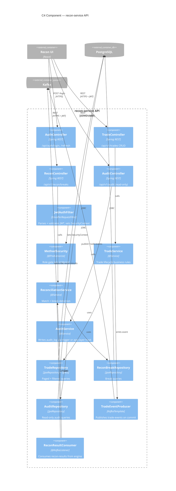

```mermaid
C4Component
title C4 Component — recon-service API

    Container_Ext(reactSpa, "Recon UI", "React")
    ContainerDb_Ext(postgres, "PostgreSQL")
    ContainerQueue_Ext(kafka, "Kafka")

    Container_Boundary(api, "recon-service API") {
        Component(authCtl, "AuthController", "Spring REST", "/api/auth/login, /refresh")
        Component(tradeCtl, "TradeController", "Spring REST", "/api/v1/trades CRUD")
        Component(reconCtl, "ReconController", "Spring REST", "/api/v1/recon/breaks")
        Component(auditCtl, "AuditController", "Spring REST", "/api/v1/audit (read-only)")

        Component(jwtFilter, "JwtAuthFilter", "OncePerRequestFilter", "Parses + validates JWT, sets SecurityContext")
        Component(rbac, "MethodSecurity", "@PreAuthorize", "Role gate per endpoint")

        Component(tradeSvc, "TradeService", "@Service", "Trade lifecycle business rules")
        Component(reconSvc, "ReconciliationService", "@Service", "Match + break detection")
        Component(auditSvc, "AuditService", "@Service", "Writes audit_log via trigger or app-layer hook")

        Component(tradeRepo, "TradeRepository", "JpaRepository + Specs", "Paged + filtered queries")
        Component(reconRepo, "ReconBreakRepository", "JpaRepository", "Break queries")
        Component(auditRepo, "AuditRepository", "JpaRepository", "Read-only audit queries")

        Component(producer, "TradeEventProducer", "KafkaTemplate", "Publishes trade-events on commit")
        Component(consumer, "ReconResultConsumer", "@KafkaListener", "Consumes recon-results from engine")
    }

    Rel(reactSpa, authCtl, "POST /login", "HTTPS")
    Rel(reactSpa, tradeCtl, "REST", "HTTPS + JWT")
    Rel(reactSpa, reconCtl, "REST", "HTTPS + JWT")
    Rel(reactSpa, auditCtl, "REST", "HTTPS + JWT")

    Rel(jwtFilter, rbac, "Sets SecurityContext")
    Rel(tradeCtl, tradeSvc, "calls")
    Rel(reconCtl, reconSvc, "calls")
    Rel(auditCtl, auditSvc, "calls")

    Rel(tradeSvc, tradeRepo, "uses")
    Rel(reconSvc, reconRepo, "uses")
    Rel(auditSvc, auditRepo, "uses")

    Rel(tradeRepo, postgres, "JDBC")
    Rel(reconRepo, postgres, "JDBC")
    Rel(auditRepo, postgres, "JDBC")

    Rel(tradeSvc, producer, "emits event")
    Rel(producer, kafka, "publish trade-events")
    Rel(consumer, kafka, "subscribe recon-results")
    Rel(consumer, reconSvc, "callback")
```