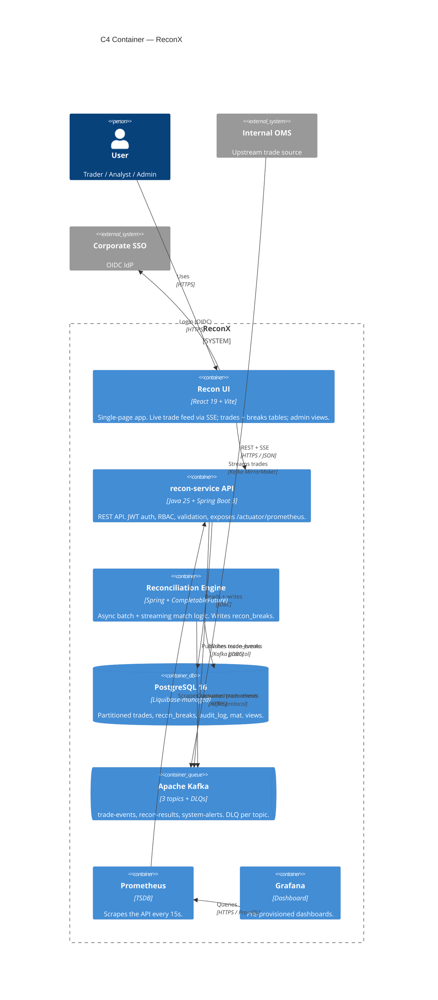

```mermaid
C4Container
title C4 Container — ReconX

    Person(user, "User", "Trader / Analyst / Admin")
    System_Ext(omsKafka, "Internal OMS", "Upstream trade source")
    System_Ext(sso, "Corporate SSO", "OIDC IdP")

    System_Boundary(reconxBoundary, "ReconX") {
        Container(reactSpa, "Recon UI", "React 19 + Vite", "Single-page app. Live trade feed via SSE; trades + breaks tables; admin views.")
        Container(api, "recon-service API", "Java 25 + Spring Boot 3", "REST API. JWT auth, RBAC, validation, exposes /actuator/prometheus.")
        Container(reconEngine, "Reconciliation Engine", "Spring + CompletableFuture", "Async batch + streaming match logic. Writes recon_breaks.")
        ContainerDb(postgres, "PostgreSQL 16", "Liquibase-managed", "Partitioned trades, recon_breaks, audit_log, mat. views.")
        ContainerQueue(kafka, "Apache Kafka", "3 topics + DLQs", "trade-events, recon-results, system-alerts. DLQ per topic.")
        Container(prom, "Prometheus", "TSDB", "Scrapes the API every 15s.")
        Container(graf, "Grafana", "Dashboard", "Pre-provisioned dashboards.")
    }

    Rel(user, reactSpa, "Uses", "HTTPS")
    Rel(reactSpa, api, "REST + SSE", "HTTPS / JSON")
    Rel(reactSpa, sso, "Login (OIDC)", "HTTPS")
    Rel(api, postgres, "Reads + writes", "JDBC")
    Rel(api, kafka, "Publishes trade-events", "Kafka protocol")
    Rel(reconEngine, kafka, "Consumes trade-events", "Kafka protocol")
    Rel(reconEngine, postgres, "Writes recon_breaks", "JDBC")
    Rel(omsKafka, kafka, "Streams trades", "Kafka MirrorMaker")
    Rel(prom, api, "Scrapes /actuator/prometheus", "HTTPS")
    Rel(graf, prom, "Queries", "HTTPS / PromQL")
```