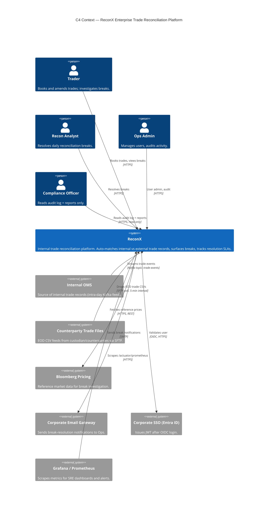

```mermaid
C4Context
title C4 Context — ReconX Enterprise Trade Reconciliation Platform

    Person(traderUser, "Trader", "Books and amends trades; investigates breaks.")
    Person(reconAnalyst, "Recon Analyst", "Resolves daily reconciliation breaks.")
    Person(opsAdmin, "Ops Admin", "Manages users, audits activity.")
    Person(complianceUser, "Compliance Officer", "Reads audit log + reports only.")

    System(reconx, "ReconX", "Internal trade reconciliation platform. Auto-matches internal vs external trade records, surfaces breaks, tracks resolution SLAs.")

    System_Ext(internalOMS, "Internal OMS", "Source of internal trade records (intra-day Kafka feed).")
    System_Ext(counterpartySFTP, "Counterparty Trade Files", "EOD CSV feeds from custodian/counterparties via SFTP.")
    System_Ext(bloombergPricing, "Bloomberg Pricing", "Reference market data for break investigation.")
    System_Ext(emailGateway, "Corporate Email Gateway", "Sends break-resolution notifications to Ops.")
    System_Ext(ssoIdP, "Corporate SSO (Entra ID)", "Issues JWT after OIDC login.")
    System_Ext(grafana, "Grafana / Prometheus", "Scrapes metrics for SRE dashboards and alerts.")

    Rel(traderUser, reconx, "Books trades, views breaks", "HTTPS")
    Rel(reconAnalyst, reconx, "Resolves breaks", "HTTPS")
    Rel(opsAdmin, reconx, "User admin, audit", "HTTPS")
    Rel(complianceUser, reconx, "Reads audit log + reports", "HTTPS, read-only")

    Rel(internalOMS, reconx, "Streams trade events", "Kafka topic: trade-events")
    Rel(counterpartySFTP, reconx, "Drops EOD trade CSVs", "SFTP poll, 5-min interval")
    Rel(reconx, bloombergPricing, "Fetches reference prices", "HTTPS, REST")
    Rel(reconx, emailGateway, "Sends break notifications", "SMTP")
    Rel(reconx, ssoIdP, "Validates user", "OIDC, HTTPS")
    Rel(grafana, reconx, "Scrapes /actuator/prometheus", "HTTPS")
```