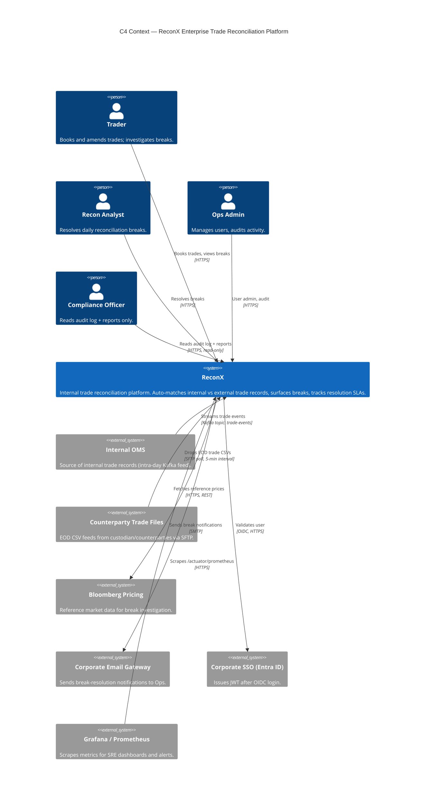
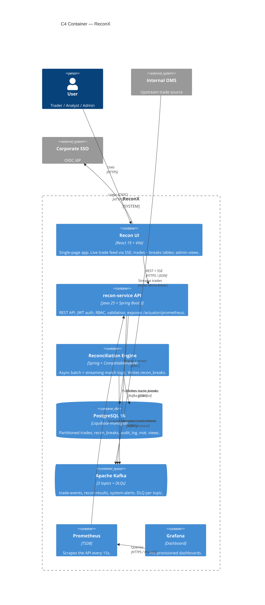
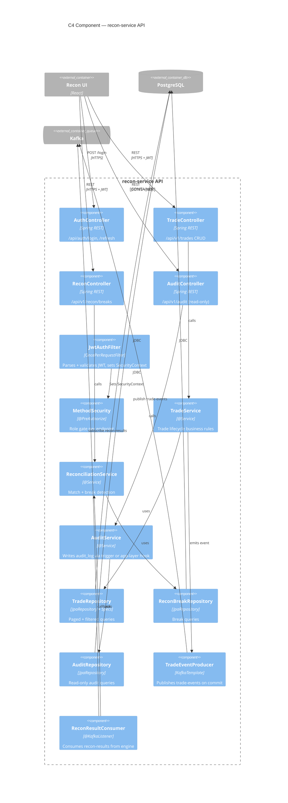
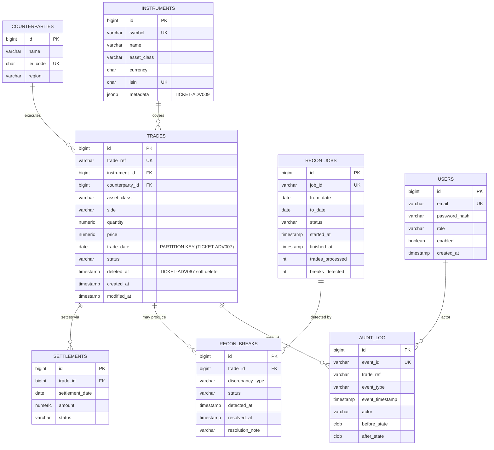

# Day 1 — Student Guide

> **Trainer-facing equivalent:** [TrainersGuide/day1/README.md](../../TrainersGuide/day1/README.md)
> **Module:** PostgreSQL Modules 1 & 2 + Liquibase Deep Dive

## What you'll build today

By end of day you will have a private team GitHub repo with branch protection,
three C4 diagrams (Context, Container, Component) committed as Mermaid, a 20+
endpoint OpenAPI 3.0 contract, an 8-entity ER model realised as Liquibase
changelogs against PostgreSQL 16, a partitioned `trades` table, a materialised
daily-recon summary view, a JSONB metadata column with a GIN index, VWAP and
recursive-CTE queries, rollback tags, preconditions, at least three
AI-assisted ADRs with prompts committed, a Jira / GitHub Project board with
epics, and seed data covering 10 counterparties, 50 instruments, and 500
trades spread across four monthly partitions.

## Day at a glance

1. Standup and Day-0 holdover unblock
2. AM Module 1: PostgreSQL Foundations (theory + live demo)
3. Workshop 1A: GitHub, C4 (TICKET-ADV001 – TICKET-ADV004)
4. Lunch
5. PM Module 2: PostgreSQL Advanced (theory + live demo)
6. Workshop 1B: Schema, partitioning, mat view, JSONB, window fns (TICKET-ADV006 – TICKET-ADV011)
7. Workshop 1C: Liquibase, AI ADRs, Jira, seed (TICKET-ADV012 – TICKET-ADV017)
8. End-of-day debrief

## Exercises

Day 1 has 16 exercises across three PM workshop blocks. The hints below are
progressive — try Hint 1 first, then Hint 2, only open Hint 3 if you are
still stuck. If you are still stuck after Hint 3, ask your trainer.

### Workshop 1A — GitHub & C4

### TICKET-ADV001 — Create GitHub repo with branch protection

**Goal:** Stand up a private team repository with enforced branch protection
rules on `main` and `develop`, plus a CODEOWNERS file that routes PR reviews
to the right team lead.

**What**
- A private team repo with branch protection on `main` (2 approvals + Code Owners + status checks) and `develop` (1 approval), plus `.github/CODEOWNERS` routing reviews by path.

**Why**
- Branch protection turns the GitFlow loop into something you cannot accidentally bypass — every later ticket (ADV002–ADV165) assumes feature branches and PR review, so the rule has to hold from minute one.

**Observe**
- `git push origin throwaway-branch:main` is rejected with a `protected branch hook declined` error.

**Done when:**
- The repo is private and every team member has push access on their own feature branches.
- A direct push to `main` is rejected by GitHub; the only path to `main` is a PR.
- `main` requires two approvals, dismisses stale approvals on new commits, and requires status checks (build, test, lint) to pass before merge.
- A `.github/CODEOWNERS` file exists and routes `backend/`, `frontend/`, and `db/` paths to the relevant leads.

<details>
<summary>Hint 1 — gentle direction</summary>

Branch protection is not noise — it is the point. If you can still push to
`main` without a PR after configuring it, the rule is not doing its job. Ask
yourself what you want to be impossible, then make GitHub enforce it.

</details>

<details>
<summary>Hint 2 — concrete pointer</summary>

Open the repo's Settings → Branches → Branch protection rules. You want
separate rules for `main` (strict) and `develop` (lighter). Look up the
"Require status checks to pass before merging" and "Require review from Code
Owners" toggles, and read the GitHub docs page for CODEOWNERS syntax — the
file lives at `.github/CODEOWNERS`.

</details>

<details>
<summary>Hint 3 — near-solution shape</summary>

For `main`: require a PR with two approvals, dismiss stale approvals on new
commits, require Code Owner review, require status checks (build, test,
lint), require linear history, include administrators, disallow force pushes
and deletions. For `develop`: require a PR with one approval and the same
status checks. Verify by trying to push directly to `main` from a feature
branch — GitHub should reject it with a protection error.

</details>

<details>
<summary>Hint 4 — step-by-step walkthrough with reference solution</summary>

**Steps:**

1. Create a new private repo on GitHub (Settings → Visibility → Private).
2. Add `.github/CODEOWNERS` on a feature branch with the routes below.
3. Open Settings → Branches → Add rule for `main`; tick the toggles from the snippet.
4. Repeat with a lighter rule for `develop` (1 approval, no Code Owners requirement).
5. Push a commit directly to `main` from your laptop — GitHub must reject it.
6. Open a PR from your feature branch and verify the required-checks/approvals UI appears.

**Reference solution** (`.github/CODEOWNERS`):

```
# .github/CODEOWNERS
*               @team-lead-handle
backend/        @team-lead-handle @backend-lead-handle
frontend/       @team-lead-handle @frontend-lead-handle
db/             @team-lead-handle @db-lead-handle
.github/        @team-lead-handle
```

**Reference solution** (branch protection settings — paste into Settings → Branches):

```
Branch name pattern: main
  [x] Require a pull request before merging
      [x] Require approvals (2)
      [x] Dismiss stale pull request approvals when new commits are pushed
      [x] Require review from Code Owners
  [x] Require status checks to pass before merging
      [x] Require branches to be up to date before merging
      Status checks required: build, test, lint
  [x] Require conversation resolution before merging
  [x] Require linear history
  [x] Include administrators
  [ ] Allow force pushes  (LEAVE OFF)
  [ ] Allow deletions     (LEAVE OFF)

Branch name pattern: develop
  [x] Require a pull request before merging
      [x] Require approvals (1)
  [x] Require status checks to pass before merging
      Status checks required: build, test
  [ ] Include administrators
```

</details>

**▶ Verify the artifact — confirm TICKET-ADV001 end-to-end**

Repo is private, branch protection rules are live on `main` and `develop`, and CODEOWNERS routes PR review to the right team.

```bash
# from project root
cat .github/CODEOWNERS
git checkout -b throwaway-push-test
git commit --allow-empty -m "test: branch protection"
git push origin throwaway-push-test:main   # MUST be rejected by GitHub
```

**Observe:**

- `.github/CODEOWNERS` exists and routes `backend/`, `frontend/`, `db/` paths to the lead handles.
- The direct push to `main` is rejected by GitHub with a protected-branch error.
- Repo Settings → General shows "Visibility: Private".
- Settings → Branches shows two rules: `main` (2 approvals + Code Owners + status checks + linear history) and `develop` (1 approval + status checks).
- Opening a PR into `main` surfaces required-checks and required-reviews UI.

---

### TICKET-ADV002 — Design C4 Context diagram

**Goal:** Produce a C4 Level 1 (Context) diagram for ReconX showing the
system as a single box, the human actors who interact with it, and the
external systems it talks to.

**What**
- `db/diagrams/c4-context.md` containing a single `C4Context` Mermaid block with four personas, one ReconX system box, and six external systems (OMS, SFTP, Bloomberg, email, SSO, Grafana).

**Why**
- Level 1 is the diagram you can hand a stakeholder who has never opened the codebase. If anyone needs the database name to explain it, you have leaked Level-2 detail and the C4 levels stop being useful.

**Observe**
- The Mermaid preview in VS Code or `mermaid.live` renders without parse errors and shows only ONE box inside the ReconX boundary.

**Done when:**
- The diagram contains exactly one ReconX box plus the surrounding people and external systems — no internal containers or databases visible.
- Every actor and every external system has a labelled relationship arrow describing the protocol and intent (e.g., HTTPS, Kafka, OIDC).
- The diagram is committed as Mermaid or a rendered image under `db/diagrams/` (or `docs/architecture/`).

<details>
<summary>Hint 1 — gentle direction</summary>

Context is the highest-altitude view. The whole system is one box. Anyone
looking at the diagram should be able to describe what ReconX does and who
talks to it without knowing a single thing about its internals.

</details>

<details>
<summary>Hint 2 — concrete pointer</summary>

Read the C4 Model "Level 1: System Context" page. Think about the four user
personas in the brief (trader, recon analyst, ops admin, compliance) and the
upstream/downstream systems implied by the requirements: an OMS feed, a
counterparty SFTP drop, market data, an email gateway, SSO, and observability.

</details>

<details>
<summary>Hint 3 — near-solution shape</summary>

Around four `Person(...)` nodes for the personas, one `System(reconx, ...)`
node for ReconX, and roughly six `System_Ext(...)` nodes for the external
systems. Then a `Rel(...)` line per arrow, labelled with both the action
(e.g., "Books trades") and the protocol (e.g., HTTPS). If a database or
Kafka appears at this level, you have leaked Level 2 detail — push it down
into the Container diagram.

</details>

<details>
<summary>Hint 4 — step-by-step walkthrough with reference solution</summary>

**Steps:**

1. Create `db/diagrams/c4-context.md` (or `docs/architecture/c4-context.md`).
2. Paste the Mermaid `C4Context` block below.
3. List four `Person(...)` nodes for trader, recon analyst, ops admin, compliance.
4. Add one `System(reconx, ...)` node and six `System_Ext(...)` nodes (OMS, SFTP, Bloomberg, email, SSO, Grafana).
5. Draw `Rel(...)` arrows labelled with intent AND protocol.
6. Render in the Mermaid live editor or GitHub preview to verify it parses.

**Reference solution** (`db/diagrams/c4-context.md`):



</details>

**▶ Verify the artifact — confirm TICKET-ADV002 end-to-end**

The C4 Context diagram is committed as Mermaid and renders cleanly in a Mermaid-aware previewer.

```bash
# from project root
ls -l db/diagrams/c4-context.md
# Then open in VS Code (Markdown Preview) or paste into https://mermaid.live
```

**Observe:**

- `db/diagrams/c4-context.md` exists and contains a `C4Context` Mermaid block.
- The diagram renders without parse errors in the Mermaid live editor.
- Exactly one `System(reconx, ...)` node — no internal containers leaked in.
- Four `Person(...)` nodes (Trader, Recon Analyst, Ops Admin, Compliance) and roughly six `System_Ext(...)` nodes (OMS, SFTP, Bloomberg, email, SSO, Grafana).
- Every `Rel(...)` arrow carries both an intent label and a protocol (HTTPS / Kafka / OIDC / SMTP).

---

### TICKET-ADV003 — Design C4 Container diagram

**Goal:** Produce a C4 Level 2 (Container) diagram showing each
independently deployable unit inside the ReconX boundary, and how they
communicate.

**What**
- `db/diagrams/c4-container.md` showing the seven runtime containers (React SPA, API, recon engine, Postgres, Kafka, Prometheus, Grafana) inside a `System_Boundary(reconxBoundary)` block.

**Why**
- Container view is what you will reach for on Day 10 to explain the Docker Compose stack — one box per process, not one box per class. Getting it right today saves rewriting it for the demo deck.

**Observe**
- The Mermaid block parses, and counting boxes inside `reconxBoundary` returns exactly seven.

**Done when:**
- The ReconX boundary contains the SPA, the API, the reconciliation engine, the database, Kafka, and the observability stack — each as its own container.
- Arrows are labelled with protocol AND intent, not just "uses".
- External actors and systems from the Context diagram are still present, but they sit outside the ReconX boundary.

<details>
<summary>Hint 1 — gentle direction</summary>

A "container" in C4 has nothing to do with Docker — it means an independently
runnable, deployable, and replaceable thing. If you could swap Kafka for
RabbitMQ without redeploying the API, they are different containers.

</details>

<details>
<summary>Hint 2 — concrete pointer</summary>

Count how many separate processes your eventual `docker compose up` will
start. The SPA, the API, the recon engine, Postgres, Kafka, Prometheus,
Grafana. Each one is its own container box. Use `Container(...)`,
`ContainerDb(...)`, and `ContainerQueue(...)` to distinguish.

</details>

<details>
<summary>Hint 3 — near-solution shape</summary>

One `System_Boundary` wrapping seven containers (UI, API, recon engine,
Postgres, Kafka, Prometheus, Grafana). Outside the boundary: the human user,
the upstream OMS, and the SSO IdP. Relations describe both protocol and
direction — for example "Reads + writes / JDBC" from API to Postgres,
"Publishes trade-events / Kafka protocol" from API to Kafka. If you see
classes or method names, you have dropped a level too far.

</details>

<details>
<summary>Hint 4 — step-by-step walkthrough with reference solution</summary>

**Steps:**

1. Create `db/diagrams/c4-container.md` (or `docs/architecture/c4-container.md`).
2. Inside a `System_Boundary(reconxBoundary, "ReconX") { ... }` block declare seven containers: React SPA, API, recon engine, Postgres, Kafka, Prometheus, Grafana.
3. Outside the boundary place the human user, upstream OMS, and SSO IdP.
4. Use `ContainerDb(...)` for Postgres and `ContainerQueue(...)` for Kafka.
5. Add `Rel(...)` arrows labelled with protocol AND intent (`"REST + SSE", "HTTPS / JSON"`).
6. Render in Mermaid live editor to verify it parses.

**Reference solution** (`db/diagrams/c4-container.md`):



</details>

**▶ Verify the artifact — confirm TICKET-ADV003 end-to-end**

The C4 Container diagram is committed as Mermaid and shows the seven independently deployable units inside the ReconX boundary.

```bash
# from project root
ls -l db/diagrams/c4-container.md
# Then preview in VS Code or paste into https://mermaid.live
```

**Observe:**

- `db/diagrams/c4-container.md` exists with a `C4Container` Mermaid block that renders without errors.
- A `System_Boundary(reconxBoundary, "ReconX")` wraps seven containers: React SPA, API, recon engine, Postgres, Kafka, Prometheus, Grafana.
- Postgres uses `ContainerDb(...)` and Kafka uses `ContainerQueue(...)`.
- External actors (User, OMS, SSO) sit outside the boundary.
- Every `Rel(...)` arrow carries both protocol and intent (`"REST + SSE", "HTTPS / JSON"`).

---

### TICKET-ADV004 — Design C4 Component diagram

**Goal:** Produce a C4 Level 3 (Component) diagram for ONE container —
usually the recon-service API — showing its major logical components and
how they wire together.

**What**
- `db/diagrams/c4-component.md` zooming into ONE container (the recon-service API) and showing its components: REST controllers, security filter, services, Kafka producer/consumer, repositories.

**Why**
- Component view is the bridge between architecture diagrams and the actual Java packages. It tells the team what to grep for when a bug ships and forces you to name the seams between subsystems early.

**Observe**
- The container under inspection is named in the diagram title (e.g., "C4 Component — recon-service API") and every component arrow carries an intent label (e.g., "publishes / Kafka").

**Done when:**
- The diagram declares which container it is for in the title.
- Roughly 10–15 component boxes, grouped by Spring stereotype (controllers, security filter, services, repositories, Kafka producer/consumer).
- External neighbours (UI, Postgres, Kafka) appear at the edge as referenced containers, not internal components.

<details>
<summary>Hint 1 — gentle direction</summary>

Component is one container, zoomed in one level. Pick which container you are
zooming into before you draw anything — you cannot do "components of the
whole system" in C4.

</details>

<details>
<summary>Hint 2 — concrete pointer</summary>

Group by Spring stereotype: REST controllers, security (the JWT filter and
method security), application services, repositories, Kafka producer and
consumer. Each grouping yields a small number of boxes. Use `Component(...)`
nodes inside a `Container_Boundary(api, ...)` and reference the UI, DB, and
Kafka with `Container_Ext(...)`.

</details>

<details>
<summary>Hint 3 — near-solution shape</summary>

Four controllers (Auth, Trade, Recon, Audit), one JWT filter, one method
security gate, three or four services, three repositories, one Kafka
producer, one Kafka listener. Arrows: UI to controllers, controllers to
services, services to repositories and to the producer, repositories to
Postgres, producer/consumer to Kafka. Anything more granular than a
`@Service` belongs at Level 4 (Code), which we do not draw.

</details>

<details>
<summary>Hint 4 — step-by-step walkthrough with reference solution</summary>

**Steps:**

1. Decide which container you are zooming into — pick the `recon-service API`.
2. Create `db/diagrams/c4-component.md`.
3. Declare external neighbours (`Container_Ext` for UI, `ContainerDb_Ext` for Postgres, `ContainerQueue_Ext` for Kafka).
4. Inside a `Container_Boundary(api, ...)` block declare ~13 components grouped by Spring stereotype: 4 controllers, JwtAuthFilter, MethodSecurity, 3 services, 3 repositories, 1 Kafka producer, 1 Kafka consumer.
5. Add `Rel(...)` arrows: UI → controllers, controllers → services, services → repositories + producer, repositories → Postgres, producer/consumer → Kafka.
6. Render in Mermaid live editor and verify roughly 10-15 boxes appear.

**Reference solution** (`db/diagrams/c4-component.md`):



</details>

**▶ Verify the artifact — confirm TICKET-ADV004 end-to-end**

The C4 Component diagram is committed as Mermaid and zooms into exactly one container — `recon-service API` — with all major Spring stereotypes shown.

```bash
# from project root
ls -l db/diagrams/c4-component.md
# Preview in VS Code or paste into https://mermaid.live
```

**Observe:**

- `db/diagrams/c4-component.md` exists with a `C4Component` Mermaid block that renders without errors.
- Title clearly names the container being zoomed into (`recon-service API`).
- Between 10 and 15 component boxes, grouped by Spring stereotype: 4 controllers, JwtAuthFilter, MethodSecurity, 3 services, 3 repositories, 1 Kafka producer, 1 Kafka consumer.
- External neighbours (UI, Postgres, Kafka) appear as `Container_Ext` / `ContainerDb_Ext` / `ContainerQueue_Ext` at the edge — NOT as components.
- Arrows flow UI → controllers → services → repositories + producer → DB / Kafka.

---

### Workshop 1B — Schema, partitioning, materialised view, JSONB, window fns

### TICKET-ADV006 — Design ER model (8 entities)

**Goal:** Produce an entity-relationship diagram covering the eight core
ReconX tables with primary keys, foreign keys, and key columns annotated.

**What**
- `db/diagrams/erd.md` with a Mermaid `erDiagram` declaring exactly eight tables (counterparties, instruments, users, trades, settlements, recon_jobs, recon_breaks, audit_log), PK / FK columns marked, FK arrows drawn.

**Why**
- The ERD is the source of truth that ADV007–ADV011 reference for partition keys, JSONB columns, and join paths. Drawing it before writing DDL stops cycles and surfaces missing FKs.

**Observe**
- The diagram renders in a Mermaid previewer; every cardinality marker points at the parent table; `trades` shows `trade_date` annotated as the partition key.

**Done when:**
- Exactly eight entities are drawn: counterparties, instruments, users, trades, settlements, recon_jobs, recon_breaks, audit_log.
- Every FK is shown with an arrow pointing to the parent table, and the diagram notes which column is the partition key on `trades`.
- The diagram is committed at `db/erd.md` or equivalent and can be regenerated by anyone on the team.

<details>
<summary>Hint 1 — gentle direction</summary>

Resist the urge to merge tables that "look similar". A reconciliation break
and an audit log entry both record "something happened", but they are owned
by different stakeholders with different retention rules. Two tables.

</details>

<details>
<summary>Hint 2 — concrete pointer</summary>

Sketch the four reference tables first (counterparties, instruments, users)
plus `trades`. Then add the lifecycle children that hang off `trades`
(settlements, recon_breaks). Then the batch table (`recon_jobs`) that owns
many breaks. Finally `audit_log` floats by itself — deliberately. Mark the
partition column on `trades` with a label.

</details>

<details>
<summary>Hint 3 — near-solution shape</summary>

FKs you should end up with: trades→counterparties, trades→instruments,
settlements→trades, recon_breaks→trades, recon_breaks→recon_jobs,
recon_jobs→users (the user who triggered it). The `audit_log.changed_by`
column references a user email but should NOT have a database FK — audit
must outlive the rows it audits. Mark `trade_date` on trades as the
partition key for TICKET-ADV007.

</details>

<details>
<summary>Hint 4 — step-by-step walkthrough with reference solution</summary>

**Steps:**

1. Create `db/erd.md`.
2. Open with a Mermaid `erDiagram` block.
3. Declare relationships first (`COUNTERPARTIES ||--o{ TRADES : "executes"`, etc.) — get the seven FK lines down.
4. Add an entity block for each of the eight tables with PK / FK / UK markers.
5. Annotate `trade_date` with `"PARTITION KEY (TICKET-ADV007)"` and `metadata` with `"TICKET-ADV009"`.
6. Preview in a Mermaid-aware renderer (GitHub README, Mermaid live editor) — every relationship should render.

**Reference solution** (`db/erd.md`):



</details>

**▶ Verify the artifact — confirm TICKET-ADV006 end-to-end**

The ER model is committed as a Mermaid `erDiagram` and covers exactly the eight core entities with FK arrows.

```bash
# from project root
ls -l db/erd.md
# Then preview in VS Code (Markdown Preview) or paste into https://mermaid.live
```

**Observe:**

- `db/erd.md` exists with an `erDiagram` Mermaid block that renders without errors.
- Exactly eight entities are drawn: COUNTERPARTIES, INSTRUMENTS, USERS, TRADES, SETTLEMENTS, RECON_JOBS, RECON_BREAKS, AUDIT_LOG.
- Seven FK arrows: trades→counterparties, trades→instruments, settlements→trades, recon_breaks→trades, recon_breaks→recon_jobs, recon_jobs→users, users→audit_log.
- `trades.trade_date` is annotated as `"PARTITION KEY (TICKET-ADV007)"` and `instruments.metadata` is annotated as `"TICKET-ADV009"`.
- `audit_log.changed_by` (actor) deliberately has NO database FK — audit outlives the rows it audits.

---

### TICKET-ADV007 — CREATE TABLE with monthly partitioning

**Goal:** Create the `trades` table as a RANGE-partitioned parent table on
`trade_date`, with one child partition per calendar month for the active
window plus a DEFAULT partition for safety.

**What**
- `trades` parent table created with `PARTITION BY RANGE (trade_date)`, plus child partitions `trades_2026_01` … `trades_2026_04` and a `trades_default` catch-all.

**Why**
- Partitioning by trade_date means EOD reconciliation queries and matview refreshes (ADV008) scan one month, not the whole table. The default partition prevents Day-9 Kafka inserts from failing if they arrive outside the window.

**Observe**
- `\d+ trades` in psql shows `Partition key: RANGE (trade_date)` and lists each child partition with its boundary.

**Done when:**
- `\d+ trades` shows `Partition key: RANGE (trade_date)` and lists each monthly child partition underneath.
- `EXPLAIN ANALYZE SELECT * FROM trades WHERE trade_date = '2026-06-15';` shows only the June partition being scanned (partition pruning).
- At least four monthly partitions (April through July 2026) exist plus a `trades_default` catch-all.

<details>
<summary>Hint 1 — gentle direction</summary>

Pick the partition key by looking at your WHERE clauses, not your PK. Almost
every recon query filters on a date range — that is what should slice the
table. Partitioning by the surrogate `id` would give you zero query speedup.

</details>

<details>
<summary>Hint 2 — concrete pointer</summary>

Read the Postgres docs for declarative partitioning. The parent table is
created with `PARTITION BY RANGE (trade_date)`. Postgres has a constraint
you will trip over: the primary key of a partitioned table must include the
partition column. Plan your PK accordingly. Children are created with
`CREATE TABLE ... PARTITION OF trades FOR VALUES FROM (...) TO (...)`.

</details>

<details>
<summary>Hint 3 — near-solution shape</summary>

Parent: `id BIGSERIAL`, `trade_date DATE NOT NULL`, the business columns,
then `PRIMARY KEY (id, trade_date)` and `PARTITION BY RANGE (trade_date)`.
Any UNIQUE constraint also needs `trade_date` in it. Then four child
partitions for April → July 2026 each covering one month, plus
`trades_default PARTITION OF trades DEFAULT`. Verify with `\d+ trades` and
the EXPLAIN ANALYZE pruning check.

</details>

<details>
<summary>Hint 4 — step-by-step walkthrough with reference solution</summary>

**Steps:**

1. Create `db/partitioning.sql` (or wrap in a Liquibase `<sql>` block under `db/changelog/changes/`).
2. `CREATE TABLE trades (...) PARTITION BY RANGE (trade_date);` — PK must be `(id, trade_date)` so the partition column is included.
3. Add `CREATE INDEX` on `status`, `instrument_id`, `counterparty_id` against the parent — Postgres propagates to children.
4. Create four child partitions for `2026-04` through `2026-07` using `PARTITION OF trades FOR VALUES FROM (...) TO (...)`.
5. Add `trades_default PARTITION OF trades DEFAULT;` as the safety catch.
6. Verify with `\d+ trades` and `EXPLAIN ANALYZE SELECT * FROM trades WHERE trade_date = '2026-06-15';` — only the June partition should scan.

**Reference solution** (`db/partitioning.sql`):

```sql
-- ============================================================================
-- Convert trades to monthly range-partitioned table (Postgres)
--
-- WARNING: destructive. Run in a maintenance window — copies the entire
-- trades table into a new partitioned trades, then renames.
-- ============================================================================

-- 1. Rename existing
ALTER TABLE trades RENAME TO trades_legacy;

-- 2. Create partitioned parent (same columns)
CREATE TABLE trades (
    id              BIGSERIAL,
    trade_ref       VARCHAR(30)   NOT NULL,
    instrument_id   BIGINT        NOT NULL REFERENCES instruments(id),
    counterparty_id BIGINT        NOT NULL REFERENCES counterparties(id),
    asset_class     VARCHAR(20)   NOT NULL,
    side            VARCHAR(4)    NOT NULL,
    quantity        NUMERIC(18,4) NOT NULL,
    price           NUMERIC(18,4) NOT NULL,
    trade_date      DATE          NOT NULL,
    status          VARCHAR(20)   NOT NULL DEFAULT 'PENDING',
    deleted_at      TIMESTAMPTZ,
    created_at      TIMESTAMPTZ   NOT NULL DEFAULT now(),
    modified_at     TIMESTAMPTZ,
    PRIMARY KEY (id, trade_date)
) PARTITION BY RANGE (trade_date);

-- 3. Per-month partitions (12-month rolling window). Add new ones on schedule.
CREATE TABLE trades_y2026m05 PARTITION OF trades
    FOR VALUES FROM ('2026-05-01') TO ('2026-06-01');
CREATE TABLE trades_y2026m06 PARTITION OF trades
    FOR VALUES FROM ('2026-06-01') TO ('2026-07-01');
CREATE TABLE trades_y2026m07 PARTITION OF trades
    FOR VALUES FROM ('2026-07-01') TO ('2026-08-01');

-- 4. Migrate data
INSERT INTO trades SELECT * FROM trades_legacy;

-- 5. Drop legacy table after verification
-- DROP TABLE trades_legacy;
```

</details>

**▶ Run the project — verify TICKET-ADV007 end-to-end**

Postgres is up, Liquibase has applied the partitioning changeset, and `trades` is RANGE-partitioned on `trade_date` with at least four monthly children plus a default.

```bash
# from project root
docker compose up -d postgres
./mvnw -pl backend spring-boot:run        # in a separate terminal
psql -h localhost -p 5432 -U reconx -d reconx_dev   # password: reconx
# Inside psql:
#   \d+ trades
#   EXPLAIN ANALYZE SELECT * FROM trades WHERE trade_date = '2026-06-15';
#   SELECT id, filename FROM databasechangelog WHERE filename LIKE '%partitioning%';
```

**Observe:**

- `\d+ trades` reports `Partition key: RANGE (trade_date)` and lists each monthly child partition underneath.
- At least four monthly partitions (`trades_y2026m04` through `trades_y2026m07`) plus `trades_default` are listed.
- `EXPLAIN ANALYZE ... WHERE trade_date = '2026-06-15'` scans only the June child partition — partition pruning is active.
- `databasechangelog` contains a row for the partitioning changeset (filename includes `004-partitioning.xml` or equivalent).
- If `\d+ trades` does not show `Partition key`, the changeset did not apply — re-check the Liquibase classpath and Postgres dialect precondition.

---

### TICKET-ADV008 — Materialised view: mv_daily_recon_summary

**Goal:** Create a materialised view that aggregates trades and recon
breaks by trade_date, region, and asset class, and make it refreshable
concurrently without blocking dashboard reads.

**What**
- A materialised view aggregating trades + breaks by trade_date / region / asset_class, with a UNIQUE INDEX on those columns so `REFRESH MATERIALIZED VIEW CONCURRENTLY` works.

**Why**
- Day-6 Grafana dashboards (ADV087–ADV092) hit this view, not the raw `trades` table. Concurrent refresh means dashboards never block while the EOD batch reloads.

**Observe**
- `REFRESH MATERIALIZED VIEW CONCURRENTLY mv_daily_recon_summary` succeeds — if it errors with "cannot refresh concurrently without a unique index", the index step was skipped.

**Done when:**
- `\d+ mv_daily_recon_summary` shows the view with columns including total_trades, matched_trades, open_breaks, gross_notional, and match_rate_pct.
- A unique index exists on `(trade_date, region, asset_class)` so that `REFRESH MATERIALIZED VIEW CONCURRENTLY mv_daily_recon_summary;` succeeds.
- The view is created via a Liquibase `<sql>` change, not a `<createView>` tag, and lives in a versioned changeset.

<details>
<summary>Hint 1 — gentle direction</summary>

A dashboard that re-aggregates 91 million trade rows on every page load is
not a dashboard, it is a denial-of-service on yourself. What is the cheap
way to make those reads constant-time at the cost of staleness?

</details>

<details>
<summary>Hint 2 — concrete pointer</summary>

Look up `CREATE MATERIALIZED VIEW` and `REFRESH MATERIALIZED VIEW
CONCURRENTLY`. The CONCURRENTLY mode has one hard prerequisite — there must
be a unique index on the view — without which refresh fails. Use the
`COUNT(*) FILTER (WHERE ...)` pattern for conditional aggregates instead of
multiple SELECTs.

</details>

<details>
<summary>Hint 3 — near-solution shape</summary>

Join trades, counterparties, and instruments, LEFT JOIN recon_breaks, GROUP
BY `(trade_date, region, asset_class)`. Use `COUNT(*) FILTER (WHERE status =
'MATCHED')` style for per-status counters and `ROUND(SUM(quantity*price), 2)`
for gross notional. Create with `WITH NO DATA` then `REFRESH` once. Add a
UNIQUE index on the three GROUP BY columns plus secondary indexes for the
most common dashboard filters (date, region). Ship the whole thing inside a
`<sql>` block in a Liquibase changeset with a matching `<rollback>`.

</details>

<details>
<summary>Hint 4 — step-by-step walkthrough with reference solution</summary>

**Steps:**

1. Add the view-creation SQL to `db/queries.sql` for prototyping.
2. Wrap it inside a Liquibase `<sql>` changeset at `db/changelog/changes/011-mv-daily-recon-summary.xml`.
3. Build the SELECT joining trades + counterparties + instruments with `LEFT JOIN recon_breaks` and `GROUP BY (trade_date, region, asset_class)`.
4. Use `COUNT(*) FILTER (WHERE ...)` for per-status counters and `ROUND(SUM(quantity*price)::NUMERIC, 2)` for gross notional.
5. Create with `WITH NO DATA`, then add `CREATE UNIQUE INDEX uq_mv_daily_recon_summary (trade_date, region, asset_class)` so `REFRESH ... CONCURRENTLY` works.
6. Add a `<rollback>` with `DROP MATERIALIZED VIEW IF EXISTS mv_daily_recon_summary;` and verify with `\d+ mv_daily_recon_summary`.

**Reference solution** (`db/queries.sql` — the concurrent refresh invocation; the CREATE lives in the Liquibase changeset below):

```sql
-- ============================================================================
-- TICKET-ADV008 — REFRESH the daily-summary materialised view (concurrent so it can
--         run while the dashboard is reading it)
-- ============================================================================
REFRESH MATERIALIZED VIEW CONCURRENTLY mv_daily_recon_summary;
```

**Reference solution** (`backend/src/main/resources/db/changelog/changes/005-mat-views.xml`):

```xml
<?xml version="1.0" encoding="UTF-8"?>
<!--
 ============================================================================
 Materialised view mv_daily_recon_summary
 WHAT:    Daily aggregate of matched/break counts + total notional, used by
          the dashboard's "today at a glance" cards.
 HOW:     REFRESH MATERIALIZED VIEW CONCURRENTLY (requires unique index).
          Scheduled refresh is done by a cron job (not shown — Day 6 task).
 WHY:     Computing daily stats over a partitioned 50M-row table at every
          dashboard load is 600ms+; the matview is 5ms.
 OBSERVE: SELECT * FROM mv_daily_recon_summary returns one row per day.
 ============================================================================
-->
<databaseChangeLog
        xmlns="http://www.liquibase.org/xml/ns/dbchangelog"
        xmlns:xsi="http://www.w3.org/2001/XMLSchema-instance"
        xsi:schemaLocation="http://www.liquibase.org/xml/ns/dbchangelog
                            http://www.liquibase.org/xml/ns/dbchangelog/dbchangelog-4.27.xsd">

    <changeSet id="005-mv-daily-recon-summary" author="trainer">
        <preConditions onFail="MARK_RAN">
            <dbms type="postgresql"/>
        </preConditions>
        <sql splitStatements="false"><![CDATA[
            CREATE MATERIALIZED VIEW mv_daily_recon_summary AS
            SELECT
                trade_date,
                COUNT(*)                                          AS total_trades,
                COUNT(*) FILTER (WHERE status = 'MATCHED')        AS matched_trades,
                COUNT(*) FILTER (WHERE status IN ('UNMATCHED','DISPUTED')) AS break_trades,
                COALESCE(SUM(quantity * price), 0)                AS total_notional
            FROM trades
            WHERE deleted_at IS NULL
            GROUP BY trade_date;

            CREATE UNIQUE INDEX uq_mv_daily_recon_summary_trade_date
                ON mv_daily_recon_summary (trade_date);
        ]]></sql>
        <rollback>
            <sql>DROP MATERIALIZED VIEW IF EXISTS mv_daily_recon_summary;</sql>
        </rollback>
    </changeSet>

</databaseChangeLog>
```

</details>

**▶ Run the project — verify TICKET-ADV008 end-to-end**

The materialised view `mv_daily_recon_summary` exists, has a unique index, and can be refreshed CONCURRENTLY without blocking dashboard reads.

```bash
# from project root
docker compose up -d postgres
./mvnw -pl backend spring-boot:run
psql -h localhost -p 5432 -U reconx -d reconx_dev   # password: reconx
# Inside psql:
#   \d+ mv_daily_recon_summary
#   SELECT * FROM mv_daily_recon_summary LIMIT 5;
#   REFRESH MATERIALIZED VIEW CONCURRENTLY mv_daily_recon_summary;
```

**Observe:**

- `\d+ mv_daily_recon_summary` shows the materialised view with columns `trade_date`, `total_trades`, `matched_trades`, `break_trades`, `total_notional`.
- A unique index (`uq_mv_daily_recon_summary_trade_date`) exists — without it `REFRESH ... CONCURRENTLY` would fail.
- `REFRESH MATERIALIZED VIEW CONCURRENTLY mv_daily_recon_summary;` succeeds and returns immediately on an empty/seeded DB.
- Once TICKET-ADV017 seed is in, `SELECT * FROM mv_daily_recon_summary` returns one row per `trade_date` with sensible counts.
- The changeset is recorded in `databasechangelog` with filename ending in `005-mat-views.xml`.

---

### TICKET-ADV009 — Add JSONB column to instruments

**Goal:** Add a `metadata` JSONB column to the `instruments` table for
schema-flexible attributes (sector, issuer, rating, tags) and back it with
a GIN index optimised for containment queries.

**What**
- `instruments.metadata JSONB NOT NULL DEFAULT '{}'::jsonb` column plus `CREATE INDEX ... USING gin (metadata jsonb_path_ops)`.

**Why**
- Instrument attributes (sector, issuer, rating, tags) change over time and aren't worth their own columns. JSONB + GIN keeps schema migration light and `metadata @> '{"sector":"Banks"}'` queries fast.

**Observe**
- `EXPLAIN ANALYZE SELECT * FROM instruments WHERE metadata @> '{"sector":"Banks"}'` shows an `Index Scan using ... gin` node, not a Seq Scan.

**Done when:**
- `\d instruments` shows a `metadata jsonb NOT NULL DEFAULT '{}'::jsonb` column.
- `\di instruments` shows a GIN index on `metadata`.
- `EXPLAIN ANALYZE SELECT * FROM instruments WHERE metadata @> '{"sector":"Technology"}';` uses the GIN index (not a sequential scan).

<details>
<summary>Hint 1 — gentle direction</summary>

Schema-on-write is wonderful until product gives you a new optional attribute
every sprint. A JSONB column gives you somewhere to put the long tail without
an ALTER TABLE every time. The question is how to make queries against it fast.

</details>

<details>
<summary>Hint 2 — concrete pointer</summary>

`JSONB` not `JSON` — the binary form is indexable and faster. A regular
B-tree index on a JSONB column buys you nothing; you need a GIN index. Look
up the difference between the `jsonb_ops` and `jsonb_path_ops` operator
classes when defining the index.

</details>

<details>
<summary>Hint 3 — near-solution shape</summary>

`ALTER TABLE instruments ADD COLUMN metadata JSONB NOT NULL DEFAULT
'{}'::JSONB;`, then `CREATE INDEX ... ON instruments USING GIN (metadata
jsonb_path_ops);`. The `jsonb_path_ops` class is smaller and faster for the
`@>` containment operator, which is the one you will use most. Verify with
EXPLAIN ANALYZE on a containment query before and after creating the index.

</details>

<details>
<summary>Hint 4 — step-by-step walkthrough with reference solution</summary>

**Steps:**

1. Create `db/changelog/changes/010-instruments-jsonb-metadata.xml`.
2. Wrap the ALTER + CREATE INDEX in a single `<sql>` block so they ship together.
3. `ALTER TABLE instruments ADD COLUMN metadata JSONB NOT NULL DEFAULT '{}'::JSONB;`.
4. `CREATE INDEX idx_instruments_metadata ON instruments USING GIN (metadata jsonb_path_ops);` — `jsonb_path_ops` is smaller and faster for `@>` containment.
5. Add a `<rollback>` block dropping the index then the column.
6. Verify with `EXPLAIN ANALYZE SELECT * FROM instruments WHERE metadata @> '{"sector":"Technology"}';` — should show a Bitmap Index Scan on `idx_instruments_metadata`.

**Reference solution** (`backend/src/main/resources/db/changelog/changes/003-jsonb.xml`):

```xml
<?xml version="1.0" encoding="UTF-8"?>
<!--
 ============================================================================
 JSONB column on instruments (+ GIN index on Postgres)
 WHAT:    instruments.metadata as JSONB to hold per-asset-class detail
          (e.g. dividend yield, country, sector).
 HOW:     Postgres-only step; H2 dialect lacks JSONB. The precondition guards
          dialect so dev (H2) skips the column entirely.
 WHY:     Schemaless metadata avoids 12 columns that only apply to one asset
          class. Trade-off: validation moves to the app layer.
 OBSERVE: \d instruments shows metadata jsonb. EXPLAIN ANALYZE on a metadata
          ->> 'sector' lookup hits idx_instruments_metadata_gin.
 ============================================================================
-->
<databaseChangeLog
        xmlns="http://www.liquibase.org/xml/ns/dbchangelog"
        xmlns:xsi="http://www.w3.org/2001/XMLSchema-instance"
        xsi:schemaLocation="http://www.liquibase.org/xml/ns/dbchangelog
                            http://www.liquibase.org/xml/ns/dbchangelog/dbchangelog-4.27.xsd">

    <changeSet id="003-jsonb-on-instruments" author="trainer">
        <preConditions onFail="MARK_RAN">
            <dbms type="postgresql"/>
        </preConditions>
        <sql>ALTER TABLE instruments ADD COLUMN metadata JSONB DEFAULT '{}'::JSONB NOT NULL;</sql>
        <sql>CREATE INDEX idx_instruments_metadata_gin ON instruments USING GIN (metadata jsonb_path_ops);</sql>
        <rollback>
            <sql>DROP INDEX IF EXISTS idx_instruments_metadata_gin;</sql>
            <sql>ALTER TABLE instruments DROP COLUMN metadata;</sql>
        </rollback>
    </changeSet>

</databaseChangeLog>
```

**Reference solution** (example payloads + lookups for `db/seed_data.sql`):

```sql
-- TICKET-ADV009 — Sample JSONB payloads
UPDATE instruments SET metadata = '{
  "sector": "Technology",
  "exchange": "XETR",
  "issuer": {"name": "SAP SE", "country": "DE", "lei": "529900D6BF99LW9R2E68"},
  "rating": {"sp": "AA-", "moody": "Aa3"},
  "tags": ["DAX40", "ESG-tier-1"]
}'::JSONB WHERE symbol = 'SAP.DE';

UPDATE instruments SET metadata = '{
  "sector": "Energy",
  "underlying": "WTI",
  "contractSize": 1000,
  "expiryMonth": "2026-12",
  "tags": ["futures", "physical-settlement"]
}'::JSONB WHERE symbol = 'CL_FUT';

-- Containment (uses GIN):
SELECT symbol, metadata->>'sector' AS sector
FROM instruments
WHERE metadata @> '{"sector": "Technology"}';

-- Path extraction:
SELECT symbol, metadata->'issuer'->>'country' AS country FROM instruments;

-- Array membership:
SELECT symbol FROM instruments WHERE metadata->'tags' ? 'DAX40';

-- Existence:
SELECT symbol FROM instruments WHERE metadata ? 'rating';
```

</details>

**▶ Run the project — verify TICKET-ADV009 end-to-end**

The `instruments` table has a `metadata JSONB` column backed by a GIN `jsonb_path_ops` index, and containment queries use the index.

```bash
# from project root
docker compose up -d postgres
./mvnw -pl backend spring-boot:run
psql -h localhost -p 5432 -U reconx -d reconx_dev   # password: reconx
# Inside psql:
#   \d instruments
#   \di instruments*
#   EXPLAIN ANALYZE SELECT * FROM instruments WHERE metadata @> '{"sector":"Technology"}';
```

**Observe:**

- `\d instruments` shows a `metadata` column of type `jsonb` with `NOT NULL DEFAULT '{}'::jsonb`.
- `\di instruments*` lists `idx_instruments_metadata_gin` as a GIN index over `(metadata)`.
- `EXPLAIN ANALYZE ... metadata @> '{"sector":"Technology"}'` shows a `Bitmap Index Scan on idx_instruments_metadata_gin` — NOT a `Seq Scan on instruments`.
- The changeset is recorded in `databasechangelog` with filename ending in `003-jsonb.xml`.
- If the column type comes back as `varchar` or `text`, the precondition gated it out — verify you are on the Postgres profile, not H2.

---

### TICKET-ADV010 — Window Function: VWAP per instrument per day

**Goal:** Write a query that returns every trade row alongside its
instrument-day volume-weighted average price, using a window function so
per-row detail is preserved.

**What**
- A SQL query that returns every trade row plus an extra `vwap` column computed via `SUM(price*quantity) OVER (PARTITION BY instrument_id, trade_date) / SUM(quantity) OVER (...)`.

**Why**
- VWAP-per-trade is the reference metric the recon engine uses on Day 3 to decide "is this a price break or noise?". Using a window function means no GROUP BY collapse — every trade keeps its detail and gains the context.

**Observe**
- The query returns the same row count as `SELECT count(*) FROM trades` for the chosen day, and trades on the same `(instrument_id, trade_date)` share the same `vwap` value.

**Done when:**
- The query returns one row per trade (no GROUP BY collapse) with the trade's quantity, price, notional, and a `vwap` column.
- VWAP is computed as `SUM(price*qty) / SUM(qty)` partitioned by `(instrument_id, trade_date)`.
- The query lives in `db/queries.sql` and runs cleanly against the seeded data.

<details>
<summary>Hint 1 — gentle direction</summary>

VWAP and per-row trade detail in the same result set means you do not want
GROUP BY — GROUP BY collapses. You want an aggregate that runs in parallel
with each row, scoped to that row's instrument and trade day.

</details>

<details>
<summary>Hint 2 — concrete pointer</summary>

Read the Postgres docs for window functions and the `OVER (PARTITION BY ...)`
clause. The numerator is `SUM(price * quantity)`, the denominator is
`SUM(quantity)`, both partitioned the same way. Wrap the denominator in
`NULLIF(..., 0)` to avoid divide-by-zero.

</details>

<details>
<summary>Hint 3 — near-solution shape</summary>

`SELECT t.trade_ref, t.trade_date, i.symbol, t.quantity, t.price,
SUM(t.price*t.quantity) OVER (PARTITION BY t.instrument_id, t.trade_date) /
NULLIF(SUM(t.quantity) OVER (PARTITION BY t.instrument_id, t.trade_date),
0) AS vwap FROM trades t JOIN instruments i ON i.id = t.instrument_id ...`.
For bonus, add `ROW_NUMBER()` for intraday sequence and a cumulative SUM
with `ROWS BETWEEN UNBOUNDED PRECEDING AND CURRENT ROW`.

</details>

<details>
<summary>Hint 4 — step-by-step walkthrough with reference solution</summary>

**Steps:**

1. Open `db/queries.sql` and add a labelled section for the VWAP query.
2. Select the per-row trade columns first (`trade_ref`, `trade_date`, `symbol`, `quantity`, `price`).
3. Add `t.quantity * t.price AS notional` to materialise per-row notional.
4. Add the VWAP as `SUM(price*qty) OVER (PARTITION BY instrument_id, trade_date) / NULLIF(SUM(qty) OVER (PARTITION BY instrument_id, trade_date), 0)`.
5. Add bonus columns: `ROW_NUMBER() OVER (PARTITION BY ... ORDER BY created_at)` and a cumulative `SUM(qty) OVER (... ROWS BETWEEN UNBOUNDED PRECEDING AND CURRENT ROW)`.
6. Verify with `EXPLAIN ANALYZE` against seeded data — one sort per partition, no GROUP BY collapse.

**Reference solution** (`db/queries.sql`):

```sql
-- ============================================================================
-- VWAP per instrument per day (window function)
-- ============================================================================
SELECT DISTINCT
    t.instrument_id,
    t.trade_date,
    SUM(t.price * t.quantity) OVER (PARTITION BY t.instrument_id, t.trade_date)
        / NULLIF(SUM(t.quantity) OVER (PARTITION BY t.instrument_id, t.trade_date), 0)
            AS vwap
FROM trades t
WHERE t.deleted_at IS NULL
  AND t.asset_class = 'EQUITY'
ORDER BY t.trade_date DESC, t.instrument_id;
```

</details>

**▶ Run the project — verify TICKET-ADV010 end-to-end**

The VWAP window-function query is committed to `db/queries.sql` and runs cleanly against seeded data, returning per-row detail alongside the partition-scoped VWAP.

```bash
# from project root
docker compose up -d postgres
./mvnw -pl backend spring-boot:run          # ensures seed has run
psql -h localhost -p 5432 -U reconx -d reconx_dev -f db/queries.sql
# Or open psql interactively and run the VWAP block:
psql -h localhost -p 5432 -U reconx -d reconx_dev
```

**Observe:**

- `db/queries.sql` exists and contains the VWAP block labelled with the ticket ID.
- The query runs without error and returns rows with `instrument_id`, `trade_date`, and a non-NULL `vwap` column.
- There is no `GROUP BY` collapse — per-row trade detail (quantity, price) is preserved when you remove the `DISTINCT`.
- `EXPLAIN ANALYZE` of the query shows window-function `WindowAgg` nodes partitioned by `(instrument_id, trade_date)`.
- Dividing by zero is guarded with `NULLIF(SUM(quantity) OVER ..., 0)` — no divide-by-zero errors on edge partitions.

---

### TICKET-ADV011 — Recursive CTE: trade lifecycle rollup

**Goal:** Write a recursive CTE that walks each trade through its lifecycle
stages (execution → confirmation → settlement → recon break → resolution)
and emits one row per stage per trade.

**What**
- A recursive CTE with a base case (every trade as `stage='EXECUTION'`) UNION ALL'd with a recursive step that adds CONFIRMATION → SETTLEMENT → RECON_BREAK → RESOLUTION.

**Why**
- Trade lifecycle isn't flat — a single trade can fan out into multiple recon events. The recursive CTE is the same shape Day 9's event-sourcing audit query uses, so getting the pattern right today pays off twice.

**Observe**
- Running the CTE on a single tradeRef returns ≤5 rows ordered by stage; runaway recursion errors out (Postgres caps at 100 by default), it does not hang.

**Done when:**
- The CTE has a clear base case (trades-as-execution) UNION ALL'd with a recursive step that adds the next lifecycle stage.
- A termination guard prevents infinite recursion.
- The result includes `trade_id`, `stage` (1..5), `stage_name`, `event_at`, and `event_status` per row.

<details>
<summary>Hint 1 — gentle direction</summary>

Recursive CTEs have two halves separated by UNION ALL: the base case, which
seeds the result, and the recursive case, which references the CTE itself.
If either is missing or the recursive case has no exit condition, you have a
crash, not a query.

</details>

<details>
<summary>Hint 2 — concrete pointer</summary>

The lifecycle is not a self-FK chain on `trades` — it spans multiple
tables (trades, settlements, recon_breaks). The recursive step is conceptually
"for a trade currently at stage N, look up the row in the appropriate table
to produce its stage N+1 event". Use a `WHERE stage < 5` style guard to
force termination.

</details>

<details>
<summary>Hint 3 — near-solution shape</summary>

`WITH RECURSIVE trade_lifecycle AS ( SELECT t.id, t.trade_ref, 1 AS stage,
'EXECUTION' AS stage_name, ... FROM trades t UNION ALL SELECT tl.trade_id,
..., tl.stage + 1, next_event.stage_name, ... FROM trade_lifecycle tl JOIN
LATERAL ( ...UNIONs covering CONFIRMATION/SETTLEMENT/RECON_BREAK/RESOLUTION
gated on tl.stage... ) AS next_event ON TRUE WHERE tl.stage < 5 ) SELECT
... FROM trade_lifecycle ORDER BY trade_id, stage;`. The LATERAL join lets
the recursive step choose which lifecycle table to read based on the current
stage.

</details>

<details>
<summary>Hint 4 — step-by-step walkthrough with reference solution</summary>

**Steps:**

1. Open `db/queries.sql` and add the recursive CTE section.
2. Define the base case: every trade as a stage-1 EXECUTION event.
3. Define the recursive step: `JOIN LATERAL (...)` of four `UNION ALL` branches each gated on `tl.stage = N`, producing the next stage event.
4. Add `WHERE tl.stage < 5` as the termination guard.
5. SELECT from the CTE with `ORDER BY trade_id, stage`.
6. Run against seeded data — each trade should yield up to five rows in order EXECUTION → CONFIRMATION → SETTLEMENT → RECON_BREAK → RESOLUTION.

**Reference solution** (`db/queries.sql`):

```sql
-- ============================================================================
-- Recursive CTE: trade lifecycle (execution -> settlement
--                -> recon_break -> resolution)
-- ============================================================================
WITH RECURSIVE trade_lifecycle AS (
    -- anchor: every trade in its execution state
    SELECT
        t.id           AS trade_id,
        t.trade_ref,
        1              AS step,
        'EXECUTED'     AS state,
        t.created_at   AS at_ts,
        NULL::text     AS detail
    FROM trades t
    WHERE t.deleted_at IS NULL

    UNION ALL

    -- recursive: each subsequent state derived from the previous step
    SELECT
        tl.trade_id,
        tl.trade_ref,
        tl.step + 1,
        CASE tl.step
            WHEN 1 THEN 'CONFIRMED'
            WHEN 2 THEN 'SETTLED'
            WHEN 3 THEN 'RECONCILED'
        END                                          AS state,
        s.settlement_date::timestamp                  AS at_ts,
        s.status                                      AS detail
    FROM trade_lifecycle tl
    JOIN settlements s ON s.trade_id = tl.trade_id
    WHERE tl.step < 4
)
SELECT * FROM trade_lifecycle
ORDER BY trade_id, step;
```

</details>

**▶ Run the project — verify TICKET-ADV011 end-to-end**

The recursive CTE is committed to `db/queries.sql`, has a proper termination guard, and emits one row per stage per trade.

```bash
# from project root
docker compose up -d postgres
./mvnw -pl backend spring-boot:run
psql -h localhost -p 5432 -U reconx -d reconx_dev -f db/queries.sql
# Or run the recursive CTE block interactively
```

**Observe:**

- The CTE returns up to five rows per trade in lifecycle order (EXECUTED → CONFIRMED → SETTLED → RECONCILED → resolution stage).
- A clear base case (anchor) UNION ALL'd with a recursive step references the CTE itself.
- A termination guard (`WHERE tl.step < 4` or `tl.stage < 5`) prevents infinite recursion — the query finishes in milliseconds, not seconds.
- `EXPLAIN ANALYZE` shows a `CTE Scan` and `Recursive Union` node — confirming Postgres recognised the CTE as recursive.
- Output is sorted by `trade_id, step` so each trade's lifecycle reads top-to-bottom.

---

### Workshop 1C — Liquibase, AI ADRs, Jira, seed

### TICKET-ADV012 — Liquibase master changelog

**Goal:** Wire a Liquibase master changelog that uses `<include>` to
compose one-changeset-per-file chapter files, and configure Spring Boot to
run the changelog at startup.

**What**
- `backend/src/main/resources/db/changelog/db.changelog-master.xml` with the standard Liquibase XSD header and `<include file="changes/XXX-xxx.xml" relativeToChangelogFile="true"/>` lines for each chapter file.

**Why**
- Master + chapter files keeps every changeset on its own concern and makes review diffs scannable. Spring Boot picks up `spring.liquibase.change-log=classpath:db/changelog/db.changelog-master.xml` automatically — pre-empt the missing `classpath:` prefix bug.

**Observe**
- `./mvnw spring-boot:run -Dspring-boot.run.profiles=dev` boots with `DATABASECHANGELOG` populated and zero `LiquibaseException` in the log.

**Done when:**
- `backend/src/main/resources/db/changelog/db.changelog-master.xml` exists with the correct XSD schema location and zero parse errors.
- Each business object (counterparties, instruments, users, trades, settlements, recon_jobs, recon_breaks, audit_log) lives in its own numbered chapter file under `db/changelog/changes/`.
- `application.yml` points `spring.liquibase.change-log` at `classpath:db/changelog/db.changelog-master.xml` and the app starts cleanly.

<details>
<summary>Hint 1 — gentle direction</summary>

A master changelog is a table of contents, not a textbook. If your master
file is more than a few dozen lines, you have stuffed migration logic into
the wrong place. Logic goes in chapter files; the master only sequences them.

</details>

<details>
<summary>Hint 2 — concrete pointer</summary>

Read the Liquibase documentation for `<databaseChangeLog>` and `<include>`.
Pay attention to the XSD `schemaLocation` declaration — leave it out and
Liquibase rejects the file. Use classpath-relative paths in your
`<include file="...">` attributes, not absolute paths, and make sure the
Spring property uses the `classpath:` prefix.

</details>

<details>
<summary>Hint 3 — near-solution shape</summary>

Master file: `<databaseChangeLog>` with the standard xmlns + xsi +
schemaLocation, then one `<include file="db/changelog/changes/NNN-...xml"/>`
per migration in dependency order (reference tables first). A final
`<changeSet>` with `<tagDatabase tag="day1-complete"/>` to anchor rollback.
Chapter files: each starts with the same `<databaseChangeLog>` envelope and
contains one `<changeSet id="..." author="...">` with a `<preConditions>`
block, the change itself, and a `<rollback>` block. In `application.yml` set
`spring.liquibase.change-log: classpath:db/changelog/db.changelog-master.xml`.

</details>

<details>
<summary>Hint 4 — step-by-step walkthrough with reference solution</summary>

**Steps:**

1. Create `backend/src/main/resources/db/changelog/db.changelog-master.xml` with the standard XSD-validated envelope.
2. List one `<include file="changes/NNN-...xml" relativeToChangelogFile="true"/>` per chapter, in dependency order (reference tables before tables with FKs).
3. Create the chapter file `db/changelog/changes/002-create-counterparties.xml` with its own `<databaseChangeLog>` envelope and one `<changeSet>` containing `<preConditions>`, change body, and `<rollback>`.
4. Add a final `<changeSet>` with `<tagDatabase tag="day1-complete"/>` to anchor rollback.
5. Set `spring.liquibase.change-log: classpath:db/changelog/db.changelog-master.xml` in `application.yml` (the `classpath:` prefix is mandatory).
6. Run `./mvnw spring-boot:run` — Liquibase logs should show every changeset applied in declared order with no parse errors.

**Reference solution** (`backend/src/main/resources/db/changelog/db.changelog-master.xml`):

```xml
<?xml version="1.0" encoding="UTF-8"?>
<!--
 ============================================================================
 Liquibase master changelog
 WHAT:    Root changelog that includes per-release changelog files in order.
 HOW:     <include file="..."/> with relativeToChangelogFile="true". Per-release
          files live under changelog/changes/.
 WHY:     Splitting per-release keeps PR diffs reviewable and makes selective
          rollback by tag straightforward (TICKET-ADV013).
 OBSERVE: On first boot, Liquibase creates databasechangelog + databasechangeloglock
          tables, then applies every included changeset in declared order.
 ============================================================================
-->
<databaseChangeLog
        xmlns="http://www.liquibase.org/xml/ns/dbchangelog"
        xmlns:xsi="http://www.w3.org/2001/XMLSchema-instance"
        xsi:schemaLocation="http://www.liquibase.org/xml/ns/dbchangelog
                            http://www.liquibase.org/xml/ns/dbchangelog/dbchangelog-4.27.xsd">

    <include file="changes/001-init.xml"          relativeToChangelogFile="true"/>
    <include file="changes/002-schema.xml"        relativeToChangelogFile="true"/>
    <include file="changes/003-jsonb.xml"         relativeToChangelogFile="true"/>
    <include file="changes/004-partitioning.xml"  relativeToChangelogFile="true"/>
    <include file="changes/005-mat-views.xml"     relativeToChangelogFile="true"/>
    <include file="changes/006-audit-and-recon.xml" relativeToChangelogFile="true"/>
    <include file="changes/007-users-rbac.xml"    relativeToChangelogFile="true"/>
    <include file="changes/008-seed.xml"          relativeToChangelogFile="true"/>

</databaseChangeLog>
```

**Reference solution** (chapter file `backend/src/main/resources/db/changelog/changes/002-schema.xml` — counterparties + instruments + trades + settlements in one file):

```xml
<?xml version="1.0" encoding="UTF-8"?>
<!--
 ============================================================================
 Core 8-entity ER model
 WHAT:    Counterparties, instruments, trades, settlements, recon_breaks,
          recon_jobs, audit_log, users. trades is partitioned in 004; here it
          is the non-partitioned base (H2 fallback) — see preconditions.
 HOW:     Standard <createTable> with constraints inline. Region/asset class/
          status guarded by CHECK constraints.
 WHY:     Strong-typed schema = the database catches bad data before it
          reaches the recon engine.
 OBSERVE: After boot: \dt on Postgres lists 8 tables (+ databasechangelog).
 ============================================================================
-->
<databaseChangeLog
        xmlns="http://www.liquibase.org/xml/ns/dbchangelog"
        xmlns:xsi="http://www.w3.org/2001/XMLSchema-instance"
        xsi:schemaLocation="http://www.liquibase.org/xml/ns/dbchangelog
                            http://www.liquibase.org/xml/ns/dbchangelog/dbchangelog-4.27.xsd">

    <!-- TICKET-ADV006 — counterparties -->
    <changeSet id="002-create-counterparties" author="trainer">
        <createTable tableName="counterparties">
            <column name="id" type="BIGINT" autoIncrement="true">
                <constraints primaryKey="true"/>
            </column>
            <column name="name" type="VARCHAR(100)"><constraints nullable="false"/></column>
            <column name="lei_code" type="VARCHAR(20)"><constraints nullable="false" unique="true"/></column>
            <column name="region" type="VARCHAR(10)"><constraints nullable="false"/></column>
            <column name="created_at" type="TIMESTAMP" defaultValueComputed="CURRENT_TIMESTAMP"/>
        </createTable>
        <rollback>
            <dropTable tableName="counterparties"/>
        </rollback>
    </changeSet>

    <!-- TICKET-ADV006 — instruments -->
    <changeSet id="002-create-instruments" author="trainer">
        <createTable tableName="instruments">
            <column name="id" type="BIGINT" autoIncrement="true">
                <constraints primaryKey="true"/>
            </column>
            <column name="symbol" type="VARCHAR(20)"><constraints nullable="false" unique="true"/></column>
            <column name="name" type="VARCHAR(200)"><constraints nullable="false"/></column>
            <column name="asset_class" type="VARCHAR(20)"><constraints nullable="false"/></column>
            <column name="currency" type="VARCHAR(3)"><constraints nullable="false"/></column>
            <column name="isin" type="VARCHAR(12)"><constraints unique="true"/></column>
        </createTable>
        <rollback>
            <dropTable tableName="instruments"/>
        </rollback>
    </changeSet>

    <!-- TICKET-ADV006 — trades (non-partitioned base; 004 attaches partitions on Postgres) -->
    <changeSet id="002-create-trades" author="trainer">
        <createTable tableName="trades">
            <column name="id" type="BIGINT" autoIncrement="true">
                <constraints primaryKey="true"/>
            </column>
            <column name="trade_ref" type="VARCHAR(30)"><constraints nullable="false" unique="true"/></column>
            <column name="instrument_id" type="BIGINT"><constraints nullable="false"/></column>
            <column name="counterparty_id" type="BIGINT"><constraints nullable="false"/></column>
            <column name="asset_class" type="VARCHAR(20)"><constraints nullable="false"/></column>
            <column name="side" type="VARCHAR(4)"><constraints nullable="false"/></column>
            <column name="quantity" type="NUMERIC(18,4)"><constraints nullable="false"/></column>
            <column name="price" type="NUMERIC(18,4)"><constraints nullable="false"/></column>
            <column name="trade_date" type="DATE"><constraints nullable="false"/></column>
            <column name="status" type="VARCHAR(20)" defaultValue="PENDING"><constraints nullable="false"/></column>
            <column name="deleted_at" type="TIMESTAMP"/>
            <column name="created_at" type="TIMESTAMP" defaultValueComputed="CURRENT_TIMESTAMP"/>
            <column name="modified_at" type="TIMESTAMP"/>
        </createTable>
        <addForeignKeyConstraint baseTableName="trades" baseColumnNames="instrument_id"
                                 constraintName="fk_trades_instrument"
                                 referencedTableName="instruments" referencedColumnNames="id"/>
        <addForeignKeyConstraint baseTableName="trades" baseColumnNames="counterparty_id"
                                 constraintName="fk_trades_counterparty"
                                 referencedTableName="counterparties" referencedColumnNames="id"/>
        <createIndex tableName="trades" indexName="idx_trades_trade_date">
            <column name="trade_date"/>
        </createIndex>
        <createIndex tableName="trades" indexName="idx_trades_status">
            <column name="status"/>
        </createIndex>
        <rollback>
            <dropTable tableName="trades"/>
        </rollback>
    </changeSet>

    <!-- TICKET-ADV006 — settlements -->
    <changeSet id="002-create-settlements" author="trainer">
        <createTable tableName="settlements">
            <column name="id" type="BIGINT" autoIncrement="true">
                <constraints primaryKey="true"/>
            </column>
            <column name="trade_id" type="BIGINT"><constraints nullable="false"/></column>
            <column name="settlement_date" type="DATE"><constraints nullable="false"/></column>
            <column name="amount" type="NUMERIC(18,4)"><constraints nullable="false"/></column>
            <column name="status" type="VARCHAR(20)" defaultValue="PENDING"><constraints nullable="false"/></column>
        </createTable>
        <addForeignKeyConstraint baseTableName="settlements" baseColumnNames="trade_id"
                                 constraintName="fk_settlements_trade"
                                 referencedTableName="trades" referencedColumnNames="id"/>
        <rollback>
            <dropTable tableName="settlements"/>
        </rollback>
    </changeSet>

</databaseChangeLog>
```

**Reference solution** (`backend/src/main/resources/application.yml` — Liquibase wiring excerpt):

```yaml
spring:
  application:
    name: reconx
  profiles:
    active: ${SPRING_PROFILES_ACTIVE:dev}

  # TICKET-ADV012 — Liquibase classpath wiring (the classic starter bug is missing the
  # `classpath:` prefix here, which causes a silent skip on JAR builds).
  liquibase:
    change-log: classpath:/db/changelog/db.changelog-master.xml
    enabled: true

  jpa:
    open-in-view: false
    hibernate:
      ddl-auto: validate
    properties:
      hibernate.format_sql: true
      hibernate.jdbc.time_zone: UTC
```

</details>

**▶ Run the project — verify TICKET-ADV012 end-to-end**

The Liquibase master changelog wires every chapter file in dependency order and Spring Boot applies the whole changelog cleanly at startup.

```bash
# from project root
docker compose up -d postgres
./mvnw -pl backend spring-boot:run
# In a separate terminal:
psql -h localhost -p 5432 -U reconx -d reconx_dev   # password: reconx
# Inside psql:
#   \dt
#   SELECT id, author, filename FROM databasechangelog ORDER BY orderexecuted;
```

**Observe:**

- App boot logs include `Liquibase: Reading from public.databasechangelog` and a line per applied changeset, in declared order.
- `\dt` lists all eight business tables (counterparties, instruments, trades, settlements, recon_jobs, recon_breaks, audit_log, users) plus `databasechangelog` and `databasechangeloglock`.
- `SELECT * FROM databasechangelog` shows one row per `<include>`'d changeset, with filenames `001-init.xml` through `008-seed.xml`.
- `application.yml` uses `classpath:/db/changelog/db.changelog-master.xml` — missing the `classpath:` prefix is the classic silent-skip bug.
- Restarting the app produces "0 changesets applied" — confirming the master is idempotent.

---

### TICKET-ADV013 — Add rollback tags

**Goal:** Make every changeset reversible — either via Liquibase's
auto-rollback for structured changes or an explicit `<rollback>` block for
SQL passthrough — and mark release boundaries with `<tagDatabase>` so the
schema can be rolled back to a named point.

**What**
- Every non-trivial changeset has a matching `<rollback>` block (or relies on Liquibase auto-rollback for structured changes), and each release boundary is marked with a `<tagDatabase tag="day1-baseline"/>` changeset.

**Why**
- Rollback tags are how you back out a release without a database restore. On Day 10 the CI pipeline (ADV155) runs `liquibase validate` — any unreversible changeset blocks the merge.

**Observe**
- `./mvnw liquibase:rollback -Dliquibase.rollbackTag=day1-baseline` runs without error against a freshly migrated database.

**Done when:**
- Every `<sql>` changeset has a matching `<rollback>` block that reverses it.
- At least one `<tagDatabase tag="release-1.0"/>` (or equivalent) is set after the initial schema is in place.
- `./mvnw liquibase:rollbackSQL -Dliquibase.rollbackTag=release-1.0` runs cleanly and emits sensible reverse-DDL.

<details>
<summary>Hint 1 — gentle direction</summary>

Liquibase can auto-generate rollback for declarative tags like
`<createTable>` because it knows the inverse. For raw `<sql>` it cannot
guess. The cost of writing the rollback is small; the cost of NOT writing it
is finding out at 3am that your hotfix is one-way.

</details>

<details>
<summary>Hint 2 — concrete pointer</summary>

Two concepts you will mix up at first: a per-changeset `<rollback>` block
describes how to undo ONE change; a `<tagDatabase>` changeset marks a point
in changelog history that you can later `rollback <tag>` to as a group.
You need both. Look up `liquibase rollbackSQL` for previewing reverse-DDL
without applying.

</details>

<details>
<summary>Hint 3 — near-solution shape</summary>

For every `<sql>` block, add a sibling `<rollback>` containing the reverse
statements (e.g., `DROP INDEX IF EXISTS ...` then `ALTER TABLE ... DROP
COLUMN IF EXISTS ...`). Sprinkle `<changeSet id="tag-release-1-0"
author="..."><tagDatabase tag="release-1.0"/></changeSet>` at logical
release boundaries. Verify by running `liquibase:rollbackSQL` against your
tag and inspecting the generated script — it should drop everything you
added after the tag, in reverse dependency order.

</details>

<details>
<summary>Hint 4 — step-by-step walkthrough with reference solution</summary>

**Steps:**

1. Walk every existing chapter file: if the change is structured (`<createTable>`, `<addColumn>`), Liquibase auto-rolls back. If it is an `<sql>` block, you must add a sibling `<rollback>`.
2. For the JSONB changeset, add `<rollback>` that drops the GIN index then drops the column (reverse order).
3. Insert a `<changeSet id="tag-release-1-0"><tagDatabase tag="release-1.0"/></changeSet>` after the initial schema is complete.
4. Add further tags at logical release boundaries (e.g., `release-1.1` after JSONB, `release-1.2` after mat view).
5. Preview the rollback script with `./mvnw liquibase:rollbackSQL -Dliquibase.rollbackTag=release-1.0 > /tmp/rollback.sql` and read it.
6. Apply rollback in dev with `./mvnw liquibase:rollback -Dliquibase.rollbackTag=release-1.0` — schema should revert cleanly.

**Reference solution** (rollback + tagDatabase patterns):

```xml
<!-- Per-changeset rollback for an SQL-passthrough change -->
<changeSet id="010-instruments-jsonb-metadata" author="trainer">
    <preConditions onFail="MARK_RAN">
        <not><columnExists tableName="instruments" columnName="metadata"/></not>
    </preConditions>

    <sql>
        ALTER TABLE instruments ADD COLUMN metadata JSONB NOT NULL DEFAULT '{}'::JSONB;
        CREATE INDEX idx_instruments_metadata ON instruments USING GIN (metadata jsonb_path_ops);
    </sql>

    <rollback>
        DROP INDEX IF EXISTS idx_instruments_metadata;
        ALTER TABLE instruments DROP COLUMN IF EXISTS metadata;
    </rollback>
</changeSet>

<!-- Tag release boundaries so we can roll back to a point as a unit -->
<changeSet id="tag-release-1-0" author="trainer">
    <tagDatabase tag="release-1.0"/>
</changeSet>

<changeSet id="tag-release-1-1" author="trainer">
    <tagDatabase tag="release-1.1"/>
</changeSet>
```

**Reference solution** (rollback verification commands):

```bash
# Roll back the last N changesets:
./mvnw liquibase:rollback -Dliquibase.rollbackCount=1

# Roll back to a named tag (everything after release-1.0 reverts):
./mvnw liquibase:rollback -Dliquibase.rollbackTag=release-1.0

# Preview rollback SQL without applying:
./mvnw liquibase:rollbackSQL -Dliquibase.rollbackTag=release-1.0 > /tmp/rollback.sql
```

</details>

**▶ Run the project — verify TICKET-ADV013 end-to-end**

Every `<sql>` changeset has a matching `<rollback>`, at least one `<tagDatabase>` anchors a release boundary, and Liquibase can emit reverse-DDL on demand.

```bash
# from project root
docker compose up -d postgres
./mvnw -pl backend spring-boot:run                                          # apply forward
./mvnw -pl backend liquibase:rollbackSQL -Dliquibase.rollbackTag=release-1.0 > /tmp/rollback.sql
cat /tmp/rollback.sql
# Optionally apply against a throwaway DB:
# ./mvnw -pl backend liquibase:rollback -Dliquibase.rollbackTag=release-1.0
```

**Observe:**

- `rollbackSQL` exits with status 0 and writes a non-empty SQL script to `/tmp/rollback.sql`.
- The script contains `DROP INDEX IF EXISTS idx_instruments_metadata_gin;` and `ALTER TABLE instruments DROP COLUMN metadata;` in that order (reverse of forward order).
- Every `<sql>` changeset in `db/changelog/changes/` has a sibling `<rollback>` block.
- At least one `<changeSet><tagDatabase tag="release-1.0"/></changeSet>` is present in the master or a chapter file.
- Applying the rollback against a dev DB returns the schema to the pre-tag state — `\d instruments` no longer shows `metadata`.

---

### TICKET-ADV014 — Add preconditions

**Goal:** Guard each changeset with a `<preConditions>` block that asks
"should this run on THIS database right now?" using the appropriate
`onFail` mode for the situation.

**What**
- Each idempotent schema changeset wraps its content in `<preConditions onFail="MARK_RAN">` (e.g., `<not><tableExists/></not>` for CREATE TABLE) so reapplying the changelog is safe.

**Why**
- Preconditions let the same changelog run on a fresh dev H2 and a long-lived prod Postgres without colliding with existing state. Day-10 CI re-runs migrations on every PR — without preconditions, every PR fails on a partially-migrated cache.

**Observe**
- Running `./mvnw liquibase:update` twice on the same DB succeeds both times; the second run reports `0 changesets applied` (not an error).

**Done when:**
- Every idempotent schema changeset has a precondition that prevents re-running it if the object already exists.
- Environment-gated changesets (e.g., seed data) use `context="dev,test"` plus a precondition that checks the target rows do not already exist.
- Each precondition uses the correct `onFail` mode (HALT vs CONTINUE vs MARK_RAN vs WARN) for its intent, documented in a comment if non-obvious.

<details>
<summary>Hint 1 — gentle direction</summary>

The same changelog must work against an empty dev DB, a half-migrated
staging DB, and a years-old prod DB. Preconditions are how you encode "only
do X if Y holds", so one file works everywhere. Without them you ship
environment-specific scripts and drift sets in.

</details>

<details>
<summary>Hint 2 — concrete pointer</summary>

Read the Liquibase preconditions reference. Common preconditions:
`<tableExists>`, `<columnExists>`, `<not>`, `<and>`, `<or>`, `<dbms>`,
`<sqlCheck>`. The `onFail` modes are HALT (default, abort migration),
CONTINUE (skip just this, do not record), MARK_RAN (skip AND record as
applied), WARN (log and run anyway). MARK_RAN is the one you want for
idempotent setup.

</details>

<details>
<summary>Hint 3 — near-solution shape</summary>

Idempotent "create-if-absent" pattern: `<preConditions onFail="MARK_RAN">
<not><tableExists tableName="X"/></not> </preConditions>`. Seed-data
pattern: `<preConditions onFail="MARK_RAN"><sqlCheck expectedResult="0">
SELECT COUNT(*) FROM counterparties </sqlCheck></preConditions>` combined
with `context="dev,test"` on the changeset. Vendor gate: `<dbms
type="postgresql"/>`. Compose with `<and>` / `<or>` / `<not>` as needed.

</details>

<details>
<summary>Hint 4 — step-by-step walkthrough with reference solution</summary>

**Steps:**

1. Open every chapter file and ask "what makes this safe to re-run?". Add a `<preConditions>` block at the top of each changeset.
2. For idempotent table creation use `onFail="MARK_RAN"` + `<not><tableExists .../></not>`.
3. For Postgres-only DDL (partitioning, JSONB) wrap the existing precondition in `<and>` with `<dbms type="postgresql"/>`.
4. For seed data, add `context="dev,test"` to the changeset and a `<sqlCheck expectedResult="0">SELECT COUNT(*) FROM ...</sqlCheck>` precondition.
5. For column additions use `<not><columnExists ...></not>`.
6. Re-run `./mvnw liquibase:update` twice — the second run should report "0 changesets applied".

**Reference solution** (precondition patterns):

```xml
<!-- Pattern 1: Idempotent table creation (most common) -->
<changeSet id="011-mv-daily-recon-summary" author="trainer">
    <preConditions onFail="MARK_RAN">
        <not>
            <tableExists tableName="mv_daily_recon_summary"/>
        </not>
    </preConditions>

    <sql>
        CREATE MATERIALIZED VIEW mv_daily_recon_summary AS
        SELECT t.trade_date, cp.region, i.asset_class,
               COUNT(*) AS total_trades
        FROM trades t
        JOIN counterparties cp ON cp.id = t.counterparty_id
        JOIN instruments    i  ON i.id  = t.instrument_id
        GROUP BY t.trade_date, cp.region, i.asset_class
        WITH NO DATA;

        CREATE UNIQUE INDEX uq_mv_daily_recon_summary
            ON mv_daily_recon_summary (trade_date, region, asset_class);
    </sql>

    <rollback>
        DROP MATERIALIZED VIEW IF EXISTS mv_daily_recon_summary;
    </rollback>
</changeSet>

<!-- Pattern 2: Composed precondition with column existence -->
<changeSet id="012-add-rating-column" author="trainer">
    <preConditions onFail="CONTINUE">
        <and>
            <tableExists tableName="instruments"/>
            <not><columnExists tableName="instruments" columnName="rating"/></not>
        </and>
    </preConditions>

    <addColumn tableName="instruments">
        <column name="rating" type="VARCHAR(10)"/>
    </addColumn>

    <rollback>
        <dropColumn tableName="instruments" columnName="rating"/>
    </rollback>
</changeSet>

<!-- Pattern 3: Environment-gated seed data -->
<changeSet id="013-seed-test-data" author="trainer" context="dev,test">
    <preConditions onFail="MARK_RAN">
        <sqlCheck expectedResult="0">
            SELECT COUNT(*) FROM counterparties
        </sqlCheck>
    </preConditions>

    <sqlFile path="db/changelog/data/seed-counterparties.sql"/>

    <rollback>
        DELETE FROM counterparties;
    </rollback>
</changeSet>

<!-- Pattern 4: Database vendor gate -->
<changeSet id="014-postgres-only-tsvector" author="trainer">
    <preConditions onFail="MARK_RAN">
        <dbms type="postgresql"/>
    </preConditions>

    <sql>
        ALTER TABLE instruments ADD COLUMN search_vector TSVECTOR;
        CREATE INDEX idx_instruments_search ON instruments USING GIN (search_vector);
    </sql>

    <rollback>
        DROP INDEX IF EXISTS idx_instruments_search;
        ALTER TABLE instruments DROP COLUMN IF EXISTS search_vector;
    </rollback>
</changeSet>
```

`onFail` cheat sheet: `HALT` (abort migration), `CONTINUE` (skip, retry next run), `MARK_RAN` (skip + record as applied — use for idempotent setup), `WARN` (log and run anyway).

</details>

**▶ Run the project — verify TICKET-ADV014 end-to-end**

Every changeset is guarded by a `<preConditions>` block with the right `onFail` mode, so re-running the changelog against the same DB is a no-op.

```bash
# from project root
docker compose up -d postgres
./mvnw -pl backend spring-boot:run        # first apply
# Restart the app (Ctrl+C, then re-run):
./mvnw -pl backend spring-boot:run
psql -h localhost -p 5432 -U reconx -d reconx_dev -c \
  "SELECT id, filename, exectype FROM databasechangelog ORDER BY orderexecuted;"
```

**Observe:**

- Second boot's Liquibase output reports "0 changesets applied" (or equivalent) — preconditions short-circuit each changeset.
- `databasechangelog.exectype` is `EXECUTED` for first-time changes and `MARK_RAN` for those whose precondition fired.
- Every chapter file has a `<preConditions>` block at the top of each `<changeSet>` — idempotent ones use `MARK_RAN`, environment-gated ones use `context="dev,test"` plus `<sqlCheck>`.
- Postgres-only DDL (partitioning, JSONB) is wrapped in `<dbms type="postgresql"/>` — running against H2 marks them ran without erroring.
- Seed data changesets do NOT re-insert rows on a second boot (count stays at 10/50/500).

---

### TICKET-ADV015 — Use Claude to generate ADRs

**Goal:** Author at least three Architecture Decision Records in the
Michael Nygard format covering real decisions made today (e.g., partition
by trade_date, JSONB for metadata, GIN over btree), using Claude to draft
each and committing the prompt alongside the output.

**What**
- At least three ADRs under `docs/adr/` in Michael Nygard format (Context / Decision / Status / Consequences) covering today's real choices (partition-by-trade_date, JSONB-for-metadata, GIN-over-btree). The Claude prompt used to draft each is committed alongside.

**Why**
- ADRs are how future-you (and the next cohort) recover the "why" behind a schema choice without doing software archaeology. Committing the prompt teaches the AI-policy expectation: prompt + output go in the PR, not just the polished output.

**Observe**
- `docs/adr/0001-*.md`, `0002-*.md`, `0003-*.md` exist; each has a `## Status` line saying "Accepted"; each has a sibling `prompt.md` capturing the Claude conversation.

**Done when:**
- At least three ADRs exist at `docs/adr/0001-*.md`, `0002-*.md`, `0003-*.md`.
- Each ADR has the five Nygard sections (Title, Status, Context, Decision, Consequences) and is specific to ReconX (named scale numbers, named alternatives, named constraints).
- The prompt template you used is committed at `docs/adr/README.md` so future ADRs follow the same shape.

<details>
<summary>Hint 1 — gentle direction</summary>

An ADR records one decision. "Architecture for the project" is not a
decision; "we partition `trades` by `trade_date` because our queries are
date-bounded" is. If you cannot state the alternatives you rejected and
why, you are not ready to write the ADR.

</details>

<details>
<summary>Hint 2 — concrete pointer</summary>

Look up the Michael Nygard ADR template. When prompting Claude, give it
the system context (ReconX, Postgres 16, scale ~50k trades/day), the
specific decision in one line, the alternatives you considered, and the
constraints / forces. A one-line prompt yields a generic ADR — reject those
in PR review.

</details>

<details>
<summary>Hint 3 — near-solution shape</summary>

Prompt skeleton: "Write an ADR in Michael Nygard format. System: ReconX,
near-prod trade reconciliation. Stack: Postgres 16, Spring Boot 3, Kafka.
Scale: 50k trades/day, 5-year retention. Decision: <one line>.
Alternatives: <2-3>. Constraints: <2-3>. Keep under 300 words. Include
Status + Date." Then for each Day-1 decision (partition strategy, JSONB
metadata, GIN index, Liquibase XML, materialised view) instantiate the
prompt, review the output critically, and commit both prompt and ADR.

</details>

<details>
<summary>Hint 4 — step-by-step walkthrough with reference solution</summary>

**Steps:**

1. Create `docs/adr/README.md` and commit the prompt template — every future ADR uses it.
2. Pick three real decisions from today: partition `trades` by `trade_date`, JSONB for `instruments.metadata`, GIN `jsonb_path_ops` index over btree.
3. For each decision, instantiate the prompt with system context, scale, alternatives, constraints, and run it through Claude.
4. Save the output to `docs/adr/0001-partition-trades-by-date.md`, `0002-jsonb-metadata.md`, `0003-gin-over-btree.md`.
5. Review each ADR critically — reject generic text and tighten until it names ReconX-specific numbers and alternatives.
6. Commit prompt + ADR in the same PR so the next reviewer can see how the output was produced.

**Reference solution** (`docs/adr/README.md` — prompt template):

```
You are an enterprise software architect. Write an Architecture Decision Record
(ADR) in the Michael Nygard format (Title, Status, Context, Decision,
Consequences) for the following decision.

System: ReconX, a near-prod trade reconciliation platform.
Stack: PostgreSQL 16, Spring Boot 3, Kafka, React.
Scale: ~50,000 trades/day, 5-year retention, 10 concurrent recon analysts.

Decision to record: <ONE LINE DESCRIBING THE DECISION>

Alternatives we considered: <LIST 2-3>

Constraints / forces: <LIST 2-3>

Format: Markdown, Nygard 5-section template, no fluff. Keep under 300 words.
Include a "Status: Accepted | Date: <YYYY-MM-DD>" line.
```

**Reference solution** (`docs/adr/0001-partition-trades-by-date.md`):

```markdown
# ADR-0001 — Partition the `trades` table by `trade_date`

- Status: Accepted
- Date: 2026-06-02
- Deciders: ReconX team

## Context

`trades` is our highest-volume table — ~50k inserts/day, 5-year retention =
~91M rows at steady state. The vast majority of queries (dashboards,
recon runs, analyst lookups) filter by a date range (often single day or
single month). A single unpartitioned table forces full-table scans for
date-range deletes and complicates archival of older trade data for the
5-year-retention SLA.

## Decision

Partition `trades` by RANGE on `trade_date`, with one partition per calendar
month. The primary key includes `trade_date` to satisfy Postgres' partitioning
constraint. Child partitions are named `trades_yYYYYmMM` and are pre-created
for the next 12 months by a monthly maintenance job.

A `trades_default` partition catches any out-of-range inserts so the table
never rejects writes; the maintenance job alerts on unexpected default-partition
inserts.

## Consequences

**Positive**
- Partition pruning eliminates 11/12 of the data on a typical month-filtered query.
- Archival becomes a DDL operation (`DETACH PARTITION`), not a row-level delete.
- Indexes are smaller per partition, faster to maintain.

**Negative**
- Composite PK `(id, trade_date)` complicates JPA `@Id` mapping (see ADR-0007).
- Cross-partition unique constraints (e.g., `trade_ref`) require a workaround.
- Pre-creating partitions is a recurring ops task — must be automated.
```

</details>

**▶ Verify the artifact — confirm TICKET-ADV015 end-to-end**

At least three ADRs are committed under `docs/adr/`, each in Nygard format, and the prompt template is committed alongside so future ADRs follow the same shape.

```bash
# from project root
ls -l docs/adr/
cat docs/adr/README.md           # prompt template
head -40 docs/adr/0001-*.md
```

**Observe:**

- `docs/adr/` contains at least three files: `0001-*.md`, `0002-*.md`, `0003-*.md`.
- `docs/adr/README.md` exists and contains the prompt template referenced from Hint 4.
- Each ADR has the five Nygard sections: Title, Status, Context, Decision, Consequences.
- Each ADR is ReconX-specific — named scale numbers (50k trades/day, 91M-row steady state), named alternatives, named constraints. Generic boilerplate fails review.
- The prompt used to generate each ADR is either inline in the file footer or committed under `docs/adr/prompts/`.

---

### TICKET-ADV016 — Set up Jira / Kanban with epics

**Goal:** Create a project board (Jira or GitHub Projects) with epics that
group related work, one card per Day-1 exercise, and a sensible column
workflow.

**What**
- A project board (Jira or GitHub Projects) with at least three epics grouping the 17 Day-1 exercises, one card per exercise tagged with story points, owner, and acceptance criteria pasted from this guide.

**Why**
- The board is what the team's daily standup orbits around on Days 2–10. Setting it up today with epics that map to today's workshops (1A / 1B / 1C) means tomorrow's standup can be 5 minutes, not 25.

**Observe**
- The board shows columns Backlog / In Progress / Review / Done with at least one card already moved out of Backlog by EOD; clicking any card shows acceptance criteria from this README.

**Done when:**
- At least three epics group the 17 Day-1 exercises (e.g., Architecture & Setup, Schema & Analytics, Liquibase & Tooling).
- One card per exercise (TICKET-ADV001 through TICKET-ADV017), each tagged with its exercise ID, owner, story-point estimate, and acceptance criteria.
- The board has Backlog / To Do / In Progress / In Review / Done columns and at least one card has flowed end-to-end by the debrief.

<details>
<summary>Hint 1 — gentle direction</summary>

The tool is interchangeable; the discipline of breaking work into trackable
units is what matters. One card per exercise gives you the traceability that
"one card per day" loses.

</details>

<details>
<summary>Hint 2 — concrete pointer</summary>

Decide your grouping dimension: by workshop block (1A / 1B / 1C) maps
naturally onto three epics. Set up the columns first, then create the
epics, then create the cards. Link each card's exercise ID to the same
identifier used in the codebase TODO blocks so trainers can grep both.

</details>

<details>
<summary>Hint 3 — near-solution shape</summary>

Epics: "Day 1: Architecture & Setup" (TICKET-ADV001–1.5), "Day 1: Schema &
Analytics" (TICKET-ADV006–1.11), "Day 1: Liquibase & Tooling" (TICKET-ADV012–1.17).
Card template fields: Exercise ID, Estimate (1/2/3/5/8 points), Owner,
Linked PR, Acceptance criteria pasted from this guide. Columns: Backlog →
To Do → In Progress → In Review (PR open) → Done. Move at least one card
through all columns by 16:45 so you have lived the workflow once.

</details>

<details>
<summary>Hint 4 — step-by-step walkthrough with reference solution</summary>

**Steps:**

1. Pick a board tool (Jira or GitHub Projects — either is fine, the team must agree).
2. Create three epics: `RECONX-E1 Day 1: Architecture & Setup`, `RECONX-E2 Day 1: Schema & Analytics`, `RECONX-E3 Day 1: Liquibase & Tooling`.
3. Set up board columns: Backlog → To Do → In Progress → In Review (PR open) → Done.
4. Create one card per exercise (TICKET-ADV001 through TICKET-ADV017), each tagged with Exercise ID, story-point estimate, owner, and acceptance criteria pasted from this guide.
5. Link each card's Exercise ID to the matching `TICKET-IHxxx` tag in the codebase TODO blocks so trainers can grep both.
6. Move at least one card end-to-end through every column before the 16:45 debrief.

**Reference solution** (epic + card structure):

```
Epic: RECONX-E1 — Day 1: Architecture & Setup
  Cards: TICKET-ADV001 .. TICKET-ADV004

Epic: RECONX-E2 — Day 1: Schema & Analytics
  Cards: TICKET-ADV006 .. TICKET-ADV011

Epic: RECONX-E3 — Day 1: Liquibase & Tooling
  Cards: TICKET-ADV012 .. TICKET-ADV017

Columns:
  Backlog → To Do (today) → In Progress → In Review (PR open) → Done

Per-card fields:
  - Exercise ID (e.g., TICKET-ADV007) — exact match to codebase TODO blocks
  - Estimate (story points: 1, 2, 3, 5, 8)
  - Owner
  - Linked PR
  - Acceptance criteria (copied from student guide "Done when" block)
```

**Reference solution** (GitHub Projects field schema — paste into project settings):

```yaml
fields:
  - name: Exercise ID
    type: text
  - name: Estimate
    type: single_select
    options: [1, 2, 3, 5, 8]
  - name: Owner
    type: assignee
  - name: Linked PR
    type: text
  - name: Status
    type: single_select
    options: [Backlog, To Do, In Progress, In Review, Done]
```

</details>

**▶ Verify the artifact — confirm TICKET-ADV016 end-to-end**

A project board (Jira or GitHub Projects) is set up with three epics, one card per Day-1 exercise, and at least one card has flowed end-to-end by the debrief.

```bash
# Open the board in a browser:
#   GitHub Projects: https://github.com/orgs/<org>/projects/<n>
#   Jira:            https://<tenant>.atlassian.net/jira/software/projects/RECONX/boards/<n>
```

**Observe:**

- Three epics exist: "Day 1: Architecture & Setup" (TICKET-ADV001–ADV004), "Day 1: Schema & Analytics" (TICKET-ADV006–ADV011), "Day 1: Liquibase & Tooling" (TICKET-ADV012–ADV017).
- Exactly 17 cards exist — one per ticket — each tagged with its `TICKET-IHxxx` ID, story-point estimate, owner, and acceptance criteria pasted from the student guide.
- Columns are configured as: Backlog → To Do → In Progress → In Review → Done.
- At least one card has moved through every column by the 16:45 debrief.
- Each card's Exercise ID matches the `TICKET-IHxxx` tag used in the codebase TODO blocks so trainers can grep both.

---

### TICKET-ADV017 — Seed data: 10 counterparties, 50 instruments, 500 trades

**Goal:** Load deterministic seed data into the database — 10
counterparties, 50 instruments (5 explicit + 45 generated), and 500 trades
spread across four monthly partitions — via a Liquibase changeset or
`db/seed_data.sql`.

**What**
- A Liquibase changeset (or `db/seed_data.sql`) loading 10 counterparties, 50 instruments (5 explicit + 45 generated), and 500 trades spread across the four monthly partitions of `trades`.

**Why**
- Without seed data every API call on Day 4 and every matview refresh today returns empty. Deterministic seeds (fixed PKs, fixed dates) also mean every team member's local DB matches every other team member's — no "works on my laptop".

**Observe**
- `SELECT count(*) FROM trades` returns 500, counterparties 10, instruments 50; `SELECT count(*), tableoid::regclass FROM trades GROUP BY 2` shows trades spread across all four monthly child partitions.

**Done when:**
- `SELECT COUNT(*) FROM counterparties;` returns 10, `FROM instruments;` returns 50, `FROM trades;` returns 500.
- Trades are spread roughly evenly across April–July 2026 so each of the four monthly partitions has roughly 125 rows.
- The seed runs in FK-safe order on a fresh database and is gated by a precondition or `context="dev,test"` so it never runs in prod.

<details>
<summary>Hint 1 — gentle direction</summary>

500 rows typed by hand is a punishment, not a deliverable. Postgres has
built-in functions to generate sequences and pseudo-random values. The
challenge is spreading the trades across the right date range so every
partition gets data.

</details>

<details>
<summary>Hint 2 — concrete pointer</summary>

Read up on `generate_series(1, 500)`, `random()`, `LPAD()`, and Postgres
array literal indexing (e.g., `(ARRAY['A','B','C'])[1 + (n % 3)]`).
Counterparties first, then instruments, then trades — FK order matters on a
fresh DB. Spread dates with `DATE '2026-04-01' + (n % 120) * INTERVAL '1
day'`.

</details>

<details>
<summary>Hint 3 — near-solution shape</summary>

Counterparties: 10 explicit `INSERT ... VALUES` rows spanning all four
regions. Instruments: 5 explicit named rows (one per asset class) followed
by `INSERT ... SELECT ... FROM generate_series(1, 45)` for the rest.
Trades: `INSERT INTO trades (...) SELECT 'TRD-2026-' || LPAD(n::TEXT, 6,
'0'), 1 + (n % 50), 1 + (n % 10), ROUND((random()*10000+1)::NUMERIC, 4),
..., DATE '2026-04-01' + (n % 120) * INTERVAL '1 day', ... FROM
generate_series(1, 500) AS n;`. Then verify with a `GROUP BY
DATE_TRUNC('month', trade_date)` count — expect ~125 rows per month.

</details>

<details>
<summary>Hint 4 — step-by-step walkthrough with reference solution</summary>

**Steps:**

1. Create `db/seed_data.sql` (or wrap inside Liquibase changeset `008-seed.xml` with `context="dev,test"` so it never runs in prod).
2. INSERT 10 named counterparties spanning all four regions (NAMR, EMEA, APAC, LATAM).
3. INSERT 5 explicit instruments (one per asset class), then `INSERT ... SELECT ... FROM generate_series(1, 45)` for the remaining instruments.
4. INSERT 500 trades with `generate_series(1, 500)` — spread `trade_date` with `DATE '2026-04-01' + (n % 120) * INTERVAL '1 day'`.
5. Add a few recon_breaks against the UNMATCHED/DISPUTED rows.
6. Verify counts: 10 / 50 / 500 and `GROUP BY DATE_TRUNC('month', trade_date)` should show ~125 rows per partition.

**Reference solution** (`db/seed_data.sql`):

```sql
-- ============================================================================
-- TICKET-ADV017 — Seed data: 10 counterparties, 50 instruments, 500 trades
-- ============================================================================

-- 10 counterparties — explicit, named, spread across all 4 regions
INSERT INTO counterparties (name, lei_code, region) VALUES
  ('Apex Brokers Inc',           '5493001ABCDE12345001', 'NAMR'),
  ('Vertex Securities LLC',      '5493001ABCDE12345002', 'NAMR'),
  ('Helix Capital Markets',      '5493001ABCDE12345003', 'APAC'),
  ('Aurora Markets SA',          '5493001ABCDE12345004', 'LATAM'),
  ('Borealis Trading GmbH',      '5493001ABCDE12345005', 'EMEA'),
  ('Cascadia Investments PLC',   '5493001ABCDE12345006', 'EMEA'),
  ('Delphi Asset Management',    '5493001ABCDE12345007', 'EMEA'),
  ('Equinox Securities Pty',     '5493001ABCDE12345008', 'APAC'),
  ('Fjord Capital Partners',     '5493001ABCDE12345009', 'EMEA'),
  ('Granite Hill Brokers',       '5493001ABCDE12345010', 'NAMR');

-- 50 instruments — 5 explicit + 45 generated
INSERT INTO instruments (symbol, name, asset_class, currency, isin, metadata) VALUES
  ('SAP.DE', 'SAP SE',                'EQUITY',       'EUR', 'DE0007164600',
     '{"sector":"Technology","exchange":"XETR"}'::JSONB),
  ('US10Y',  'US 10-Year Treasury',   'FIXED_INCOME', 'USD', 'US912828F622',
     '{"tenor":"10Y","issuer":"US Treasury"}'::JSONB),
  ('EURUSD', 'Euro / US Dollar',      'FX',           'USD', NULL,
     '{"pair":["EUR","USD"]}'::JSONB),
  ('XAU',    'Spot Gold',             'COMMODITY',    'USD', NULL,
     '{"unit":"troy ounce"}'::JSONB),
  ('CL_FUT', 'WTI Crude Oil Futures', 'DERIVATIVE',   'USD', NULL,
     '{"underlying":"WTI","contractSize":1000}'::JSONB);

INSERT INTO instruments (symbol, name, asset_class, currency, isin, metadata)
SELECT
    'GEN' || LPAD(g::TEXT, 4, '0'),
    'Generated Instrument ' || g,
    (ARRAY['EQUITY','FIXED_INCOME','FX','COMMODITY','DERIVATIVE'])[1 + (g % 5)],
    (ARRAY['USD','EUR','GBP','JPY','CHF'])[1 + (g % 5)],
    NULL,
    jsonb_build_object('seq', g, 'auto', true)
FROM generate_series(1, 45) AS g;

-- 500 trades spread across 4 months (April–July 2026)
INSERT INTO trades (trade_ref, instrument_id, counterparty_id, quantity, price, trade_date, status)
SELECT
    'TRD-2026-' || LPAD(n::TEXT, 6, '0')                     AS trade_ref,
    1 + (n % 50)                                              AS instrument_id,
    1 + (n % 10)                                              AS counterparty_id,
    ROUND((random() * 10000 + 1)::NUMERIC, 4)                 AS quantity,
    ROUND((random() * 500 + 1)::NUMERIC, 4)                   AS price,
    DATE '2026-04-01' + (n % 120) * INTERVAL '1 day'          AS trade_date,
    (ARRAY['PENDING','MATCHED','UNMATCHED','DISPUTED','MATCHED','MATCHED'])[1 + (n % 6)]
                                                              AS status
FROM generate_series(1, 500) AS n;

-- A handful of breaks against the unmatched/disputed trades
INSERT INTO recon_breaks (trade_id, discrepancy_type, status)
SELECT id,
       (ARRAY['PRICE_MISMATCH','QUANTITY_MISMATCH','DATE_MISMATCH'])[1 + (id % 3)],
       'OPEN'
FROM trades
WHERE status IN ('UNMATCHED','DISPUTED')
LIMIT 30;

-- Sanity checks
SELECT COUNT(*) AS counterparties_total FROM counterparties;   -- expect 10
SELECT COUNT(*) AS instruments_total   FROM instruments;       -- expect 50
SELECT COUNT(*) AS trades_total        FROM trades;            -- expect 500
SELECT COUNT(*) AS open_breaks         FROM recon_breaks WHERE status = 'OPEN';

-- Confirm partition spread:
SELECT
    DATE_TRUNC('month', trade_date)::DATE AS month,
    COUNT(*) AS n
FROM trades
GROUP BY 1
ORDER BY 1;
-- Expect ~125 rows per month across the 4 active partitions.
```

**Reference solution** (`backend/src/main/resources/db/changelog/changes/008-seed.xml` — Liquibase wrapper using CSV `loadData` + `<insert>` for users; this is the shipping pattern in the trainer codebase):

```xml
<?xml version="1.0" encoding="UTF-8"?>
<!--
 ============================================================================
 Seed data (counterparties, instruments, sample trades, users)
 WHAT:    Loads CSV files baked into the JAR.
 HOW:     <loadData> reads from classpath — paths are relative to the
          changeSet file. CSV headers must match column names.
 WHY:     The student copy ships an empty DB; the trainer copy ships seeded
          data so demos work the moment the app boots.
 OBSERVE: SELECT count(*) FROM counterparties → 10. trades → 500.
          users → 4 (admin/trader/viewer/recon analyst).
 ============================================================================
-->
<databaseChangeLog
        xmlns="http://www.liquibase.org/xml/ns/dbchangelog"
        xmlns:xsi="http://www.w3.org/2001/XMLSchema-instance"
        xsi:schemaLocation="http://www.liquibase.org/xml/ns/dbchangelog
                            http://www.liquibase.org/xml/ns/dbchangelog/dbchangelog-4.27.xsd">

    <changeSet id="008-seed-counterparties" author="trainer">
        <loadData file="data/counterparties.csv" tableName="counterparties"
                  separator="," relativeToChangelogFile="true">
            <column name="id" type="NUMERIC"/>
            <column name="name" type="STRING"/>
            <column name="lei_code" type="STRING"/>
            <column name="region" type="STRING"/>
        </loadData>
        <rollback>
            <sql>DELETE FROM counterparties;</sql>
        </rollback>
    </changeSet>

    <changeSet id="008-seed-instruments" author="trainer">
        <loadData file="data/instruments.csv" tableName="instruments"
                  separator="," relativeToChangelogFile="true">
            <column name="id" type="NUMERIC"/>
            <column name="symbol" type="STRING"/>
            <column name="name" type="STRING"/>
            <column name="asset_class" type="STRING"/>
            <column name="currency" type="STRING"/>
            <column name="isin" type="STRING"/>
        </loadData>
        <rollback>
            <sql>DELETE FROM instruments;</sql>
        </rollback>
    </changeSet>

    <changeSet id="008-seed-users" author="trainer">
        <!-- Real BCrypt hashes (cost=10) for admin123 / trader123 / viewer123 / recon123.
             Generated via: htpasswd -bnBC 10 "" <pw> | tr -d ':\n'
             Spring Security's BCryptPasswordEncoder accepts both $2a$ and $2y$ prefixes. -->
        <insert tableName="users">
            <column name="email" value="admin@db.com"/>
            <column name="password_hash" value="$2y$10$L9iP3BfsBS2LbVJRfc86TuWnJvP.AohjX3PNLwdtjlZfyB7YSp87C"/>
            <column name="role" value="ADMIN"/>
        </insert>
        <insert tableName="users">
            <column name="email" value="trader@db.com"/>
            <column name="password_hash" value="$2y$10$LIpkayi0QDWyVguPtEQbkOATM7PTnMKFDNq47K92TUx2LHTBFQf1i"/>
            <column name="role" value="TRADER"/>
        </insert>
        <insert tableName="users">
            <column name="email" value="viewer@db.com"/>
            <column name="password_hash" value="$2y$10$gC8J5Tzr15p4V6BgbbEFGOEb4VWM4YUOAdKEeyFlXtEvYolYblCVC"/>
            <column name="role" value="VIEWER"/>
        </insert>
        <insert tableName="users">
            <column name="email" value="recon@db.com"/>
            <column name="password_hash" value="$2y$10$UVYhlvPX38zSdPhY6bz4ee453bh6gXp9guhAfV5IU2SjcWPm0eWKq"/>
            <column name="role" value="RECON_ANALYST"/>
        </insert>
        <rollback>
            <sql>DELETE FROM users;</sql>
        </rollback>
    </changeSet>

</databaseChangeLog>
```

</details>

**▶ Run the project — verify TICKET-ADV017 end-to-end**

The seed changeset loads 10 counterparties, 50 instruments, 500 trades spread across four monthly partitions, plus 4 BCrypt-hashed users — gated so it never runs in prod.

```bash
# from project root
docker compose up -d postgres
./mvnw -pl backend spring-boot:run
psql -h localhost -p 5432 -U reconx -d reconx_dev   # password: reconx
# Inside psql:
#   SELECT COUNT(*) FROM counterparties;   -- expect 10
#   SELECT COUNT(*) FROM instruments;      -- expect 50
#   SELECT COUNT(*) FROM trades;           -- expect 500
#   SELECT DATE_TRUNC('month', trade_date)::DATE AS m, COUNT(*) FROM trades GROUP BY 1 ORDER BY 1;
#   SELECT email, role, LEFT(password_hash, 7) AS hash_prefix FROM users;
```

**Observe:**

- Row counts: `counterparties` = 10, `instruments` = 50, `trades` = 500.
- Monthly grouping shows roughly 125 rows per month across April–July 2026 — every partition has data.
- `users` returns 4 rows (admin / trader / viewer / recon) and every `password_hash` starts with `$2a$10$` or `$2y$10$` — BCrypt cost-10.
- Changeset is gated with `context="dev,test"` or a `<sqlCheck expectedResult="0">` precondition — re-running the app does NOT double-insert.
- If the trades are all concentrated in one month, the `DATE '2026-04-01' + (n % 120) * INTERVAL '1 day'` spread expression was dropped or wrong.

---

## End-of-day checklist

Before standup tomorrow, all of the following should be green:

- [ ] GitHub repo created and private, branch protection on both `main` and `develop`, CODEOWNERS in place (TICKET-ADV001).
- [ ] C4 Context, Container, and Component diagrams committed under `docs/architecture/` or `db/diagrams/` (TICKET-ADV002–1.4).
- [ ] ER diagram at `db/erd.md` covering all 8 entities with FK arrows and the partition column called out (TICKET-ADV006).
- [ ] Liquibase migrations apply cleanly on a fresh DB; `\d+ trades` shows the partition key and child partitions; `\d+ mv_daily_recon_summary` shows the materialised view (TICKET-ADV007, 1.8, 1.12).
- [ ] JSONB `metadata` column on `instruments` with a GIN index using `jsonb_path_ops` (TICKET-ADV009).
- [ ] VWAP window-function query and recursive-CTE lifecycle query committed to `db/queries.sql` (TICKET-ADV010, 1.11).
- [ ] At least one rollback tag (`release-1.0` or equivalent) is set; `liquibase:rollbackSQL` emits sensible reverse-DDL (TICKET-ADV013).
- [ ] Preconditions are on every changeset that could run twice across environments (TICKET-ADV014).
- [ ] At least 3 ADRs under `docs/adr/` with the prompt template committed at `docs/adr/README.md` (TICKET-ADV015).
- [ ] Project board has epics + one card per Day-1 exercise; at least one card has moved through all columns (TICKET-ADV016).
- [ ] Seed data loaded — counts of 10 / 50 / 500 and roughly even spread across the four monthly partitions (TICKET-ADV017).
- [ ] At least one PR has been opened, reviewed by two team-mates, and merged to `develop`.

If any of these are red at the end of the day, raise it in standup tomorrow
before you start on Day 2 — schema drift between today's deliverables and
tomorrow's JPA entities will bite hard.
