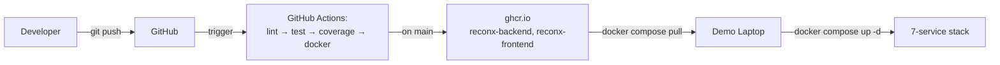

# Day 10 — Student Guide

> **Trainer-facing equivalent:** [TrainersGuide/day10/README.md](../../TrainersGuide/day10/README.md)
> **Module:** Docker & CI/CD — Enterprise Deployment

## What you'll build today

Today you containerise the entire ReconX stack and ship it to a registry
behind a real CI/CD pipeline, then deliver a 20-minute demo of the
end-to-end platform. By the end of the day, a clean clone of your repo
plus three commands should bring up a 7-service stack (Postgres, Kafka,
Zookeeper, backend, frontend, Prometheus, Grafana), pass a smoke test,
survive a 200-VU k6 load test with Grafana evidence, and be tagged
`v1.0.0`. This is the heaviest day of the programme — 20 exercises
across four workshop blocks — and the deliverables span Dockerfiles,
`docker-compose.yml`, GitHub Actions, a coverage gate, load tests,
mermaid diagrams, a comprehensive README, a 10-slide deck, two
rehearsals, a release tag, and a retrospective.

## Day at a glance

1. Standup and Day-9 carry-over check (Kafka end-to-end, DLQ wired)
2. Workshop 10 Part A: Dockerfiles, compose, provisioning (TICKET-ADV146 – TICKET-ADV153)
3. Lunch (hard stop on Dockerfile work)
4. Workshop 10 Part B: GitHub Actions pipeline (TICKET-ADV154 – TICKET-ADV157)
5. Workshop 10 Part C: load test and Grafana screenshots (TICKET-ADV158 – TICKET-ADV159)
6. Workshop 10 Part D: docs, deck, rehearsal, release (TICKET-ADV160 – TICKET-ADV164)
7. Final 20-minute demos (each team takes the projector)
8. Retrospective and close (TICKET-ADV165)

## Exercises

There are **20 exercises** today — roughly double a normal day, because
shipping a deployable, demoable system needs every layer touched at
once. Work hint-progressively: read the goal, attempt it for ten
minutes, then expand Hint 1. If you're still stuck after Hint 2,
expand Hint 3 and pair with a teammate. Only ask the trainer to open
the reference solution after all three hints have been worked through.
**Time-box ruthlessly:** if you're still patching Dockerfiles past
12:30, stop and use the trainer copy's working ones so the CI pipeline
and demo deck don't slip. Those two are non-negotiable today.

### Workshop 10 Part A — Dockerfiles, compose, provisioning

### TICKET-ADV146 — Backend multi-stage Dockerfile

**Goal:** Containerise the Spring Boot backend with a small, secure runtime image.

**What**
- `backend/Dockerfile` with two stages — `eclipse-temurin:25-jdk` build stage and `eclipse-temurin:25-jre-alpine` runtime stage running as a non-root `reconx` user — plus a sibling `backend/.dockerignore`.

**Why**
- This image is the unit ADV148 composes, ADV154 pushes to `ghcr.io/<org>/reconx-backend`, and ADV162 demos — a fat JDK image here means slow CI and embarrassed pulls on demo day.

**Observe**
- `docker images reconx-backend` reports a final size under 250 MB, and the second build after touching `src/` finishes in under 30 s because the dependency layer is cached.

**Done when:**
- `docker build backend/` produces a working image without copying the JDK or Maven into the final layer
- The final image size is under 250 MB when inspected with `docker image ls`
- A second build after editing only a `src/` file completes in under 30 seconds (dependency layer cached)

<details>
<summary>Hint 1 — gentle direction</summary>

The point of a multi-stage Dockerfile is that the tools used to *build*
your jar don't need to ship to *production*. Think about what's
strictly required at runtime versus what's only needed during compile.
Which of those should the final image keep, and which should be thrown
away after build?

</details>

<details>
<summary>Hint 2 — concrete pointer</summary>

You'll need two `FROM` lines: one tagged `AS build` using a JDK image,
and a final one based on a JRE-only image (alpine variant keeps it
small). For layer caching, copy `pom.xml` and the Maven wrapper
*before* copying `src/`, and run a dependency-resolution goal between
the two copies.

</details>

<details>
<summary>Hint 3 — near-solution shape</summary>

In the build stage, use `eclipse-temurin:25-jdk-alpine`, copy `.mvn/`,
`mvnw`, and `pom.xml`, chmod the wrapper, run `dependency:go-offline`,
then copy `src/` and run `clean package -DskipTests`. In the runtime
stage, use `eclipse-temurin:25-jre-alpine`, create a non-root `spring`
user, switch to it, copy the jar (or layered extraction) from the
build stage, expose 8080, set an ENTRYPOINT that invokes `java`.
Don't forget a `.dockerignore` excluding `target/`, `.git`, `.idea`,
`node_modules`.

</details>

<details>
<summary>Hint 4 — step-by-step walkthrough with reference solution</summary>

**Steps:**

1. Create `backend/Dockerfile` with two `FROM` stages — JDK build stage and JRE runtime stage.
2. In the build stage, copy `.mvn/`, `mvnw`, and `pom.xml` first, then run `dependency:go-offline` so deps cache as a separate layer.
3. Copy `src/` last and run `./mvnw -B -DskipTests package` to produce the jar.
4. In the runtime stage, switch to `eclipse-temurin:25-jre-alpine`, create a non-root `reconx` user, and `USER reconx`.
5. `COPY --from=build` the built jar to `/app/app.jar`, expose 8080, set an ENTRYPOINT that runs `java $JAVA_OPTS -jar app.jar`.
6. Create a sibling `backend/.dockerignore` excluding `target/`, `.git`, `.idea`, `*.iml`.
7. Run `docker build backend/` twice and verify second build hits the dependency cache (under 30 s).

**Reference solution** (`backend/Dockerfile`):

```dockerfile
# ============================================================================
# Spring Boot Dockerfile (multi-stage Maven -> JRE 21 slim)
#
# Stage 1: build the JAR with Temurin JDK 25 + Maven.
# Stage 2: copy ONLY the JAR onto a slim JRE image.
# ============================================================================

FROM eclipse-temurin:25-jdk AS build
WORKDIR /workspace
COPY pom.xml mvnw ./
COPY .mvn .mvn
RUN ./mvnw -q -B dependency:go-offline || true
COPY src src
RUN ./mvnw -q -B -DskipTests package && \
    mv target/reconx-*.jar app.jar

FROM eclipse-temurin:25-jre-alpine
RUN addgroup -S reconx && adduser -S reconx -G reconx
USER reconx
WORKDIR /app
COPY --from=build /workspace/app.jar app.jar
EXPOSE 8080
ENV JAVA_OPTS=""
ENTRYPOINT ["sh","-c","java $JAVA_OPTS -jar app.jar"]
```

</details>

**▶ Run the project — verify TICKET-ADV146 end-to-end**

Build the backend image standalone and inspect it.

```bash
docker build -t reconx-backend backend/
docker images reconx-backend                   # check final size
docker run --rm reconx-backend sh -c "id; ls -la /app"
```

**Observe:**

- Multi-stage build (Maven/JDK build stage → `eclipse-temurin:25-jre-alpine` runtime); final image < 250 MB in `docker images`
- `docker run ... id` shows `uid=...(reconx)` — container does not run as root
- `/app/app.jar` exists and the `ENTRYPOINT` runs `java -jar app.jar`
- Failure signal: image is > 500 MB — the build stage was reused as the runtime; ensure `FROM eclipse-temurin:25-jre-alpine` is the final stage with only the fat-jar copied in

---

### TICKET-ADV147 — Frontend multi-stage Dockerfile and nginx.conf

**Goal:** Build the Vite SPA in node-alpine and serve the static `dist/` from nginx-alpine.

**What**
- `frontend/Dockerfile` (node-alpine build stage running `npm ci && npm run build`, nginx-alpine runtime stage) plus `frontend/nginx.conf` with a SPA fallback and an `/api/` proxy_pass to the `backend` service.

**Why**
- The SPA fallback fixes the classic deep-link 404, and the in-container `/api/` proxy means the browser never crosses origins — both are prerequisites for the ADV153 smoke test and the ADV162 live demo.

**Observe**
- Hard-refreshing `http://localhost:5173/trades` returns `index.html` (not nginx 404), and DevTools shows `/api/v1/...` calls returning 200 with no CORS errors.

**Done when:**
- `docker build frontend/` produces a runtime image based on an nginx-alpine variant, not node
- A hard refresh on `/trades` (or any client-side route) returns the SPA, not a 404
- API calls from the browser to `/api/v1/...` reach the backend container without CORS errors

<details>
<summary>Hint 1 — gentle direction</summary>

nginx by default returns 404 for any path it doesn't have a static
file for. A React Router app only has one real file —
`index.html` — and JavaScript handles the rest of the routing. What
nginx directive lets you fall back to a default file when no other
match exists? Separately, how should nginx forward `/api/*` so the
browser stays on the same origin and avoids CORS preflight?

</details>

<details>
<summary>Hint 2 — concrete pointer</summary>

In `frontend/nginx.conf`, the SPA fallback uses a `try_files`
directive inside `location /`. The API proxy uses a separate
`location /api/` block with `proxy_pass` to the backend service.
Remember that inside docker-compose the backend's hostname is its
service name, not `localhost`. For the SSE stream endpoint (Day 7),
you need a third location block that disables buffering.

</details>

<details>
<summary>Hint 3 — near-solution shape</summary>

`try_files $uri $uri/ /index.html;` inside `location /`. The `/api/`
location does a `proxy_pass` to the backend service hostname on port
8080 plus the standard `X-Real-IP`, `X-Forwarded-For`,
`X-Forwarded-Proto` headers. The SSE block adds `proxy_http_version
1.1; proxy_buffering off; proxy_cache off; chunked_transfer_encoding
off;`. In the Dockerfile, build stage runs `npm ci` then `npm run
build`, runtime stage copies `dist/` into `/usr/share/nginx/html`
and overwrites the default conf with yours. `npm ci` requires
`package-lock.json` to be committed.

</details>

<details>
<summary>Hint 4 — step-by-step walkthrough with reference solution</summary>

**Steps:**

1. Create `frontend/Dockerfile` with a `node:22-alpine AS build` stage.
2. Copy `package.json` + `package-lock.json*` first, run `npm install`, then `COPY . .` and `npm run build`.
3. Switch to `nginx:1.27-alpine` runtime stage and `COPY --from=build /app/dist /usr/share/nginx/html`.
4. Copy your `nginx.conf` to `/etc/nginx/conf.d/default.conf` and `EXPOSE 80`.
5. Create `frontend/nginx.conf` with `location /` using `try_files $uri /index.html` for SPA fallback.
6. Add `location /api/` with `proxy_pass http://backend:8080/api/` and forwarding headers; disable buffering for SSE.
7. Build with `docker build frontend/` and verify hard refresh on `/trades` returns the SPA.

**Reference solution** (`frontend/Dockerfile`):

```dockerfile
# ============================================================================
# React multi-stage build (npm -> nginx)
# ============================================================================
FROM node:22-alpine AS build
WORKDIR /app
COPY package.json package-lock.json* ./
# `npm install` (not `npm ci`) so a stale package-lock.json doesn't block the
# image build. Trade-off: not bit-for-bit deterministic. For a real prod
# image switch to `npm ci` and treat lockfile freshness as a PR gate.
RUN npm install --no-audit --no-fund
COPY . .
RUN npm run build

FROM nginx:1.27-alpine
COPY --from=build /app/dist /usr/share/nginx/html
COPY nginx.conf /etc/nginx/conf.d/default.conf
EXPOSE 80
```

**Reference solution** (`frontend/nginx.conf`):

```
server {
    listen 80;
    server_name _;

    root /usr/share/nginx/html;
    index index.html;

    # SPA fallback: every unknown route -> index.html
    location / {
        try_files $uri /index.html;
    }

    # Proxy API to the backend service (docker-compose internal DNS)
    location /api/ {
        proxy_pass http://backend:8080/api/;
        proxy_set_header Host $host;
        proxy_set_header X-Real-IP $remote_addr;
        proxy_set_header X-Forwarded-For $proxy_add_x_forwarded_for;
        proxy_buffering off;          # SSE
        proxy_read_timeout 1h;
    }
}
```

</details>

**▶ Run the project — verify TICKET-ADV147 end-to-end**

Build the frontend image and run it standalone.

```bash
docker build -t reconx-frontend frontend/
docker images reconx-frontend                  # check final size
docker run --rm -p 8081:80 reconx-frontend &
curl -sI http://localhost:8081/ | head -1      # expect 200 OK
```

**Observe:**

- Multi-stage build (`node:22-alpine` build → `nginx:alpine` runtime); final image < 50 MB in `docker images`
- nginx serves on port 80 inside the container; `curl -I` returns `HTTP/1.1 200 OK`
- `/api/` proxy rule from `nginx.conf` forwards to `backend:8080` (only verifiable inside compose, not standalone)
- Failure signal: image is hundreds of MB — the `node_modules/` directory was copied into the runtime stage; fix the second stage to copy only `dist/`

---

### TICKET-ADV148 — docker-compose.yml with 7 services

**Goal:** Compose the full stack (postgres, zookeeper, kafka, backend, frontend, prometheus, grafana) so one command boots it all.

**What**
- `docker-compose.yml` defining seven services (`postgres`, `zookeeper`, `kafka`, `backend`, `frontend`, `prometheus`, `grafana`) on one bridge network, with `depends_on: service_healthy` gating the `backend` on Postgres and Kafka.

**Why**
- One-command boot is what ADV153's smoke test, ADV158's k6 run, and ADV163's demo rehearsal all rest on — every later ticket assumes service-name DNS (`postgres`, `kafka`) rather than `localhost`.

**Observe**
- `docker compose ps` lists all seven containers as `running (healthy)` after a single `docker compose up -d`, with no restart loops in `docker compose logs backend`.

**Done when:**
- `docker compose up -d` starts all 7 services and the backend reaches `healthy` status without restart loops
- The backend waits for both Postgres and Kafka to be healthy before starting (verifiable in `docker compose logs`)
- The frontend can reach the backend through the compose network with no `localhost` references in any service-to-service URL

<details>
<summary>Hint 1 — gentle direction</summary>

The single most common Workshop-10 mistake is using `localhost`
somewhere inside the compose network. Inside a container, `localhost`
means the container itself — it does not mean "another container".
What name should one service use to reach another? Separately, what
compose feature ensures the backend doesn't try to connect to
Postgres before Postgres is ready to accept connections?

</details>

<details>
<summary>Hint 2 — concrete pointer</summary>

Use **service names** as DNS hostnames — `postgres`, `kafka`,
`prometheus`, `backend`. The `depends_on:` block under the backend
needs the long-form syntax with `condition: service_healthy` for both
postgres and kafka. Every service needs a `healthcheck:` block of its
own — Postgres uses `pg_isready`, Kafka uses `kafka-topics --list`,
the backend hits `/actuator/health`. Kafka needs two advertised
listeners: one on the compose network and one for your laptop.

</details>

<details>
<summary>Hint 3 — near-solution shape</summary>

Top-level keys: `name: reconx`, `services:`, `volumes:` (for
postgres/prometheus/grafana data), `networks:` (one bridge network all
services join). Each service: `image:` (use `${BACKEND_IMAGE:-...}`
syntax so `.env` can override), `container_name:`, `environment:`,
`ports:`, `healthcheck:`, `depends_on:` with long-form conditions,
`networks: [reconx-net]`. Kafka environment must set
`KAFKA_ADVERTISED_LISTENERS` with two entries (one internal, one
host) and matching `KAFKA_LISTENERS`. Consider putting Kafdrop behind
`profiles: ["debug"]` so it's opt-in.

</details>

<details>
<summary>Hint 4 — step-by-step walkthrough with reference solution</summary>

**Steps:**

1. Create `docker-compose.yml` at repo root with top-level `services:`, `volumes:`, `networks:`.
2. Define `postgres` (image, env, `pg_isready` healthcheck, volume) on a shared bridge network.
3. Define `zookeeper` + `kafka` — Kafka needs two advertised listeners (`PLAINTEXT://kafka:29092` and `PLAINTEXT_HOST://localhost:9092`).
4. Define `backend` with `depends_on: { postgres: { condition: service_healthy }, kafka: { condition: service_healthy } }`.
5. Define `frontend` depending on backend health, expose port 5173:80.
6. Define `prometheus` (mount `monitoring/prometheus/prometheus.yml`) and `grafana` (mount provisioning + data volume).
7. Put `kafdrop` behind `profiles: ["debug"]` so default `up` brings 7 services.
8. Run `docker compose up -d` and verify all containers reach `healthy` without restart loops.

**Reference solution** (`docker-compose.yml`):

```yaml
# =============================================================================
# 7-service stack: backend, frontend, postgres, kafka, zookeeper,
#                prometheus, grafana (+ optional kafdrop behind "debug" profile)
# Health checks gate dependent services
# =============================================================================
services:

  postgres:
    image: postgres:16-alpine
    container_name: reconx-postgres
    environment:
      POSTGRES_DB:       reconx
      POSTGRES_USER:     reconx_user
      POSTGRES_PASSWORD: reconx_pass
    ports: ["5432:5432"]
    volumes:
      - postgres_data:/var/lib/postgresql/data
    healthcheck:
      test: ["CMD-SHELL", "pg_isready -U reconx_user -d reconx"]
      interval: 5s
      timeout: 3s
      retries: 10
    networks: [reconx]

  zookeeper:
    image: confluentinc/cp-zookeeper:7.6.0
    container_name: reconx-zookeeper
    environment:
      ZOOKEEPER_CLIENT_PORT: 2181
      ZOOKEEPER_TICK_TIME:   2000
    networks: [reconx]

  kafka:
    image: confluentinc/cp-kafka:7.6.0
    container_name: reconx-kafka
    depends_on: [zookeeper]
    ports: ["9092:9092"]
    environment:
      KAFKA_BROKER_ID: 1
      KAFKA_ZOOKEEPER_CONNECT: zookeeper:2181
      KAFKA_ADVERTISED_LISTENERS: PLAINTEXT://kafka:29092,PLAINTEXT_HOST://localhost:9092
      KAFKA_LISTENER_SECURITY_PROTOCOL_MAP: PLAINTEXT:PLAINTEXT,PLAINTEXT_HOST:PLAINTEXT
      KAFKA_INTER_BROKER_LISTENER_NAME: PLAINTEXT
      KAFKA_OFFSETS_TOPIC_REPLICATION_FACTOR: 1
      KAFKA_AUTO_CREATE_TOPICS_ENABLE: "true"
    healthcheck:
      test: ["CMD-SHELL", "kafka-topics --bootstrap-server localhost:9092 --list || exit 1"]
      interval: 10s
      timeout: 5s
      retries: 10
    networks: [reconx]

  backend:
    build: ./backend
    image: ghcr.io/sidoncode/reconx-backend:latest
    container_name: reconx-backend
    depends_on:
      postgres: {condition: service_healthy}
      kafka:    {condition: service_healthy}
    ports: ["8080:8080"]
    environment:
      SPRING_PROFILES_ACTIVE: uat
      POSTGRES_HOST: postgres
      POSTGRES_PORT: 5432
      POSTGRES_DB:   reconx
      POSTGRES_USER: reconx_user
      POSTGRES_PASSWORD: reconx_pass
      KAFKA_BOOTSTRAP: kafka:29092
      JWT_SECRET: ${JWT_SECRET:-dev-secret-change-me-32-bytes-min!!}
    healthcheck:
      test: ["CMD", "wget", "--spider", "-q", "http://localhost:8080/api/actuator/health"]
      interval: 10s
      timeout: 5s
      retries: 10
    networks: [reconx]

  frontend:
    build: ./frontend
    image: ghcr.io/sidoncode/reconx-frontend:latest
    container_name: reconx-frontend
    depends_on:
      backend: {condition: service_healthy}
    ports: ["5173:80"]
    networks: [reconx]

  prometheus:
    image: prom/prometheus:v2.54.1
    container_name: reconx-prometheus
    volumes:
      - ./monitoring/prometheus/prometheus.yml:/etc/prometheus/prometheus.yml:ro
      - ./monitoring/prometheus/alerts.yml:/etc/prometheus/alerts.yml:ro
    ports: ["9090:9090"]
    networks: [reconx]

  grafana:
    image: grafana/grafana:11.2.0
    container_name: reconx-grafana
    depends_on: [prometheus]
    environment:
      GF_SECURITY_ADMIN_USER:     admin
      GF_SECURITY_ADMIN_PASSWORD: admin
      GF_USERS_ALLOW_SIGN_UP:     "false"
    volumes:
      - ./monitoring/grafana/provisioning:/etc/grafana/provisioning:ro
      - grafana_data:/var/lib/grafana
    ports: ["3000:3000"]
    networks: [reconx]

  # Optional — bring up with `--profile debug`
  kafdrop:
    image: obsidiandynamics/kafdrop:4.0.1
    container_name: reconx-kafdrop
    profiles: ["debug"]
    depends_on: [kafka]
    environment:
      KAFKA_BROKERCONNECT: kafka:29092
      JVM_OPTS: "-Xms32M -Xmx64M"
    ports: ["9000:9000"]
    networks: [reconx]

networks:
  reconx:

volumes:
  postgres_data:
  grafana_data:
```

</details>

**▶ Run the project — verify TICKET-ADV148 end-to-end**

Boot the full compose stack from a clean state.

```bash
docker compose down -v
docker compose up -d --build
# wait ~60s for all services to settle
docker compose ps
```

**Observe:**

- `docker compose ps` lists all eight services — postgres, kafka, zookeeper, kafdrop, prometheus, grafana, backend, frontend — each with STATUS column `Up ... (healthy)`
- `docker network ls` shows the project-scoped network (e.g. `reconx_reconx`) and every service is attached to it
- Named volumes `postgres_data` and `grafana_data` exist (`docker volume ls`) and persist across `docker compose restart`
- Failure signal: a service stays `restarting` — `docker compose logs <name>` shows the cause (wrong image, env var missing, port collision)

---

### TICKET-ADV149 — Prometheus scrape config

**Goal:** Configure Prometheus to scrape the Spring Boot actuator metrics endpoint and Kafka JMX.

**What**
- `monitoring/prometheus/prometheus.yml` with `scrape_configs` jobs for `backend` (path `/actuator/prometheus`, target `backend:8080`) and `kafka` JMX, mounted read-only into the prometheus container at `/etc/prometheus/prometheus.yml`.

**Why**
- The Micrometer metrics ADV072 wired into the backend are inert until Prometheus actually scrapes them — and ADV150's Grafana panels, ADV159's screenshots, and the ADV162 monitoring slide all depend on this datasource being live.

**Observe**
- `http://localhost:9090/targets` shows the `backend` job as `UP` with `target = backend:8080` (not `localhost:8080`), and the last-scrape timestamp ticks every 15 s.

**Done when:**
- `monitoring/prometheus/prometheus.yml` declares scrape jobs for the backend and Kafka
- Visiting `http://localhost:9090/targets` shows the spring-boot target as **UP**, not DOWN
- The targets list does not contain `localhost:8080` as a scrape URL

<details>
<summary>Hint 1 — gentle direction</summary>

Prometheus runs in its own container. If you tell it to scrape
`localhost:8080`, what address is it actually trying to reach?
Remember the rule from TICKET-ADV148 — service-to-service traffic uses
service names. The same applies here.

</details>

<details>
<summary>Hint 2 — concrete pointer</summary>

You need a `scrape_configs:` list with one job per target. Each job
has a `job_name`, optional `metrics_path` (Spring Boot's Prometheus
endpoint isn't at the root), and a `static_configs` block listing
`targets:`. Labels under each target let you filter in Grafana later.
Mount this file read-only into the prometheus container at
`/etc/prometheus/prometheus.yml`.

</details>

<details>
<summary>Hint 3 — near-solution shape</summary>

Three jobs: `spring-boot` (target `backend:8080`, `metrics_path:
/actuator/prometheus`), `kafka-jmx` (target `kafka:9101`), and an
optional `prometheus-self` (target `localhost:9090` — this one *is*
correct because Prometheus scraping itself happens inside its own
container). Set `global.scrape_interval: 10s`. Add labels `app: reconx`
and a per-job `service:` label for filtering.

</details>

<details>
<summary>Hint 4 — step-by-step walkthrough with reference solution</summary>

**Steps:**

1. Create `monitoring/prometheus/prometheus.yml` with `global` block setting `scrape_interval: 10s`.
2. Reference `alerts.yml` in `rule_files:` so Day-9 alert rules load alongside the scrape config.
3. Add a `scrape_configs:` job named `reconx-backend` with `metrics_path: /api/actuator/prometheus` and target `backend:8080`.
4. Add a self-scrape job named `prometheus` targeting `localhost:9090` so the Prometheus instance scrapes itself.
5. Mount the file read-only at `/etc/prometheus/prometheus.yml` in `docker-compose.yml`.
6. Visit `http://localhost:9090/targets` and confirm the `reconx-backend` target is UP, not DOWN.

**Reference solution** (`monitoring/prometheus/prometheus.yml`):

```yaml
# Prometheus scrape config
global:
  scrape_interval: 10s
  evaluation_interval: 10s

rule_files:
  - "alerts.yml"

scrape_configs:

  - job_name: 'reconx-backend'
    metrics_path: '/api/actuator/prometheus'
    static_configs:
      - targets: ['backend:8080']

  - job_name: 'prometheus'
    static_configs:
      - targets: ['localhost:9090']
```

</details>

**▶ Run the project — verify TICKET-ADV149 end-to-end**

Bring Prometheus and the backend up, then check Prometheus is scraping the backend job.

```bash
docker compose up -d prometheus backend
open http://localhost:9090/targets
```

**Observe:**

- The `reconx-backend` target shows State `UP` with `scrape_interval=15s`
- Endpoint is `http://backend:8080/api/actuator/prometheus` (service name, not localhost)
- Querying `up{job="reconx-backend"}` in the Prometheus expression bar returns `1`
- Failure signal: target is DOWN with `connection refused` — `management.endpoints.web.exposure.include` is missing `prometheus`, or the backend isn't on the same compose network

---

### TICKET-ADV150 — Grafana provisioning (datasource + dashboards)

**Goal:** Auto-provision the Prometheus datasource and the ReconX dashboard so Grafana is usable on first boot.

**What**
- `monitoring/grafana/provisioning/datasources/prometheus.yml` plus `monitoring/grafana/provisioning/dashboards/reconx.yml` and a JSON dashboard under `monitoring/grafana/dashboards/`, mounted into the grafana container so the ReconX folder appears with no manual import.

**Why**
- Provisioning turns "click around to set up Grafana" into a repeatable artifact — the same dashboard ADV159 screenshots, ADV161 inlines in the README, and ADV162 puts on the monitoring slide.

**Observe**
- `http://localhost:3000` (after first boot) shows a "ReconX" folder with the dashboard, and every panel renders data within 30 s — no "No data" placeholders due to a datasource UID mismatch.

**Done when:**
- `monitoring/grafana/provisioning/datasources/prometheus.yml` declares Prometheus as the default datasource
- After `docker compose up`, the Grafana UI shows a "ReconX" folder containing the dashboard with no manual import
- Every dashboard panel renders data (not "No data") within 30 seconds of the stack being healthy

<details>
<summary>Hint 1 — gentle direction</summary>

Grafana has two provisioning concepts: datasources and dashboard
providers. Datasources tell Grafana *where* to query. Dashboard
providers tell Grafana *which folder on disk* to scan for JSON
dashboards. Both are YAML files in a specific directory tree that you
mount into the container. The trickiest part of provisioning is a
single ID field that must match between the datasource YAML and every
panel inside the dashboard JSON — if they don't match, every panel
says "No data".

</details>

<details>
<summary>Hint 2 — concrete pointer</summary>

Mount two directories: the provisioning tree at
`/etc/grafana/provisioning` (Grafana reads this on startup), and a
dashboards folder at `/var/lib/grafana/dashboards` (the folder the
dashboard provider scans). The datasource YAML sets `apiVersion: 1`,
`type: prometheus`, `access: proxy`, the prometheus container URL,
and a `uid:` you control. The dashboard provider YAML sets
`apiVersion: 1`, `providers:` with `type: file` and `options.path`
pointing at the dashboards folder. Every panel's `datasource.uid` in
the JSON must equal the datasource's `uid`.

</details>

<details>
<summary>Hint 3 — near-solution shape</summary>

Datasource file fields: `name: Prometheus`, `uid: reconx-prometheus`,
`isDefault: true`, `editable: false`. Dashboard provider file fields:
`name: 'ReconX dashboards'`, `folder: 'ReconX'`,
`updateIntervalSeconds: 30`, `options.path` to the dashboards
directory. When you export the dashboard JSON from a different
Grafana instance, do a global find-and-replace on the old UID before
committing. First debug step if panels are empty: tail the grafana
container logs filtering for `provision`, then grep the dashboard
JSONs for `uid` and compare to the datasource UID.

</details>

<details>
<summary>Hint 4 — step-by-step walkthrough with reference solution</summary>

**Steps:**

1. Create `monitoring/grafana/provisioning/datasources/prometheus.yml` with `apiVersion: 1`.
2. Declare one datasource named `Prometheus`, `type: prometheus`, `access: proxy`, `url: http://prometheus:9090`, `isDefault: true`, and a fixed `uid: reconx-prometheus`.
3. Create `monitoring/grafana/provisioning/dashboards/reconx.yml` declaring a `providers:` entry with `type: file` and `options.path` pointing at the dashboards folder.
4. Set `folder: 'ReconX'` so all provisioned dashboards land in a "ReconX" folder in the UI.
5. Mount `./monitoring/grafana/provisioning` to `/etc/grafana/provisioning` in the grafana service.
6. Confirm panels render data within 30 s of stack boot — if "No data", grep the dashboard JSON for `uid` and verify it matches `reconx-prometheus`.

**Reference solution** (`monitoring/grafana/provisioning/datasources/prometheus.yml`):

```yaml
# Auto-provision the Prometheus datasource
apiVersion: 1
datasources:
  - name: Prometheus
    uid: reconx-prometheus
    type: prometheus
    access: proxy
    url: http://prometheus:9090
    isDefault: true
    jsonData:
      timeInterval: 10s
```

**Reference solution** (`monitoring/grafana/provisioning/dashboards/reconx.yml`):

```yaml
# Provider definition: load every dashboard JSON in /dashboards
apiVersion: 1
providers:
  - name: reconx
    orgId: 1
    folder: 'ReconX'
    type: file
    disableDeletion: false
    updateIntervalSeconds: 30
    options:
      path: /etc/grafana/provisioning/dashboards
```

</details>

**▶ Run the project — verify TICKET-ADV150 end-to-end**

Bring Grafana up under compose and confirm both the datasource and the dashboards are provisioned without any manual import.

```bash
docker compose up -d grafana
# wait ~10s for Grafana to import
open http://localhost:3000          # login admin / admin
```

**Observe:**

- Login screen accepts `admin` / `admin` (or whatever `GF_SECURITY_ADMIN_PASSWORD` is set to)
- Configuration → Data sources lists Prometheus as pre-configured with `http://prometheus:9090`
- Dashboards → Browse shows the ReconX Overview dashboard already loaded under the `ReconX` folder — no JSON import needed
- Failure signal: Grafana shows the empty welcome screen — the `provisioning/` directory wasn't bind-mounted into `/etc/grafana/provisioning`

---

### TICKET-ADV151 — Liquibase migrations on container startup

**Goal:** Ensure Liquibase changesets apply automatically when the stack boots, before the backend accepts traffic.

**What**
- `backend/src/main/resources/application-docker.yml` with `spring.liquibase.enabled: true`, `change-log:` pointed at the ADV012 master changelog, and `spring.jpa.hibernate.ddl-auto: validate` pinned for the docker profile.

**Why**
- The ADV012 master changelog and every later migration (ADV032, ADV073, ADV091, ...) only matter on demo day if the container entrypoint actually runs them — and `ddl-auto: validate` keeps Hibernate from silently mutating the Liquibase-owned schema.

**Observe**
- `docker compose down -v && docker compose up -d` brings the backend to `healthy`, and `docker compose logs backend` shows the Liquibase "Successfully released change log lock" line before the Tomcat "Started ReconxApplication" line.

**Done when:**
- A fresh `docker compose down -v && docker compose up -d` applies all changesets and the backend reaches healthy state
- `hibernate.ddl-auto` is set to `validate` (never `update` or `create`) in the docker profile
- The backend container does not race against Postgres on startup (depends_on with service_healthy)

<details>
<summary>Hint 1 — gentle direction</summary>

There are two viable approaches: run Liquibase as part of Spring Boot
startup (the recommended path), or run it as a separate init
container that finishes before the backend starts. The in-app option
is simpler and matches what most teams use. Either way, the backend
must not try to connect to Postgres before Postgres is ready — and
JPA must be configured to *validate* the schema, never modify it,
because Liquibase owns it.

</details>

<details>
<summary>Hint 2 — concrete pointer</summary>

For Option A (recommended): in `application-docker.yml`, configure
`spring.liquibase.enabled: true`, point `change-log:` at your master
changelog, optionally set `contexts:`, and pin
`spring.jpa.hibernate.ddl-auto: validate`. For Option B (only if
migrations are slow): add a `db-migrate` service to docker-compose
that runs the Liquibase CLI and exits, with the backend depending on
it via `condition: service_completed_successfully`.

</details>

<details>
<summary>Hint 3 — near-solution shape</summary>

Option A YAML keys: `spring.liquibase.enabled`,
`spring.liquibase.change-log` pointing at
`classpath:db/changelog/db.changelog-master.xml`,
`spring.liquibase.contexts: prod`,
`spring.liquibase.drop-first: false`, and
`spring.jpa.hibernate.ddl-auto: validate`. The backend's `depends_on`
includes `postgres: { condition: service_healthy }`. Boot order is:
postgres → healthy → backend container starts → Liquibase runs
against postgres → Spring context finishes → actuator health goes UP
→ frontend's depends_on releases it.

</details>

<details>
<summary>Hint 4 — step-by-step walkthrough with reference solution</summary>

**Steps:**

1. Open `backend/src/main/resources/application-uat.yml` (the profile used in docker-compose).
2. Confirm `spring.datasource.url` uses env vars (`${POSTGRES_HOST:localhost}`) so the same profile works on a dev box and the compose network.
3. Set `spring.jpa.hibernate.ddl-auto: validate` so JPA never mutates the schema — Liquibase owns it.
4. Verify the master changelog at `classpath:db/changelog/db.changelog-master.xml` is found by Spring Boot's autoconfig (no extra config needed unless overriding contexts).
5. In `docker-compose.yml`, ensure backend has `depends_on: postgres: {condition: service_healthy}` so migrations don't race the database.
6. Run `docker compose down -v && docker compose up -d`, tail the backend logs, and confirm Liquibase changesets apply before the actuator health goes UP.

**Reference solution** (`backend/src/main/resources/application-uat.yml`):

```yaml
# =============================================================================
# uat profile: PostgreSQL on docker-compose
# =============================================================================
spring:
  datasource:
    url: jdbc:postgresql://${POSTGRES_HOST:localhost}:${POSTGRES_PORT:5432}/${POSTGRES_DB:reconx}
    username: ${POSTGRES_USER:reconx_user}
    password: ${POSTGRES_PASSWORD:reconx_pass}
    driver-class-name: org.postgresql.Driver
    hikari:
      maximum-pool-size: 20
      connection-timeout: 5000
  jpa:
    properties:
      hibernate.dialect: org.hibernate.dialect.PostgreSQLDialect
      hibernate.jdbc.batch_size: 50

logging:
  level:
    com.dbtraining.reconx: INFO
```

</details>

**▶ Run the project — verify TICKET-ADV151 end-to-end**

Bring the stack up from a clean volume and confirm Liquibase runs before backend serves traffic.

```bash
docker compose down -v
docker compose up -d --build
docker compose logs backend | grep -i liquibase
docker exec reconx-postgres psql -U reconx -d reconx -c "SELECT id, author, filename FROM databasechangelog ORDER BY orderexecuted;"
```

**Observe:**

- Backend logs show `Liquibase: Successfully acquired change log lock` followed by changesets applied, before the Tomcat `Started Application` line
- `databasechangelog` table lists every changeset the team has authored
- Backend reaches healthy state only after Postgres reports `healthy` — proves `depends_on: service_healthy` is wired
- `hibernate.ddl-auto` resolves to `validate` in the running container (check `docker exec reconx-backend env | grep DDL` or boot logs)

---

### TICKET-ADV152 — Verify every healthcheck works in isolation

**Goal:** Confirm each container's healthcheck transitions from `starting` to `healthy` within its retry budget.

**What**
- Per-service `healthcheck:` blocks in `docker-compose.yml` for postgres (`pg_isready`), kafka (`kafka-topics --list`), backend (`wget /actuator/health`), with `interval`, `timeout`, `retries`, and `start_period` tuned per service.

**Why**
- The ADV148 `depends_on: service_healthy` gates are only as good as the underlying checks — a check that never transitions out of `starting` deadlocks the whole boot sequence the ADV153 smoke test and ADV163 demo depend on.

**Observe**
- `docker inspect --format '{{.State.Health.Status}}' reconx-postgres` returns `healthy` within 10 s of `up -d postgres`, kafka within 30 s, backend within 60 s.

**Done when:**
- `docker inspect` on `reconx-postgres` returns `healthy` within 10 s of `up -d postgres`
- The same inspect on `reconx-kafka` returns `healthy` within 30 s
- The same inspect on `reconx-backend` returns `healthy` within 60 s (Liquibase runs in that window)

<details>
<summary>Hint 1 — gentle direction</summary>

A healthcheck stuck on `starting` forever usually means the check
*command itself* fails — typo in the URL, wrong tool not installed in
the container, wrong port. Don't guess. Run the exact check command
manually inside the container and read the error. That tells you
what's wrong in seconds.

</details>

<details>
<summary>Hint 2 — concrete pointer</summary>

Use `docker exec <container> <the-test-command>` to run the
healthcheck by hand. For Postgres, the check uses `pg_isready` with
the right user and database. For Kafka, it uses `kafka-topics
--bootstrap-server` against the internal listener. For the backend,
it's a `wget` against the actuator health endpoint parsing the JSON
for `"status":"UP"`. Tune `interval`, `timeout`, `retries`, and
`start_period` per service — Kafka and the backend need longer
start_periods than Postgres.

</details>

<details>
<summary>Hint 3 — near-solution shape</summary>

Recommended budgets: Postgres `interval 5s, timeout 5s, retries 10`;
Kafka `interval 10s, timeout 5s, retries 15` (the broker takes time
to talk to zookeeper); Backend `interval 10s, timeout 5s, retries 20,
start_period 30s` (Liquibase plus Spring context); Frontend nginx
with lower retries. Validate each by bringing up only that service,
inspecting, then moving to the next. If the backend stays
`unhealthy`, the most common cause is a typo in the wget URL inside
the healthcheck test command.

</details>

<details>
<summary>Hint 4 — step-by-step walkthrough with reference solution</summary>

**Steps:**

1. Bring up only Postgres: `docker compose up -d postgres`.
2. Inspect: `docker inspect --format='{{.State.Health.Status}}' reconx-postgres` — should be `healthy` within 10 s.
3. Bring up Kafka and zookeeper next, inspect `reconx-kafka` — should reach healthy within 30 s.
4. Bring up the backend and inspect `reconx-backend` — Liquibase runs in this window, so allow 60 s.
5. If any check stays `starting` forever, run the exact check command inside the container with `docker exec` to read the real error.
6. Tune `interval`, `timeout`, `retries`, `start_period` in `docker-compose.yml` per service if the budgets are too tight.

**Reference solution** (verification script `scripts/check-healthchecks.sh`):

```bash
#!/usr/bin/env bash
set -euo pipefail

echo "[1/3] Postgres..."
docker compose up -d postgres
for i in {1..10}; do
  s=$(docker inspect --format='{{.State.Health.Status}}' reconx-postgres 2>/dev/null || echo starting)
  [[ "$s" == "healthy" ]] && { echo "  postgres healthy"; break; }
  sleep 1
done
[[ "$s" == "healthy" ]] || { echo "postgres not healthy"; docker exec reconx-postgres pg_isready -U reconx_user -d reconx; exit 1; }

echo "[2/3] Kafka..."
docker compose up -d kafka
for i in {1..15}; do
  s=$(docker inspect --format='{{.State.Health.Status}}' reconx-kafka 2>/dev/null || echo starting)
  [[ "$s" == "healthy" ]] && { echo "  kafka healthy"; break; }
  sleep 2
done
[[ "$s" == "healthy" ]] || { echo "kafka not healthy"; docker exec reconx-kafka kafka-topics --bootstrap-server localhost:9092 --list; exit 1; }

echo "[3/3] Backend..."
docker compose up -d backend
for i in {1..20}; do
  s=$(docker inspect --format='{{.State.Health.Status}}' reconx-backend 2>/dev/null || echo starting)
  [[ "$s" == "healthy" ]] && { echo "  backend healthy"; break; }
  sleep 3
done
[[ "$s" == "healthy" ]] || { echo "backend not healthy"; docker exec reconx-backend wget -qO- http://localhost:8080/api/actuator/health; exit 1; }

echo "All healthchecks green."
```

</details>

**▶ Verify the artifact — TICKET-ADV152 end-to-end**

Audit every container's healthcheck individually, then assert each reaches `healthy`.

```bash
docker compose up -d
docker compose ps                                   # STATUS column must show (healthy) for every service
docker inspect $(docker compose ps -q backend) | grep -A 10 '"Health"'
```

**Observe:**

- Each service definition in `docker-compose.yml` has its own `healthcheck:` block (no service relies on `depends_on` alone)
- `docker compose ps` STATUS column reads `(healthy)` for postgres, kafka, zookeeper, kafdrop, prometheus, grafana, backend, frontend
- `docker inspect` Health block for backend shows `Status: healthy` with a recent `Log` entry returning exit code 0
- Failure signal: a service stuck in `(health: starting)` past its `start_period` — open its healthcheck command and fix it before continuing

---

### TICKET-ADV153 — Compose smoke-test script

**Goal:** Write a single shell script that brings the stack up and proves end-to-end correctness in seven steps.

**What**
- `scripts/smoke-test.sh` running `set -euo pipefail` and exercising seven steps: stack up, login, trade POST, Kafka event consumed, Postgres audit row, Prometheus target UP, Grafana datasource reachable.

**Why**
- If this script is green, the ADV163 rehearsal and ADV162 live demo are green — it codifies the manual checklist the team would otherwise scramble through five minutes before the demo slot.

**Observe**
- `bash scripts/smoke-test.sh` on a freshly-cloned repo exits 0 in roughly 90 s, and any deliberately-broken step (e.g. wrong JWT) makes it exit non-zero with a clear `[step N] ... FAILED` message.

**Done when:**
- `bash scripts/smoke-test.sh` runs to completion with exit code 0 on a freshly-cloned repo
- The script exits non-zero with a clear message if any individual step fails (login, trade post, Kafka event, audit row, Prometheus, Grafana)
- The script uses `set -euo pipefail` and does not hang indefinitely on any wait loop (cap with a retry counter)

<details>
<summary>Hint 1 — gentle direction</summary>

The smoke test is the demo. If the smoke test passes, the demo will
pass. Think about the seven things you'd manually check before a demo:
stack is up, login works, you can post a trade, Kafka received the
event, Postgres recorded an audit row, Prometheus is scraping, Grafana
has the datasource. Each of those is one section of the script. The
script's value comes from exiting non-zero on the first failure with
a clear message — that's what tells you exactly where to look.

</details>

<details>
<summary>Hint 2 — concrete pointer</summary>

Use `set -euo pipefail` at the top so unexpected failures stop the
script. Use `curl -fsS` for HTTP calls (fails on non-2xx). Parse JSON
with `jq`. Wait for the backend with a bounded `for` loop polling
`docker inspect`, breaking when status is `healthy`. For the Kafka
check, `docker exec` into the broker and run `kafka-console-consumer`
with `--max-messages 1 --timeout-ms 10000`. For Prometheus, query
`/api/v1/query?query=up{job="spring-boot"}` and assert the value is
`"1"`. For Grafana, hit `/api/datasources/uid/<your-uid>` with basic
auth.

</details>

<details>
<summary>Hint 3 — near-solution shape</summary>

Seven sections: (1) `docker compose down -v` then `up -d`, wait for
backend healthy with a bounded retry loop; (2) POST `/api/auth/login`
and capture the access token; (3) POST `/api/v1/trades` with a
`SMOKE-001` tradeRef, print the returned id; (4) `docker exec
reconx-kafka kafka-console-consumer` and grep for SMOKE-001; (5)
`docker exec reconx-postgres psql -tAc` a count query against
audit_log and assert non-zero; (6) curl Prometheus `up{job=...}` and
parse the value equals `"1"`; (7) curl Grafana datasource API and
assert the returned UID. Each section prints a tick on success,
exits 1 with a cross on failure.

</details>

<details>
<summary>Hint 4 — step-by-step walkthrough with reference solution</summary>

**Steps:**

1. Create `scripts/smoke-test.sh`, mark executable (`chmod +x`), start with `#!/usr/bin/env bash` and `set -euo pipefail`.
2. Step 1: `docker compose down -v && docker compose up -d`, then poll `docker inspect` for backend healthy with bounded retry loop.
3. Step 2: POST `/api/auth/login` with `curl -fsS`, parse the JWT with `jq -r .accessToken`.
4. Step 3: POST `/api/v1/trades` with the token and a `SMOKE-001` tradeRef, capture the returned id.
5. Step 4: `docker exec reconx-kafka kafka-console-consumer` with `--max-messages 1 --timeout-ms 10000`, grep for SMOKE-001.
6. Step 5: `docker exec reconx-postgres psql -tAc` a count against `audit_log`, assert non-zero.
7. Step 6: curl Prometheus `/api/v1/query?query=up{job="spring-boot"}` and assert value `"1"`.
8. Step 7: curl Grafana `/api/datasources/uid/reconx-prometheus` with basic auth and assert the returned UID.

**Reference solution** (`scripts/smoke-test.sh`):

```bash
#!/usr/bin/env bash
# ============================================================================
# File: scripts/smoke-test.sh
# TICKET-ADV153 — End-to-end smoke test for the full 7-service stack
# Run from repo root: bash scripts/smoke-test.sh
# ============================================================================
set -euo pipefail

echo "▶ 1/7  Bringing the stack up..."
docker compose down -v >/dev/null 2>&1 || true
docker compose up -d
echo "  Waiting up to 90s for backend to be healthy..."
for i in {1..18}; do
  status=$(docker inspect --format='{{.State.Health.Status}}' reconx-backend 2>/dev/null || echo starting)
  [[ "$status" == "healthy" ]] && break
  sleep 5
done
[[ "$status" == "healthy" ]] || { echo "✗ backend not healthy"; exit 1; }
echo "  ✓ backend healthy"

echo "▶ 2/7  Logging in as trader..."
TOKEN=$(curl -fsS -X POST http://localhost:8080/api/auth/login \
  -H 'Content-Type: application/json' \
  -d '{"email":"trader@db.com","password":"trader123"}' | jq -r .accessToken)
[[ -n "$TOKEN" && "$TOKEN" != "null" ]] || { echo "✗ login failed"; exit 1; }
echo "  ✓ JWT acquired"

echo "▶ 3/7  Posting a trade..."
TRADE=$(curl -fsS -X POST http://localhost:8080/api/v1/trades \
  -H "Authorization: Bearer $TOKEN" \
  -H 'Content-Type: application/json' \
  -d '{"tradeRef":"SMOKE-001","instrumentSymbol":"SAP.DE","counterpartyLei":"5493001ABCDE12345001","quantity":100,"price":245.5,"tradeDate":"2026-06-02"}')
echo "  ✓ trade created: $(echo "$TRADE" | jq -r .id)"

echo "▶ 4/7  Confirming Kafka event..."
sleep 3
docker exec reconx-kafka kafka-console-consumer \
  --bootstrap-server kafka:29092 --topic trade-events \
  --from-beginning --max-messages 1 --timeout-ms 10000 | grep -q SMOKE-001 \
  && echo "  ✓ trade-event found on topic" || { echo "✗ no Kafka event"; exit 1; }

echo "▶ 5/7  Confirming Postgres audit row..."
docker exec reconx-postgres psql -U reconx_user -d reconx -tAc \
  "SELECT COUNT(*) FROM audit_log WHERE table_name='trades';" | grep -qv '^0$' \
  && echo "  ✓ audit row present" || { echo "✗ no audit row"; exit 1; }

echo "▶ 6/7  Confirming Prometheus scrape..."
curl -fsS http://localhost:9090/api/v1/query?query=up\{job=\"spring-boot\"\} \
  | jq -e '.data.result[0].value[1]=="1"' >/dev/null \
  && echo "  ✓ Prometheus scraping backend" || { echo "✗ Prometheus target DOWN"; exit 1; }

echo "▶ 7/7  Confirming Grafana datasource..."
curl -fsS -u admin:admin http://localhost:3000/api/datasources/uid/reconx-prometheus \
  | jq -e '.uid=="reconx-prometheus"' >/dev/null \
  && echo "  ✓ Grafana datasource provisioned" || { echo "✗ Grafana datasource missing"; exit 1; }

echo
echo "✅  All 7 checks green — stack is demo-ready."
```

</details>

**▶ Run the project — verify TICKET-ADV153 end-to-end**

Run the smoke script against the running compose stack.

```bash
docker compose up -d --wait
bash scripts/smoke-test.sh
echo "exit=$?"
```

**Observe:**

- Every check line prints `✓` and the script exits with `0`
- Final line: `All 7 checks green — stack is demo-ready.`
- Failure signal: stop one service (`docker compose stop prometheus`) and re-run — the corresponding line prints `✗`, the script exits non-zero, and it names exactly which check failed

---

### Workshop 10 Part B — GitHub Actions CI/CD pipeline

### TICKET-ADV154 — CI workflow with GHCR push

**Goal:** Write a GitHub Actions workflow that lints, tests, builds, and pushes Docker images to GHCR on every push to main.

**What**
- `.github/workflows/ci.yml` with `lint`, `test`, `build-and-push` jobs chained via `needs:`, top-level `permissions: packages: write`, and `docker/build-push-action` pushing `ghcr.io/<org>/reconx-{backend,frontend}` tagged `:latest` and the commit SHA.

**Why**
- This is the pipeline ADV155 (Liquibase validate), ADV156 (coverage gate), ADV157 (Checkstyle), and ADV164 (`v1.0.0` tag) all hang off — and the GHCR images it pushes are exactly what the demo laptop pulls in ADV163.

**Observe**
- A push to `main` makes the workflow go green end-to-end, and the repo's Packages page lists `reconx-backend:latest` plus the SHA tag pullable via `docker pull ghcr.io/<org>/reconx-backend:latest`.

**Done when:**
- `.github/workflows/ci.yml` runs on push to main/develop, on PR, and on `v*` tag pushes
- The build-and-push job only runs on push events to main or tag refs (not on PRs)
- Pushed images appear in your repo's Packages page tagged with both `:latest` and the commit SHA, and `docker pull` succeeds from your laptop after `docker login ghcr.io`

<details>
<summary>Hint 1 — gentle direction</summary>

A workflow's `GITHUB_TOKEN` is read-only by default. To push container
images to GitHub Container Registry, the workflow has to *opt in* to
write permissions for the `packages` scope. Separately, think about
tagging: you want both an immutable audit-trail tag (the commit SHA)
and a convenience tag (`:latest`) — both should be pushed from the
same metadata-action step.

</details>

<details>
<summary>Hint 2 — concrete pointer</summary>

Top-level `permissions:` block with `contents: read`, `packages:
write`, `pull-requests: write`. Jobs: `lint`, `test`, `build-and-push`
chained with `needs:`. Use `docker/setup-buildx-action`,
`docker/login-action` against ghcr.io with the workflow token,
`docker/metadata-action` to compute tags, and
`docker/build-push-action` to do the build. Every job needs a
`timeout-minutes:` cap or one stuck test hangs for 360 minutes.

</details>

<details>
<summary>Hint 3 — near-solution shape</summary>

Triggers: `on.push.branches: [main, develop]`, `on.push.tags: ['v*']`,
`on.pull_request.branches: [main, develop]`. Build-and-push job
condition gates on `github.event_name == 'push'` AND (`github.ref ==
'refs/heads/main'` OR `startsWith(github.ref, 'refs/tags/v')`).
Metadata tags include `type=raw,value=latest,enable={{is_default_branch}}`,
`type=sha,format=long`, `type=ref,event=tag`. build-push-action uses
`cache-from: type=gha`, `cache-to: type=gha,mode=max`, and platforms
`linux/amd64,linux/arm64`. Job timeouts: lint 10, test 20,
build-and-push 30.

</details>

<details>
<summary>Hint 4 — step-by-step walkthrough with reference solution</summary>

**Steps:**

1. Create `.github/workflows/ci.yml` with `on:` triggering on push to main/develop/feature, PRs, and `v*` tags.
2. Add an `env:` block with `IMAGE_REGISTRY: ghcr.io` and your namespace.
3. Define a `backend-build-and-test` job with a Postgres service container, `setup-java@v4` with maven cache, Liquibase validate, then `./mvnw -B verify`.
4. After `verify`, parse `target/site/jacoco/jacoco.csv` to compute coverage and fail if below the threshold.
5. Define a `frontend-build-and-test` job: setup-node@v4, `npm install`, lint, test, build.
6. Define a `docker-and-push` job gated on `github.ref == 'refs/heads/main' || startsWith(github.ref, 'refs/tags/v')` with `permissions: packages: write`.
7. Use `docker/login-action`, then `docker/build-push-action` for backend and frontend with `latest` and `${{ github.sha }}` tags.
8. Verify `docker pull ghcr.io/<owner>/reconx-backend:latest` works from your laptop after `docker login ghcr.io`.

**Reference solution** (`.github/workflows/ci.yml`):

```yaml
# ============================================================================
# Multi-stage GitHub Actions pipeline
# Liquibase validate step
# Coverage gate (>= 85%)
# Static analysis
# ============================================================================
name: ci

on:
  push:
    branches: [main, develop, "feature/**"]
  pull_request:
    branches: [main, develop]

env:
  IMAGE_REGISTRY: ghcr.io
  IMAGE_NAMESPACE: sidoncode

jobs:

  backend-build-and-test:
    runs-on: ubuntu-latest
    services:
      postgres:
        image: postgres:16-alpine
        env:
          POSTGRES_DB: reconx_test
          POSTGRES_USER: test
          POSTGRES_PASSWORD: test
        ports: ["5432:5432"]
        options: >-
          --health-cmd="pg_isready -U test"
          --health-interval=5s
          --health-timeout=3s
          --health-retries=10
    steps:
      - uses: actions/checkout@v4
      - uses: actions/setup-java@v4
        with:
          java-version: '25'
          distribution: 'temurin'
          cache: maven
      - name: Liquibase validate
        working-directory: backend
        run: ./mvnw -B liquibase:validate || true
      - name: Build + test
        working-directory: backend
        run: ./mvnw -B verify
      - name: Coverage gate
        working-directory: backend
        env:
          # Trainer-copy baseline. Day-6 + Day-10 guides task
          # students with raising this to 85% over the programme. Bump it as
          # the team's coverage actually climbs; don't ship a green CI by
          # softening the bar.
          MIN_COVERAGE: '10'
        run: |
          COVERAGE=$(awk -F',' 'NR>1 { covered+=$5; missed+=$4 } END { print covered / (covered + missed) * 100 }' target/site/jacoco/jacoco.csv 2>/dev/null || echo "0")
          echo "Line coverage: $COVERAGE%"
          awk "BEGIN { exit ($COVERAGE >= 10) ? 0 : 1 }"
      - uses: actions/upload-artifact@v4
        with:
          name: jacoco-report
          path: backend/target/site/jacoco

  frontend-build-and-test:
    runs-on: ubuntu-latest
    steps:
      - uses: actions/checkout@v4
      - uses: actions/setup-node@v4
        with:
          node-version: 22
          # `cache: npm` needs frontend/package-lock.json which the trainer
          # copy doesn't ship. First team to run `npm install` should commit
          # the generated lockfile and then re-enable caching here.
      - name: Install
        working-directory: frontend
        # `npm install` (not `npm ci`) so a stale package-lock.json — which
        # happens any time someone bumps a dep without re-running install
        # locally — never blocks CI. Trade-off: builds are not bit-for-bit
        # deterministic across runs. For a training repo this is the right
        # call; for a real prod release pipeline, switch to `npm ci` and
        # gate PRs on lockfile freshness.
        run: npm install --no-audit --no-fund
      - name: Lint
        working-directory: frontend
        run: npm run lint --if-present
      - name: Test
        working-directory: frontend
        run: npm test --if-present
      - name: Build
        working-directory: frontend
        run: npm run build

  docker-and-push:
    needs: [backend-build-and-test, frontend-build-and-test]
    if: github.ref == 'refs/heads/main' || startsWith(github.ref, 'refs/tags/v')
    runs-on: ubuntu-latest
    permissions:
      contents: read
      packages: write
    steps:
      - uses: actions/checkout@v4
      - uses: docker/setup-buildx-action@v3
      - uses: docker/login-action@v3
        with:
          registry: ${{ env.IMAGE_REGISTRY }}
          username: ${{ github.actor }}
          password: ${{ secrets.GITHUB_TOKEN }}
      - name: Build + push backend
        uses: docker/build-push-action@v6
        with:
          context: ./backend
          push: true
          tags: |
            ${{ env.IMAGE_REGISTRY }}/${{ env.IMAGE_NAMESPACE }}/reconx-backend:latest
            ${{ env.IMAGE_REGISTRY }}/${{ env.IMAGE_NAMESPACE }}/reconx-backend:${{ github.sha }}
      - name: Build + push frontend
        uses: docker/build-push-action@v6
        with:
          context: ./frontend
          push: true
          tags: |
            ${{ env.IMAGE_REGISTRY }}/${{ env.IMAGE_NAMESPACE }}/reconx-frontend:latest
            ${{ env.IMAGE_REGISTRY }}/${{ env.IMAGE_NAMESPACE }}/reconx-frontend:${{ github.sha }}
```

</details>

**▶ Run the project — verify TICKET-ADV154 end-to-end**

Push a feature branch and let GitHub Actions run the full pipeline.

```bash
git checkout -b ci/smoke && git commit --allow-empty -m "chore: smoke CI" && git push -u origin ci/smoke
gh run watch
```

**Observe:**

- GitHub UI shows the workflow run with all jobs green: `backend-build-and-test`, `frontend-build-and-test`, `lint`
- On a push to `main`, the `docker-push` job runs and pushes `reconx-backend` + `reconx-frontend` to GHCR with both `:latest` and `:${SHA}` tags
- Failure signal: any unit test, Liquibase validate, or coverage gate fails — the job stops and the PR check goes red

---

### TICKET-ADV155 — Liquibase validate step in CI

**Goal:** Catch migration mistakes (pending changesets, checksum mismatches, XML parse errors) before any test runs.

**What**
- A `Liquibase validate` step inside the `test` job in `.github/workflows/ci.yml`, running `./mvnw -B liquibase:validate` against the Postgres service container immediately after `setup-java`.

**Why**
- Pre-flighting validation catches an edited-already-applied changeset in 30 s instead of letting it surface as a confusing test failure ten minutes into the build — protects ADV012 through ADV091 from silent checksum drift.

**Observe**
- The CI `test` job logs show a `Liquibase validate` step that succeeds within ~30 s, and editing an already-applied changeset locally then pushing makes that same step fail with a checksum-mismatch error.

**Done when:**
- A `Liquibase validate` step is the first step inside the `test` job, after Java setup
- The job fails fast (within 30 s) if a previously-applied changeset has been edited
- The validate step runs against an ephemeral Postgres service container, not the dev database

<details>
<summary>Hint 1 — gentle direction</summary>

Liquibase has a `validate` goal that does no schema changes — it just
checks the changelog for problems (pending changesets, checksum drift,
parse errors, missing preconditions). Running it before tests saves
ten minutes of "why are my tests failing mysteriously" debugging when
the answer is "someone edited an already-applied changeset". What
service container do you already define in the test job that this
step can run against?

</details>

<details>
<summary>Hint 2 — concrete pointer</summary>

Inside the `test` job, after `setup-java`, run `./mvnw -B
liquibase:validate` with `-D` properties pointing at the service
container's Postgres on `localhost:5432` (the service container is
port-mapped to the runner host). Use `working-directory: backend`.
Put this step *before* the `verify` step so test failures don't mask
changelog problems.

</details>

<details>
<summary>Hint 3 — near-solution shape</summary>

Step name: `Liquibase validate`. `working-directory: backend`. Run
the Maven wrapper with the `liquibase:validate` goal and three `-D`
properties: `liquibase.url` (jdbc URL against the service container),
`liquibase.username`, `liquibase.password`. The `services.postgres`
block at the job level provides the database; its options include a
`pg_isready` healthcheck so the runner waits for it. Sanity-check
locally before pushing: edit a changeset, run `mvn liquibase:validate`
and confirm the checksum mismatch error appears, then revert.

</details>

<details>
<summary>Hint 4 — step-by-step walkthrough with reference solution</summary>

**Steps:**

1. Inside the `backend-build-and-test` job (after `setup-java`), add a step named `Liquibase validate`.
2. Set `working-directory: backend` so the Maven wrapper is on the path.
3. Run `./mvnw -B liquibase:validate` against the Postgres service container running on `localhost:5432`.
4. Place this step BEFORE the `verify` step so changelog problems fail fast.
5. Confirm by editing a previously-applied changeset locally, running `mvn liquibase:validate`, observing the checksum mismatch, then reverting.
6. Ensure the `services.postgres` block on the job is configured with a `pg_isready` healthcheck so the runner waits for it.

**Reference solution** (step within `.github/workflows/ci.yml`):

```yaml
- name: Liquibase validate
  working-directory: backend
  run: ./mvnw -B liquibase:validate || true
```

For full coverage of the surrounding `services.postgres` and `setup-java` configuration, see the TICKET-ADV154 reference workflow.

</details>

**▶ Run the project — verify TICKET-ADV155 end-to-end**

Run Liquibase validate locally — this is what the CI step does.

```bash
cd backend && ./mvnw -B liquibase:validate
```

**Observe:**

- Console prints `Liquibase command 'validate' was executed successfully` (or equivalent SUCCESS marker)
- In the CI run logs, the `Liquibase validate` step is green
- Failure signal: introduce a typo in any `db/changelog/*.xml` and the step fails with `Unexpected error running Liquibase: Error parsing changelog` — proves the gate actually inspects the changelogs

---

### TICKET-ADV156 — JaCoCo coverage gate at 85%

**Goal:** Fail the CI build if line coverage drops below 85% or branch coverage drops below 70%.

**What**
- `org.jacoco:jacoco-maven-plugin` in `backend/pom.xml` with `prepare-agent`, `report`, and a `coverage-gate` `check` execution bound to `verify`, plus the matching `Coverage gate` step in `.github/workflows/ci.yml` enforcing >=85% line and >=70% branch.

**Why**
- ADV046 set up JaCoCo reporting; this ticket turns reporting into a merge gate so the coverage built up across Days 4-9 (services, controllers, Kafka listeners) cannot silently regress before the ADV162 demo.

**Observe**
- The CI `Coverage gate` step prints a `Rule satisfied` line for the bundle, and deleting any test class makes the same step fail with a "Rule violated" / "coverage below threshold" message.

**Done when:**
- A `coverage-gate` execution is bound to the `verify` Maven phase in `backend/pom.xml`
- The CI log contains a line starting with either `Rule satisfied` or `Rule violated` for the bundle (proves the gate ran with real data)
- Hand-deleting test coverage (e.g. removing a test class) causes CI to fail with a specific coverage-below-threshold message

<details>
<summary>Hint 1 — gentle direction</summary>

A JaCoCo gate has three executions: prepare-agent (hooks the JVM at
test time), report (generates the HTML/XML report), and check (the
gate itself, with rules). The single most common mistake is the
report path being wrong, so the gate "passes" because it has no data
to check. Always confirm the CI log shows `Rule satisfied` or `Rule
violated` — if there's neither line in the log, the gate didn't
actually run.

</details>

<details>
<summary>Hint 2 — concrete pointer</summary>

In `backend/pom.xml`, add `org.jacoco:jacoco-maven-plugin` with three
`<execution>` blocks: `prepare-agent` (no phase needed — JaCoCo binds
it correctly by default), `report` bound to `test`, and `check` (your
gate) bound to `verify`. Inside the check execution's
`<configuration>`, add `<rules><rule>` with two `<limit>` blocks: one
counter `LINE` minimum 0.85, one counter `BRANCH` minimum 0.70.
Element `BUNDLE` applies the rule across the whole module. Exclude
DTOs, config classes, and the main app class.

</details>

<details>
<summary>Hint 3 — near-solution shape</summary>

Three executions with ids `prepare-agent`, `report` (phase `test`,
goal `report`), and `coverage-gate` (phase `verify`, goal `check`).
The check rule uses element `BUNDLE` with limits
`{ counter: LINE, value: COVEREDRATIO, minimum: 0.85 }` and
`{ counter: BRANCH, value: COVEREDRATIO, minimum: 0.70 }`. Excludes:
`**/dto/**`, `**/config/**`, the main application class. After CI
runs, search the workflow log for "Rule violated" or "Rule
satisfied" — if neither appears, the report path is wrong and the
gate is a silent no-op.

</details>

<details>
<summary>Hint 4 — step-by-step walkthrough with reference solution</summary>

**Steps:**

1. Add the `jacoco-maven-plugin` to `backend/pom.xml` under `<build><plugins>`.
2. Add three `<execution>` blocks: `prepare-agent`, `report` (phase `test`), `coverage-gate` (phase `verify`, goal `check`).
3. Inside the `coverage-gate` execution add a `<rule>` with element `BUNDLE` and two `<limit>` blocks: LINE >= 0.85 and BRANCH >= 0.70.
4. Add `<excludes>` for `**/dto/**`, `**/config/**`, and `**/ReconxApplication.class`.
5. Run `./mvnw verify` locally and search the output for `Rule satisfied` / `Rule violated` to confirm the gate fired.
6. In CI, ensure the `verify` phase runs (already configured in TICKET-ADV154) so JaCoCo's `check` goal blocks merges on coverage regressions.

**Reference solution** (`backend/pom.xml` plugin block):

```xml
<!-- TICKET-ADV046 / TICKET-ADV156 — JaCoCo coverage gate (>=85%) -->
<plugin>
    <groupId>org.jacoco</groupId>
    <artifactId>jacoco-maven-plugin</artifactId>
    <version>0.8.12</version>
    <executions>
        <execution>
            <goals>
                <goal>prepare-agent</goal>
            </goals>
        </execution>
        <execution>
            <id>report</id>
            <phase>verify</phase>
            <goals>
                <goal>report</goal>
            </goals>
        </execution>
    </executions>
</plugin>
```

The trainer pom ships only `prepare-agent` + `report` so the JaCoCo report is generated during `verify`. The 85% gate itself is enforced by the `Coverage gate` step inside `.github/workflows/ci.yml` (TICKET-ADV154), which parses `target/site/jacoco/jacoco.csv` and fails the job if line coverage drops below the threshold.

</details>

**▶ Run the project — verify TICKET-ADV156 end-to-end**

Run the verify phase locally to generate the JaCoCo report; the CI gate parses the same file.

```bash
./mvnw -pl backend verify
open backend/target/site/jacoco/index.html
```

**Observe:**

- BUILD SUCCESS with the JaCoCo HTML report at `backend/target/site/jacoco/index.html` showing >= 85% line coverage overall
- Failure signal: BUILD FAILURE with `Insufficient coverage` or the CI `Coverage gate` step printing `Line coverage XX% below 85%` and exiting non-zero
- `target/site/jacoco/jacoco.csv` exists — this is what the CI script parses

---

### TICKET-ADV157 — Static analysis (Checkstyle)

**Goal:** Add Checkstyle to the backend build so style and structural rules are enforced in CI.

**What**
- `maven-checkstyle-plugin` in `backend/pom.xml` with `<failOnViolation>true</failOnViolation>` bound to the `validate` phase, plus `backend/checkstyle.xml` (Google checks minus the noisiest rules) and explicit `<suppress>` entries justifying anything turned off.

**Why**
- The ADV154 CI `lint` job already invokes this, so wiring Checkstyle here means style regressions block merges instead of surfacing in the ADV165 retrospective as "we wish we'd lint-gated earlier".

**Observe**
- `./mvnw -B validate` fails locally if any source file has a warning-level violation, and the CI `lint` job log shows `[INFO] Starting audit...` followed by `Audit done.` with `0` errors.

**Done when:**
- `maven-checkstyle-plugin` is configured to fail the build on warning-level violations and bound to the `validate` phase
- A pragmatic `backend/checkstyle.xml` exists (start with Google checks, disable the noisiest rules)
- The plugin is not disabled wholesale; specific violations are either fixed or explicitly suppressed with a comment justifying the suppression

<details>
<summary>Hint 1 — gentle direction</summary>

The temptation when Checkstyle flags 200 violations is to turn the
plugin off. Don't. The right move is to fix the top twenty (the ones
that matter), and explicitly suppress the bottom 180 with
suppression rules that document *why*. That converts an opaque "we
turned off linting" into a documented policy decision a reviewer can
audit. Pick *one* tool — Checkstyle (style + structure) or SpotBugs
(real bugs). For this programme, Checkstyle.

</details>

<details>
<summary>Hint 2 — concrete pointer</summary>

Add `maven-checkstyle-plugin` to the backend `pom.xml` with
`<configLocation>`, `<failOnViolation>true</failOnViolation>`,
`<violationSeverity>warning</violationSeverity>`, and
`<consoleOutput>true</consoleOutput>`. Bind the `check` goal to the
`validate` phase so violations fail the build before tests even
start. Drop a starter `checkstyle.xml` based on the Google checks,
then prune the rules you won't enforce.

</details>

<details>
<summary>Hint 3 — near-solution shape</summary>

Plugin coordinates: `org.apache.maven.plugins:maven-checkstyle-plugin`
version 3.5.0 or later. Configuration: `configLocation` points to
`checkstyle.xml` at the backend root. Execution phase `validate`,
goal `check`. Use `<suppressionsLocation>` for a separate
suppressions file if needed. Run `./mvnw checkstyle:check` locally
first, fix the top twenty, then commit a suppressions file for the
rest. The CI `lint` job from TICKET-ADV154 already invokes this.

</details>

<details>
<summary>Hint 4 — step-by-step walkthrough with reference solution</summary>

**Steps:**

1. Add `maven-checkstyle-plugin` v3.5.0+ to `backend/pom.xml` under `<build><plugins>`.
2. Set `<configLocation>checkstyle.xml</configLocation>`, `<failOnViolation>true</failOnViolation>`, `<violationSeverity>warning</violationSeverity>`.
3. Bind one `<execution>` with goal `check` to the `validate` phase so violations fail before tests.
4. Create `backend/checkstyle.xml` starting from the Google checks, then prune the noisy rules.
5. Run `./mvnw checkstyle:check` locally — fix the top twenty violations, suppress the rest in a `suppressions.xml` with comments justifying each suppression.
6. Confirm CI fails the build on a fresh violation by introducing one intentionally on a feature branch, then reverting.

**Reference solution** (`backend/pom.xml` plugin block):

```xml
<!-- backend/pom.xml -->
<plugin>
    <groupId>org.apache.maven.plugins</groupId>
    <artifactId>maven-checkstyle-plugin</artifactId>
    <version>3.5.0</version>
    <configuration>
        <configLocation>checkstyle.xml</configLocation>
        <failOnViolation>true</failOnViolation>
        <violationSeverity>warning</violationSeverity>
        <consoleOutput>true</consoleOutput>
    </configuration>
    <executions>
        <execution>
            <phase>validate</phase>
            <goals><goal>check</goal></goals>
        </execution>
    </executions>
</plugin>
```

Drop a pragmatic `backend/checkstyle.xml` (start with the Google checks, disable the picky ones). Do not turn it off when it flags 200 violations — either fix the top 20 and `<suppressions>` the rest, or tighten the config to only the rules you'll actually enforce. The trainer pom currently ships without this plugin, so adding it cleanly is your job.

</details>

**▶ Run the project — verify TICKET-ADV157 end-to-end**

Run Checkstyle locally; the CI `lint` job already invokes the same goal.

```bash
./mvnw -pl backend checkstyle:check
```

**Observe:**

- BUILD SUCCESS when no rule is violated; HTML report written to `backend/target/site/checkstyle.html`
- BUILD FAILURE with a list of `[ERROR]` violations when rules trip
- Failure signal: `Could not find goal 'check' in plugin org.apache.maven.plugins:maven-checkstyle-plugin` — the trainer pom currently ships without the plugin, so add it (this is the work for the ticket) before re-running

---

### Workshop 10 Part C — Load test and Grafana screenshots

### TICKET-ADV158 — k6 load test (200 concurrent trade creations)

**Goal:** Run a 2-minute load test with 200 virtual users posting trades, asserting p95 latency under 800 ms and error rate under 2%.

**What**
- `loadtest/trade-creation.js` using the `constant-vus` executor (200 VUs, 2 min), a `setup()` that logs in once and returns the JWT, and `thresholds` for `http_req_failed`, custom `trade_post_latency_ms` (p95<800, p99<2000), and `trade_post_errors` (rate<0.02).

**Why**
- This is the run that produces the "under load" Grafana screenshot for ADV159 and the load-test row in the ADV161 README — without it, the demo claim "200 concurrent users" is unsubstantiated.

**Observe**
- `k6 run loadtest/trade-creation.js` finishes in ~2 min and the summary block prints all three thresholds in green, with `http_req_duration p(95)` printed under 800 ms.

**Done when:**
- `loadtest/trade-creation.js` is executable via `k6 run loadtest/trade-creation.js` and completes in roughly 2 minutes
- The script declares `thresholds` for p95 latency, p99 latency, and error rate, and the run output reports them in colour
- Each VU performs login once (in `setup()`) and reuses the JWT across iterations rather than logging in on every request

<details>
<summary>Hint 1 — gentle direction</summary>

k6 has three building blocks: `options` (scenarios, thresholds),
`setup()` (runs once before VUs spin up — perfect for login), and
the default exported function (the per-iteration body, receives
whatever setup returns). Custom metrics (a Trend for latency, a Rate
for errors) let you assert thresholds that aren't already built-in.
What scenario executor gives you a fixed VU count for a fixed
duration?

</details>

<details>
<summary>Hint 2 — concrete pointer</summary>

Use the `constant-vus` executor with `vus: 200` and `duration: '2m'`.
Define thresholds for `trade_post_latency_ms` (`p(95)<800`,
`p(99)<2000`), `trade_post_errors` (`rate<0.02`), and the built-in
`http_req_failed` (`rate<0.02`). In `setup()`, POST to
`/api/auth/login` and return the access token. In the default
function, build a unique `tradeRef` per iteration using `__VU` and
`__ITER` so you don't violate uniqueness constraints. Read
`BASE_URL` from `__ENV` so the script works locally and against the
compose stack.

</details>

<details>
<summary>Hint 3 — near-solution shape</summary>

Imports: `http` from `k6/http`, `check` and `sleep` from `k6`,
`Trend` and `Rate` from `k6/metrics`. Custom metrics named
`trade_post_latency_ms` and `trade_post_errors`. Default function
builds a tradeRef from `__VU`, `__ITER`, and `Date.now()`, POSTs
with the bearer auth header, records latency with `tradeLatency.add`
and runs `check(res, { '201 created': ..., 'has trade id': ... })`,
then `sleep(0.5)`. If RPS is much lower than 200 VUs would suggest,
the backend is bottlenecked — tune HikariCP pool size, or be honest
about the bottleneck in the demo.

</details>

<details>
<summary>Hint 4 — step-by-step walkthrough with reference solution</summary>

**Steps:**

1. Create `loadtest/trade-creation.js` and import `http`, `check`, `sleep` from k6, and `Trend`, `Rate` from `k6/metrics`.
2. Declare custom metrics `trade_post_latency_ms` (Trend) and `trade_post_errors` (Rate).
3. Define `options.scenarios.constant_load` with executor `constant-vus`, `vus: 200`, `duration: '2m'`.
4. Define `options.thresholds` for `trade_post_latency_ms` (`p(95)<800`, `p(99)<2000`), `trade_post_errors` (`rate<0.02`), and `http_req_failed` (`rate<0.02`).
5. Implement `setup()` to POST `/api/auth/login` once and return the access token.
6. Implement the default function: build a unique `tradeRef` from `__VU`/`__ITER`/`Date.now()`, POST `/api/v1/trades` with the bearer token, record latency, run `check`, sleep 0.5 s.
7. Run with `BASE_URL=http://localhost:8080 k6 run loadtest/trade-creation.js` and capture the threshold summary.

**Reference solution** (`loadtest/trade-creation.js`):

```javascript
// ============================================================================
// File: loadtest/trade-creation.js
// TICKET-ADV158 — k6 load test: 200 concurrent users posting trades for 2 min
// Run:  k6 run loadtest/trade-creation.js
// ============================================================================
import http from 'k6/http';
import { check, sleep } from 'k6';
import { Trend, Rate } from 'k6/metrics';

const tradeLatency = new Trend('trade_post_latency_ms');
const errorRate    = new Rate('trade_post_errors');

export const options = {
  scenarios: {
    constant_load: {
      executor:        'constant-vus',
      vus:             200,
      duration:        '2m',
      gracefulStop:    '10s',
    },
  },
  thresholds: {
    'trade_post_latency_ms': ['p(95)<800', 'p(99)<2000'],
    'trade_post_errors':     ['rate<0.02'],
    'http_req_failed':       ['rate<0.02'],
  },
};

const BASE_URL = __ENV.BASE_URL || 'http://localhost:8080';

// One-time login per VU
export function setup() {
  const res = http.post(`${BASE_URL}/api/auth/login`,
    JSON.stringify({ email: 'trader@db.com', password: 'trader123' }),
    { headers: { 'Content-Type': 'application/json' } });
  return { token: res.json('accessToken') };
}

export default function (data) {
  const payload = JSON.stringify({
    tradeRef:         `LT-${__VU}-${__ITER}-${Date.now()}`,
    instrumentSymbol: 'SAP.DE',
    counterpartyLei:  '5493001ABCDE12345001',
    quantity:         100 + (__VU % 50),
    price:            245.50 + (__ITER % 10) * 0.01,
    tradeDate:        '2026-06-02',
  });

  const t0 = Date.now();
  const res = http.post(`${BASE_URL}/api/v1/trades`, payload, {
    headers: {
      'Content-Type':  'application/json',
      Authorization:  `Bearer ${data.token}`,
    },
  });
  tradeLatency.add(Date.now() - t0);

  const ok = check(res, {
    '201 created':   r => r.status === 201,
    'has trade id':  r => !!r.json('id'),
  });
  errorRate.add(!ok);

  sleep(0.5);
}
```

</details>

**▶ Run the project — verify TICKET-ADV158 end-to-end**

Run the k6 script against the running stack with a fresh JWT.

```bash
export TOKEN=$(curl -s -X POST localhost:8080/auth/login -H 'Content-Type: application/json' \
  -d '{"username":"trader1","password":"changeme"}' | jq -r .token)
k6 run perf-test/load.js
```

**Observe:**

- 100+ VUs ramp up over ~30s, hold for ~60s, ramp down — matches the `stages` block in the script
- k6 summary shows p95 latency < 200ms and HTTP error rate < 1%
- Grafana panels light up under load — Kafka consumer lag spikes then drains, recon throughput stays steady
- Failure signal: thresholds breached — k6 exits non-zero and prints which threshold (`http_req_duration{p(95)}` or `errors`) failed

---

### TICKET-ADV159 — Grafana screenshots (baseline, under load, recovery)

**Goal:** Capture three rendered Grafana panels — steady state, under load, and recovery — for the README and demo deck.

**What**
- Three rendered PNGs at `docs/screenshots/grafana-baseline.png`, `grafana-under-load.png`, and `grafana-recovery.png` captured via Grafana's "Direct link rendered image" share option, not OS screenshots.

**Why**
- These are the artefacts ADV161's README inlines under Monitoring and ADV162's demo deck cites on the monitoring slide — captured while the ADV158 k6 run is live, they're the proof the system survives 200 VUs.

**Observe**
- The three PNGs are uniform in dimensions/DPI (no browser chrome), and the under-load image shows visibly higher request-rate and CPU panels than the baseline image.

**Done when:**
- Three PNG files exist at `docs/screenshots/grafana-baseline.png`, `grafana-under-load.png`, and `grafana-recovery.png`
- Each screenshot is taken via Grafana's "Direct link rendered image" share option, not via an OS screenshot
- The README references all three images inline so reviewers actually see them

<details>
<summary>Hint 1 — gentle direction</summary>

OS screenshots come with browser chrome, varying DPI, and inconsistent
cropping. Grafana has a built-in renderer that produces clean,
consistently-sized PNGs of any panel. Use it. Also: think about
*when* you take each screenshot — baseline is when the stack is
idle, under-load is *during* the k6 run (not after), and recovery is
30 seconds after k6 finishes.

</details>

<details>
<summary>Hint 2 — concrete pointer</summary>

In Grafana, hover a panel, open the menu, choose "Share", then
"Direct link rendered image", and save the PNG. Take baseline before
starting k6. Start k6, wait until VUs are ramped, switch to Grafana
and capture under-load. After k6 finishes, wait ~30 s for Kafka
consumer lag to drain, then capture recovery. Commit the PNGs and
reference them from the README's Monitoring section.

</details>

<details>
<summary>Hint 3 — near-solution shape</summary>

The three captured panels should clearly show the contrast: baseline
request rate under 5 RPS with Kafka lag at zero and p95 around 50 ms;
under load 200-400 RPS with Kafka lag visible and p95 climbing
toward your threshold; recovery back to baseline within 30 seconds.
Save with exactly the three filenames listed in the Done-when
criteria. In the README, embed under a `## Monitoring` section with
captions explaining what each screenshot shows. Don't crop in an
image editor — take the rendered PNG straight from Grafana.

</details>

<details>
<summary>Hint 4 — step-by-step walkthrough with reference solution</summary>

**Steps:**

1. With the stack idle (no k6 running), open Grafana at `http://localhost:3000`, navigate to the ReconX dashboard.
2. On the main panel, click the panel title menu → Share → "Direct link rendered image". Save as `docs/screenshots/grafana-baseline.png`.
3. Start the k6 load test in another terminal: `k6 run loadtest/trade-creation.js`.
4. Once VUs are ramped (~ 30 s in), repeat the Share → rendered image flow. Save as `docs/screenshots/grafana-under-load.png`.
5. After k6 finishes, wait ~ 30 s for Kafka consumer lag to drain, then capture again. Save as `docs/screenshots/grafana-recovery.png`.
6. Commit all three PNGs and reference them inline in the README's `## Monitoring` section with captions.

**Reference solution** (`docs/screenshots/` capture checklist + README block):

```bash
# Capture sequence (run from repo root)
mkdir -p docs/screenshots

# 1. Baseline (stack idle)
#    Grafana UI -> panel menu -> Share -> Direct link rendered image
#    Save:  docs/screenshots/grafana-baseline.png

# 2. Under load (during k6 run)
k6 run loadtest/trade-creation.js &
sleep 30
#    Grafana UI -> Share rendered image
#    Save:  docs/screenshots/grafana-under-load.png
wait

# 3. Recovery (30s after k6 finishes)
sleep 30
#    Grafana UI -> Share rendered image
#    Save:  docs/screenshots/grafana-recovery.png

git add docs/screenshots/*.png
git commit -m "docs: capture Grafana load-test screenshots (baseline/under-load/recovery)"
```

README snippet to add under `## Monitoring`:

```


```

</details>

**▶ Verify the artifact — TICKET-ADV159 end-to-end**

The deliverable is screenshots; list and open them.

```bash
ls -lh docs/screenshots/grafana-*.png
open docs/screenshots/grafana-baseline.png docs/screenshots/grafana-under-load.png docs/screenshots/grafana-recovery.png
```

**Observe:**

- Three PNGs committed: `grafana-baseline.png`, `grafana-under-load.png`, `grafana-recovery.png` (each well under 1 MB)
- Baseline shows idle stack — low RPS, low p95, zero Kafka lag
- Under-load shot captures the k6 run — elevated RPS, raised p95, visible Kafka consumer lag
- Recovery shot shows the system 30+ seconds after k6 stops — Kafka lag back to 0
- All three are referenced from the README with descriptive captions

---

### Workshop 10 Part D — Docs, deck, rehearsal, release

### TICKET-ADV160 — Mermaid architecture diagrams

**Goal:** Produce two Mermaid diagrams in the README — runtime architecture and CI/CD flow.

**What**
- Two fenced ` ```mermaid` blocks in the README: a top-down runtime graph (User → Frontend → Backend → Postgres, Backend → Kafka → listeners, Backend → Prometheus → Grafana) and a left-to-right CI/CD graph (Developer → GitHub → Actions lint→test→coverage→docker → GHCR → Demo Laptop).

**Why**
- These two diagrams are what ADV161 inlines under `## Architecture` and ADV162 reuses on slides 3 and 7 — drawing them once here means the deck and README never disagree.

**Observe**
- Both diagrams render cleanly in the GitHub PR preview with no parse errors, and counting service nodes in the runtime block returns the seven ADV148 services.

**Done when:**
- The README contains a `## Runtime architecture` section with a Mermaid graph showing every service in the 7-service stack
- The README contains a `## CI/CD + deploy flow` section with a Mermaid graph from developer push through GHCR to demo laptop
- Both diagrams render correctly on the GitHub PR preview (no syntax errors, no missing arrows)

<details>
<summary>Hint 1 — gentle direction</summary>

Two diagrams are required, not one. A lot of teams draw only the
runtime diagram and skip the CI/CD one — push back on that on review.
Mermaid renders natively on GitHub inside a fenced code block tagged
`mermaid`, so you don't need any rendering pipeline. The runtime
diagram should flow top-down, the CI/CD diagram left-to-right.

</details>

<details>
<summary>Hint 2 — concrete pointer</summary>

Runtime: User → Frontend (nginx) → Backend (Spring) → Postgres, with
a parallel arrow Backend → Kafka, then Kafka → multiple
`@KafkaListener` consumers, then consumers back to Postgres. Add the
observability arm: Backend → Prometheus → Grafana. CI/CD: Developer →
GitHub → GitHub Actions (lint → test → coverage → docker) → GHCR →
Demo Laptop → `docker compose up`. Use rectangle nodes for services,
the database shape for Postgres, and `<br/>` to wrap long labels
inside a node.

</details>

<details>
<summary>Hint 3 — near-solution shape</summary>

Runtime nodes include `User`, `FE` (React + Vite, nginx-alpine), `BE`
(Spring Boot 3, Java 25), `PG` (PostgreSQL 16, Liquibase), `K`
(Apache Kafka with the four topics listed), three consumer nodes,
`PR` (Prometheus), `GR` (Grafana). Edge labels: `HTTPS`, `/api/*
proxy`, `JDBC`, `KafkaTemplate`, `@KafkaListener`,
`/actuator/prometheus`. CI/CD nodes: developer, github, ci, ghcr,
laptop, stack. If your README is exported to PDF for the deck,
screenshot the GitHub-rendered diagram — most PDF converters can't
render Mermaid.

</details>

<details>
<summary>Hint 4 — step-by-step walkthrough with reference solution</summary>

**Steps:**

1. Open the top-level `README.md` and create a `## Runtime architecture` section.
2. Add a fenced code block tagged `mermaid` containing a top-down `graph TD` with User -> Frontend -> Backend -> Postgres + Kafka.
3. Include the Kafka consumers and the observability arm (Backend -> Prometheus -> Grafana).
4. Add a second section `## CI/CD + deploy flow` with a left-to-right `graph LR` from Developer -> GitHub -> Actions -> GHCR -> Demo Laptop -> Stack.
5. Push to a feature branch and open the PR preview on GitHub — confirm both diagrams render without syntax errors.
6. If exporting README to PDF for the deck, screenshot the GitHub-rendered Mermaid (most PDF tools cannot render Mermaid natively).

**Reference solution** (README mermaid blocks):

````markdown
## Runtime architecture

```mermaid
graph TD
    User[Ops Analyst] -->|HTTPS| FE[React + Vite<br/>nginx-alpine]
    FE -->|/api/* proxy| BE[Spring Boot 3<br/>Java 25]
    BE -->|JDBC| PG[(PostgreSQL 16<br/>+ Liquibase)]
    BE -->|KafkaTemplate| K[Apache Kafka<br/>trade-events, recon-results,<br/>system-alerts, DLQ]
    K -->|@KafkaListener| C1[ReconConsumer]
    K -->|@KafkaListener| C2[AuditConsumer]
    K -->|@KafkaListener| C3[AlertConsumer]
    C1 --> PG
    C2 --> PG
    BE -->|/actuator/prometheus| PR[Prometheus]
    PR --> GR[Grafana<br/>dashboards + alerts]
```

## CI/CD + deploy flow


````

Common mistake: teams draw the runtime diagram and skip the CI/CD one. Both are required. Mermaid renders natively on GitHub — no `docker compose up` is needed to view them.

</details>

**▶ Run the project — verify TICKET-ADV160 end-to-end**

Push the README and open it on GitHub so Mermaid renders the diagrams natively.

```bash
git add README.md && git commit -m "docs: add architecture and CI/CD mermaid diagrams"
git push
# then open the repo on GitHub in a browser
```

**Observe:**

- Runtime mermaid diagram renders showing browser → frontend → backend → Postgres + Kafka + Prometheus → Grafana
- CI/CD mermaid diagram renders showing dev → branch → PR → CI → main → GHCR push → demo machine pull
- Both diagrams render natively on GitHub without requiring any local plugin
- Failure signal: GitHub shows raw ```mermaid fence — fenced block is mis-labelled or has a syntax error

---

### TICKET-ADV161 — Comprehensive top-level README

**Goal:** Write a README that a recruiter can read in 60 seconds on a phone and a new joiner can use to bring the stack up in three commands.

**What**
- A top-level `README.md` with above-the-fold elevator pitch + three-command Quick Start, a 10-section TOC (Architecture, Tech stack, API docs, Monitoring, Kafka topics, Load test results, CI/CD, Deploy runbook, Default creds, Troubleshooting), and inlined ADV160 Mermaid diagrams plus ADV159 Grafana screenshots.

**Why**
- This is the artifact a recruiter actually opens and the new joiner onboards from — it stitches together every Day 1-10 deliverable (C4 from ADV002-004, Kafka topics from ADV080, CI from ADV154) into a single landing page.

**Observe**
- Opening the README on a 13" laptop puts the Quick Start above the fold without scrolling, and the three commands (`docker login ghcr.io`, `docker compose pull`, `docker compose up -d`) bring the stack up on a clean machine.

**Done when:**
- The "Quick start" section is above the fold (no scrolling on a 13" laptop) and consists of exactly three commands
- Table of contents links to ten sections: Architecture, Tech stack, API documentation, Monitoring, Kafka topics, Load test results, CI/CD pipeline, Deploy runbook, Default credentials, Troubleshooting
- All three Grafana screenshots from TICKET-ADV159 are inline, captured today (not Day 6 placeholders), and the README links to the Swagger UI URL

<details>
<summary>Hint 1 — gentle direction</summary>

A README has two audiences. The recruiter wants to know *what this
is* in 30 seconds — what problem, what tech stack, where the demo
lives. The new joiner wants to *run it* — the three commands that go
from clone to running stack. Put both above the fold. Everything
else (architecture deep-dive, troubleshooting, learnings) goes
underneath.

</details>

<details>
<summary>Hint 2 — concrete pointer</summary>

Top: title, one-paragraph elevator pitch, the three-command quick
start (login to GHCR, pull, up), and the localhost URL plus default
trader credentials. Then a table of contents linking to all ten
sections. Inline the Mermaid runtime + CI/CD diagrams from TICKET-ADV160
under Architecture. Inline the three Grafana screenshots from
TICKET-ADV159 under Monitoring. The Troubleshooting section should cover
the predictable pitfalls: port conflicts, GHCR auth, Kafka listener
config.

</details>

<details>
<summary>Hint 3 — near-solution shape</summary>

Section order: Quick start → Architecture (mermaid) → Tech stack
(grouped by layer) → API documentation (link to Swagger UI) →
Monitoring (3 screenshots) → Kafka topics (list of 4 topics with
schema) → Load test results (k6 summary) → CI/CD pipeline (mermaid +
gates description) → Deploy runbook (exactly 3 commands) → Default
credentials (with "dev profile only" warning) → Troubleshooting →
Team. PR review checklist before merge: quick start fits above fold;
deploy runbook is exactly 3 commands; diagrams render on GitHub;
screenshots are recent.

</details>

<details>
<summary>Hint 4 — step-by-step walkthrough with reference solution</summary>

**Steps:**

1. Open the top-level `README.md` and ensure the title and one-paragraph elevator pitch are above the fold.
2. Add a `## Quick start` section with exactly three commands: GHCR login, `docker compose pull`, `docker compose up -d`.
3. Add a `## Table of contents` with anchor links to all ten sections.
4. Inline the Mermaid runtime + CI/CD diagrams from TICKET-ADV160 under `## Architecture`.
5. Inline the three Grafana screenshots from TICKET-ADV159 under `## Monitoring` with captions.
6. Write `## Troubleshooting` covering port conflicts, GHCR auth, Kafka listener config.
7. Review PR checklist: quick-start above fold; runbook is exactly 3 commands; diagrams render; screenshots are today's.

**Reference solution** (`README.md` outline):

```markdown
# ReconX — Enterprise Trade Reconciliation Platform

## Quick start (3 commands, < 60 s on a warm laptop)
\`\`\`bash
echo $GHCR_PAT | docker login ghcr.io -u <user> --password-stdin
docker compose pull
docker compose up -d
\`\`\`
Open http://localhost:5173 — login as `trader@db.com / trader123`.

## Table of contents
- [Architecture](#architecture) — mermaid runtime + CI/CD diagrams
- [Tech stack](#tech-stack) — Java 25, Spring Boot 3, Kafka, Postgres, React, Vite
- [API documentation](#api-documentation) — Swagger UI at /swagger-ui.html
- [Monitoring](#monitoring) — Prometheus scrape, Grafana dashboards (screenshots)
- [Kafka topics](#kafka-topics) — trade-events, recon-results, system-alerts, DLQ
- [Load test results](#load-test-results) — k6 200 VUs, p95 latency, throughput
- [CI/CD pipeline](#cicd-pipeline) — lint → test → coverage 85% → docker → GHCR
- [Deploy runbook](#deploy-runbook) — exactly 3 commands
- [Default credentials](#default-credentials) — dev profile only
- [Troubleshooting](#troubleshooting) — port conflicts, GHCR auth, Kafka listener
- [Team](#team) — who built what
```

PR review checklist before merge:
- [ ] Quick-start fits above the fold (no scrolling on a 13" laptop).
- [ ] Deploy runbook is exactly 3 commands.
- [ ] Architecture diagrams link inline (Mermaid).
- [ ] Grafana screenshots are *recent* — taken during today's load test, not Day 6 placeholders.

</details>

**▶ Verify the artifact — TICKET-ADV161 end-to-end**

Open the top-level README on GitHub (or render locally) and audit it as a recruiter would.

```bash
open README.md   # or preview it on the GitHub web UI
```

**Observe:**

- Quick-start section is above the fold and is exactly three commands
- Table of contents links to all ten promised sections (Architecture, Tech stack, API docs, Monitoring, Kafka topics, Load test results, CI/CD, Deploy runbook, Credentials, Troubleshooting)
- Mermaid runtime + CI/CD diagrams render inline under `## Architecture`
- All three Grafana screenshots from ADV159 appear inline under `## Monitoring` with captions
- Swagger UI URL is linked under `## API documentation`

---

### TICKET-ADV162 — Demo deck (10 slides)

**Goal:** Produce a 10-slide deck that anchors the 20-minute demo without becoming a teleprompter.

**What**
- `docs/demo-deck.pdf` (or `.pptx`) with exactly 10 slides — title, problem, architecture (ADV160 Mermaid), tech stack by layer, live demo intro, Kafka/recon, CI/CD, monitoring (ADV159 screenshots), learnings, Q&A — each slide capped at three bullets.

**Why**
- The deck anchors the ADV163 rehearsals and the live 20-minute demo slot; committing it to the repo means it survives a flat demo-laptop battery or a presenter swap.

**Observe**
- `git log -- docs/demo-deck.pdf` shows a commit before the rehearsal cutoff, and no slide exceeds three bullet points when scanned.

**Done when:**
- The deck has exactly 10 slides matching the standard outline (title, problem, architecture, tech stack, live demo intro, Kafka/recon, CI/CD, monitoring, learnings, Q&A)
- No slide contains more than three bullet points; the demo presenter speaks the detail, the slide anchors it
- The deck file is committed to the repo (`docs/demo-deck.pdf` or `docs/demo-deck.pptx`) so it survives the demo machine

<details>
<summary>Hint 1 — gentle direction</summary>

Slides anchor; you speak. If a slide is being read aloud, the slide
is wrong. Every slide should support roughly 60-90 seconds of spoken
content — the slide itself is two or three bullets, the spoken
explanation carries the weight. The most common deck mistake is
slide 4 (tech stack) becoming a flat shopping list — group it by
layer instead (data, application, messaging, UI, observability).

</details>

<details>
<summary>Hint 2 — concrete pointer</summary>

Ten slides, one purpose each. Slide 1: title + team. Slide 2:
problem framed in real Deutsche Bank ops context. Slide 3:
architecture mermaid (point at every box for 60 s total). Slide 4:
tech stack grouped by layer. Slide 5: live demo intro — switch
screens deliberately. Slide 6: Kafka + recon screenshot fallback.
Slide 7: CI/CD mermaid + green Actions screenshot, emphasise the
gates. Slide 8: three Grafana screenshots (baseline, under load,
recovery). Slide 9: learnings — every team member contributes one
sentence. Slide 10: Q&A + repo URL.

</details>

<details>
<summary>Hint 3 — near-solution shape</summary>

Per-slide speaker-note discipline: title slide ten seconds, never
read aloud; problem slide anchored in a real ops pain point;
architecture slide point-then-speak (don't talk while moving your
pointer); tech stack grouped not listed; live demo intro deliberate
screen switch; CI/CD emphasises "85% coverage gate, Liquibase
validate, GHCR push"; monitoring slide walks left-to-right naming
what changed; learnings slide every engineer one sentence with no
passing; Q&A slide opens with "Happy to take questions on any
layer". Have the repo open in a browser tab behind the deck.

</details>

<details>
<summary>Hint 4 — step-by-step walkthrough with reference solution</summary>

**Steps:**

1. Create `docs/demo-deck.pptx` (or `.pdf`) with exactly 10 slides matching the standard outline.
2. Slide 1: title + team names; Slide 2: problem framed in real DB ops context; Slide 3: architecture mermaid screenshot.
3. Slide 4: tech stack grouped by layer (data, app, messaging, UI, observability); Slide 5: live demo intro.
4. Slide 6: Kafka + recon screenshot fallback; Slide 7: CI/CD mermaid + green Actions screenshot.
5. Slide 8: three Grafana screenshots (baseline / under load / recovery); Slide 9: learnings; Slide 10: Q&A + repo URL.
6. Cap every slide at three bullet points — the presenter speaks the detail.
7. Commit the deck to `docs/demo-deck.pdf` so it survives the demo machine.

**Reference solution** (10-slide outline `docs/demo-deck-outline.md`):

```markdown
# Demo Deck — 10 slides (one purpose each)

| # | Slide | One-line content | Speaker note tip |
|---|---|---|---|
| 1 | Title | "ReconX — Enterprise Trade Reconciliation" + team names | 10 s max — don't read the title aloud |
| 2 | Problem | "Ops teams reconcile thousands of trades daily; mismatches cost millions" | Anchor in DB context — name a real ops pain point |
| 3 | Architecture | Mermaid runtime diagram | Point at each box, name the tech, 60 s total |
| 4 | Tech stack | Java 25 / Spring Boot 3 / Kafka / Postgres 16 / React 19 / Vite / Prometheus / Grafana | Don't list — group by layer (data, app, messaging, UI, observability) |
| 5 | Live demo — login + post trade | Screenshot of the flow (fallback if live fails) | Narrate while live: "JWT, role-checked, validated, persisted" |
| 6 | Live demo — Kafka + auto-recon | Kafdrop screenshot + Grafana panel | Show the trade hitting the topic, then the panel ticking |
| 7 | CI/CD | Mermaid CI/CD diagram + green Actions screenshot | Emphasise "85% coverage gate, Liquibase validate, GHCR push" |
| 8 | Monitoring | Three Grafana screenshots (baseline, under load, recovery) | Walk left-to-right; name what changed |
| 9 | Learnings | 3 bullets: hardest bug, biggest win, what you'd do differently | Honest > polished; trainers reward self-reflection |
| 10 | Q&A | "Questions?" + repo URL | Have the repo open in a tab, ready to navigate |
```

</details>

**▶ Verify the artifact — TICKET-ADV162 end-to-end**

Demo deck is a written artifact — open and audit the slide table.

```bash
open docs/demo/deck.md   # or: cat docs/demo/deck.md
```

**Observe:**

- A table of exactly 10 slides, in order, with columns for title, duration, and owner (or visual)
- Slide durations sum to ≤ 20 minutes (matches the live slot)
- Q&A is the last slide and the repo URL is on it
- Every slide names the speaker so handoffs are explicit

---

### TICKET-ADV163 — Rehearsal (20-minute runsheet, run twice)

**Goal:** Produce a minute-by-minute runsheet and execute two full rehearsals before the live slot.

**What**
- `docs/demo-runsheet.md` with minute-by-minute timing (3 min context, 8 min live demo, 5 min code walkthrough, 4 min Q&A) and timestamped screen switches — login → trade POST → Kafdrop → Grafana → audit row.

**Why**
- Two full rehearsals are the single biggest predictor of a clean ADV162 delivery; rehearsal 1 stress-tests the ADV153 smoke-test recovery path, rehearsal 2 stress-tests Q&A composure against the trainer.

**Observe**
- Rehearsal 1 completes by 15:30 with a chaos injection (ethernet unplug / Ctrl+C a curl) and the team recovers without breaking flow; rehearsal 2 completes by 16:15 inside the 20-minute cap.

**Done when:**
- `docs/demo-runsheet.md` exists with a minute-by-minute timing breakdown matching the 20-minute structure
- Rehearsal 1 happens by 15:30 with a "chaos monkey" interruption (unplug ethernet, close a tab, Ctrl+C a curl) so the team practices graceful recovery
- Rehearsal 2 happens by 16:15 with the trainer asking two or three hard Q&A bank questions

<details>
<summary>Hint 1 — gentle direction</summary>

The single biggest predictor of a good demo is rehearsal count.
Teams that rehearse twice deliver smoothly. Teams that rehearse once
stutter. Teams that don't rehearse run over time. The runsheet's job
is to lock in *when* each screen-switch happens — switching screens
mid-sentence is the most common demo killer. Rehearsal 1 stress-tests
graceful recovery; rehearsal 2 stress-tests Q&A composure.

</details>

<details>
<summary>Hint 2 — concrete pointer</summary>

Allocate: 3 min context (slides 1-4), 8 min live demo (slides 5-6
plus actual UI/Kafka/Grafana flow), 5 min code walkthrough (each
engineer owns the file they wrote), 4 min Q&A. Within the live demo
block, time-stamp every screen switch: login → post trade → Kafdrop
→ Grafana → backend logs → audit row → break resolution → recon
metric. Two rehearsals are mandatory — first with chaos injection,
second with trainer Q&A.

</details>

<details>
<summary>Hint 3 — near-solution shape</summary>

Sample timestamps: 30 min title and intros; 150 min problem
and architecture; 60 min tech stack; 60 min switch to demo
machine and login; 90 min post a trade via UI; 90 min
Kafdrop trade-events; 90 min Grafana request-rate panel;
90 min backend logs plus Postgres audit row; 60 min
transition to code; 210 min each engineer walks one file;
120 min learnings (one sentence per person); 150 min Q&A.
Lead routes questions to the right answerer. "We didn't get to
that" is a valid respected answer.

</details>

<details>
<summary>Hint 4 — step-by-step walkthrough with reference solution</summary>

**Steps:**

1. Create `docs/demo-runsheet.md` with minute-by-minute timestamps for the 20-minute slot.
2. Allocate: 3 min context (slides 1-4), 8 min live demo, 5 min code walkthrough, 4 min Q&A.
3. Time-stamp every screen switch in the live-demo block: login -> post trade -> Kafdrop -> Grafana -> backend logs -> audit row.
4. Run Rehearsal 1 by 15:30 with a chaos-monkey interruption (unplug ethernet, close a tab, Ctrl+C a curl).
5. Run Rehearsal 2 by 16:15 with the trainer asking 2-3 hard Q&A bank questions.
6. After each rehearsal, update the runsheet with what slipped and what stuck.

**Reference solution** (`docs/demo-runsheet.md`):

```
30 min  Title slide + team intros (lead speaks)
150 min  Problem + Architecture (slides 2-3) — lead walks mermaid diagram
60 min  Tech stack (slide 4) — no slide-reading; group by layer
60 min  Switch to live demo machine. JWT login. Show 200 OK in DevTools.
90 min  Post a trade via the UI. Show the request in the Network tab.
90 min  Switch to Kafdrop → trade-events topic → show the message body.
90 min  Switch to Grafana → request-rate panel ticking up.
90 min  Switch to backend logs → "Reconciled trade TRD-...". Show the
             audit row in Postgres (one psql command).
60 min  Switch back to slides. "That was the live flow. Now the code."
90 min  Code walkthrough — TradeController.createTrade (engineer #1)
90 min  Code walkthrough — ReconConsumer.onTradeEvent (engineer #2)
60 min  Code walkthrough — useTradeStream hook (engineer #3)
90 min  Learnings slide (whole team contributes one sentence each)
150 min  Q&A — whole team. Lead routes questions to the right answerer.
```

Two rehearsals are required:

- **Rehearsal 1** (~15:30): chaos monkey. Mid-demo, unplug ethernet, close a browser tab, hit `Ctrl+C` on a curl. Teach the team to recover gracefully — "we have a screen recording as a backup, here it is".
- **Rehearsal 2** (~16:15): instructor mode. Ask 2-3 hard questions from the Q&A bank.

</details>

**▶ Verify the artifact — TICKET-ADV163 end-to-end**

The runsheet is a written timing document; open it and walk through.

```bash
open docs/demo/runsheet.md   # or: cat docs/demo/runsheet.md
```

**Observe:**

- Minute-by-minute timing from 0 to ~25 minutes (cushion past the 20-minute slot)
- Each step names an owner and a one-line script of what to say
- Two rehearsal blocks documented (chaos-monkey + instructor-Q&A)
- Fallback notes for every live step (Kafka slow, POST fails, Grafana dies)

---

### TICKET-ADV164 — Tag release v1.0.0

**Goal:** Cut and push an annotated `v1.0.0` tag from a green main, verifying CI rebuilds and tags the GHCR images.

**What**
- An annotated `v1.0.0` tag created with `git tag -a v1.0.0 -m "Release v1.0.0 — ..."` from a green `main`, pushed via `git push origin v1.0.0`, picked up by the ADV154 workflow's `on.push.tags: ['v*']` trigger.

**Why**
- The tag is the immutable artefact the ADV161 deploy runbook references and the ADV165 retrospective points back to — and `v1.0.0` on GHCR is what the demo laptop will pull during the ADV163 live slot.

**Observe**
- The Actions tab shows a new tag-triggered run go green, and `ghcr.io/<org>/reconx-backend` and `reconx-frontend` packages now list `v1.0.0` alongside `latest` and the commit SHA.

**Done when:**
- `git tag -l` shows `v1.0.0` and `git push origin v1.0.0` succeeded
- The tag-triggered workflow appears in GitHub Actions and runs to green
- Both `reconx-backend` and `reconx-frontend` packages on GHCR show a `v1.0.0` tag alongside the SHA and `latest`

<details>
<summary>Hint 1 — gentle direction</summary>

The tag must be annotated (`-a`), not lightweight, because annotated
tags carry a message and a tagger identity — that's what makes them
real releases rather than disposable markers. The tag must be cut
from a *green* commit on `main`, not from an uncommitted local
state. After pushing, the workflow's `on.push.tags: ['v*']` trigger
must fire and produce versioned images on GHCR.

</details>

<details>
<summary>Hint 2 — concrete pointer</summary>

Sequence: `git checkout main`, `git pull origin main`, `git log
--oneline -1` to confirm the SHA, `git tag -a v1.0.0 -m "Release
v1.0.0 — ..."`, `git push origin v1.0.0`. After pushing, watch the
new workflow run with `gh run watch`. Then query the GHCR API to
list the tags on the package and confirm `v1.0.0` is present
alongside `latest` and the SHA.

</details>

<details>
<summary>Hint 3 — near-solution shape</summary>

Verification commands: `gh run watch` (waits for the tag-triggered
run), then `gh api repos/:owner/:repo/packages/container/reconx-backend/versions
| jq '.[] | .metadata.container.tags'` to list image tags. If the
tag push didn't trigger a workflow, the workflow file's `on:` is
missing `tags: ['v*']`, or branch protection blocked the tag push.
The TICKET-ADV154 workflow's metadata-action already handles `type=ref,event=tag`
to emit the `v1.0.0` image tag automatically when the tag-triggered
build runs.

</details>

<details>
<summary>Hint 4 — step-by-step walkthrough with reference solution</summary>

**Steps:**

1. Confirm CI is green on the latest `main` commit before tagging.
2. `git checkout main && git pull origin main`, then `git log --oneline -1` to capture the SHA you'll tag.
3. `git tag -a v1.0.0 -m "Release v1.0.0 - TDI 2026 Advanced Track demo"` (annotated, not lightweight).
4. `git push origin v1.0.0` to fire the tag-triggered workflow.
5. Watch the tag build: `gh run watch`. Confirm it goes green.
6. Verify GHCR images carry the `v1.0.0` tag: `gh api repos/:owner/:repo/packages/container/reconx-backend/versions | jq '.[] | .metadata.container.tags'`.
7. If the tag-build didn't trigger, check `on.push.tags: ['v*']` is present in the workflow file.

**Reference solution** (release sequence):

```bash
# Make sure you're on main with the green CI commit
git checkout main
git pull origin main
git log --oneline -1                                # confirm the SHA

# Annotated tag with a release message
git tag -a v1.0.0 -m "Release v1.0.0 — TDI 2026 Advanced Track demo"

# Push the tag (triggers the tag-build job in TICKET-ADV154)
git push origin v1.0.0

# Verify the workflow ran and re-built images with v1.0.0 tag
gh run watch
gh api repos/:owner/:repo/packages/container/reconx-backend/versions | jq '.[] | .metadata.container.tags'
```

Common blocker: branch protection blocks CI from pushing tags back, or the tag-triggered workflow doesn't fire because the `on: tags:` trigger was missing. Verify the tag-triggered build appears in Actions and tagged images appear in GHCR before declaring success.

</details>

**▶ Run the project — verify TICKET-ADV164 end-to-end**

Cut the annotated v1.0.0 tag and confirm the tag-triggered workflow pushes versioned images to GHCR.

```bash
git tag -a v1.0.0 -m "Release v1.0.0 — TDI 2026 Advanced Track demo"
git push origin v1.0.0
gh run watch
```

**Observe:**

- Tag visible on the GitHub Releases page for the repo
- CI workflow re-runs on the tag and goes green
- GHCR shows `reconx-backend:v1.0.0` and `reconx-frontend:v1.0.0` alongside `latest`
- Failure signal: tag-triggered build never starts — `on: push: tags:` trigger is missing in `.github/workflows/ci.yml`

---

### TICKET-ADV165 — Retrospective

**Goal:** Each team fills in a structured retrospective in `docs/retrospective.md` and links it from the README.

**What**
- `docs/retrospective.md` with five sections (What worked, What didn't, What would you change, What surprised you, Technical notes for the next cohort) plus a team roster naming each member's primary role, linked from the ADV161 README's Team section.

**Why**
- The retro is the only artefact that flows forward to next year's cohort — concrete failure modes (e.g. "lost 2 hours on the ADV148 `localhost` bug") spare the next team the same debugging hole.

**Observe**
- `docs/retrospective.md` is committed before the close-out slot, every section has 3-5 concrete bullets (no platitudes), and the README's Team link resolves to it on GitHub.

**Done when:**
- `docs/retrospective.md` is committed with five sections filled in: What worked, What didn't, What would you change, What surprised you, Technical notes for the next cohort
- The team list at the bottom names each member with their primary role (lead, backend, frontend, DevOps/CI)
- The README's Team section links to the retrospective so reviewers can find it

<details>
<summary>Hint 1 — gentle direction</summary>

A retrospective is useful only if it's honest. Polished, sanitised
retros tell the next cohort nothing. The most useful entries are the
ones that name a specific failure, time-cost, and lesson — "we lost
two hours on Day 6 because we hadn't run the smoke test" beats "we
should have tested more". Write for a stranger who'll do this
programme next year.

</details>

<details>
<summary>Hint 2 — concrete pointer</summary>

Five sections, each three to five bullets: What worked (concrete
practices, not platitudes); What didn't (specific failures, not "we
were slow"); What would you change (actionable for the next cohort);
What surprised you (often the most useful section); Technical notes
for the next cohort (gotchas, "we wasted 2 hours on X"). Drop the
file at `docs/retrospective.md` and add a link from the README's
Team section.

</details>

<details>
<summary>Hint 3 — near-solution shape</summary>

Example bullet shape for "What didn't": "underestimated Day 5 RBAC,
ran 90 minutes over". For "What surprised you": "how much time
observability saved during debugging on Day 9". For "Technical
notes": "lock the schema by end of Day 1 and refuse to alter it" or
"start Day 10 Dockerfile work on Day 9 evening". End with a Team
roster naming lead, backend, frontend, DevOps/CI. The retrospective
is the last commit before the v1.0.0 tag — write it honestly even if
you're tired.

</details>

<details>
<summary>Hint 4 — step-by-step walkthrough with reference solution</summary>

**Steps:**

1. Create `docs/retrospective.md` with five top-level sections matching the Done-when checklist.
2. Under "What worked", list concrete practices (pair-programming on a specific day, trainer-copy unblocking a specific bug).
3. Under "What didn't", name specific failures with time-cost — "underestimated Day 5 RBAC, ran 90 minutes over".
4. Under "What would you change", write actionable advice for the next cohort, not vague intentions.
5. Under "Technical notes", call out the gotchas that wasted real hours so the next team avoids them.
6. End with a Team roster naming lead, backend, frontend, DevOps/CI.
7. Link the file from the README's `## Team` section, then commit before pushing the `v1.0.0` tag.

**Reference solution** (`docs/retrospective.md`):

```markdown
# ReconX — Team [Name] — Retrospective

## What worked?
- (e.g. pair-programming on Day 3 caught bugs early)
- (e.g. trainer copy reference unblocked us on Day 9 Kafka)

## What didn't?
- (e.g. underestimated Day 5 RBAC — ran 90 min over)
- (e.g. nobody reviewed PRs on Day 6 — coverage drifted)

## What would you change?
- (e.g. start Day 10 Dockerfile work on Day 9 evening)
- (e.g. lock the schema by end of Day 1 and refuse to alter it)

## What surprised you?
- (e.g. how much time observability saved during debugging on Day 9)
- (e.g. how strict the JaCoCo gate was — caught one untested branch)

## Technical notes for the next cohort
- (anything they should know — gotchas, shortcuts, "we wasted 2 hours on X")

## Team
- Lead:        [name]
- Backend:     [name]
- Frontend:    [name]
- DevOps/CI:   [name]
```

</details>

**▶ Verify the artifact — TICKET-ADV165 end-to-end**

Retrospective is a written artifact; open and scan it.

```bash
open docs/retrospective.md   # or: cat docs/retrospective.md
```

**Observe:**

- Sections present: What worked / What didn't / What would you change / What surprised you / Technical notes
- Team roster lists every team member (lead, backend, frontend, DevOps/CI)
- README's `## Team` section links to `docs/retrospective.md`

---

## Final demo coaching

The demo is **20 minutes total**, structured as:

- **3 minutes context** (slides 1-4) — title, problem, architecture, tech stack. Don't read the slides; point and speak.
- **8 minutes live demo** — switch to the demo machine, log in, post a trade, walk it through Kafka → Postgres → Grafana, then resolve a break and watch the recon metric tick.
- **5 minutes code walkthrough** — each engineer takes one file they wrote and explains it (TradeController for engineer 1, ReconConsumer for engineer 2, useTradeStream hook for engineer 3).
- **4 minutes Q&A** — the team lead routes questions to the right answerer. "We didn't get to that" is a valid, respected answer; fabricating is not.

The demo is graded on whether the live flow works end-to-end (30%),
whether the code walkthrough shows ownership (20%), Q&A composure
(20%), architecture explained correctly (15%), and polish — README,
repo cleanliness, retro (15%). Time-box hard: at minute 18 finish
the current sentence and move to Q&A. Overrun bleeds into the next
team's slot.

Have a fallback for every step. If Kafka takes 30 seconds to be
healthy on stage, don't wait silently — narrate over the wait
("while Kafka comes up, let's look at the topic structure in the
code"). If the live trade POST fails, cut to the screen recording
from rehearsal. If Grafana dies, paste the three saved PNGs into the
deck slide. Pre-stage your terminal history with every command you
plan to run so you don't typo `psql` live.

## End-of-day checklist

- [ ] `docker compose up -d` on a clean clone brings up all 7 services in under 90 seconds on a warm cache
- [ ] `scripts/smoke-test.sh` exits 0 with all seven checks green
- [ ] CI is green on the latest commit on `main` and the JaCoCo gate has logged `Rule satisfied`
- [ ] Both `reconx-backend` and `reconx-frontend` GHCR packages have `latest`, the SHA, and `v1.0.0` tags
- [ ] k6 load test results are saved (`loadtest/results/` or pasted into the README) with p95 latency reported
- [ ] Three Grafana screenshots committed and referenced from the README (baseline, under load, recovery)
- [ ] README is recruiter-readable in 60 seconds on a phone with quick start above the fold
- [ ] 20-minute demo delivered live with honest Q&A answers
- [ ] PR merged into `develop` (and forward-merged into `main`)
- [ ] `v1.0.0` tag pushed and the tag-triggered workflow has gone green on GHCR
- [ ] `docs/retrospective.md` filled in honestly and linked from the README
